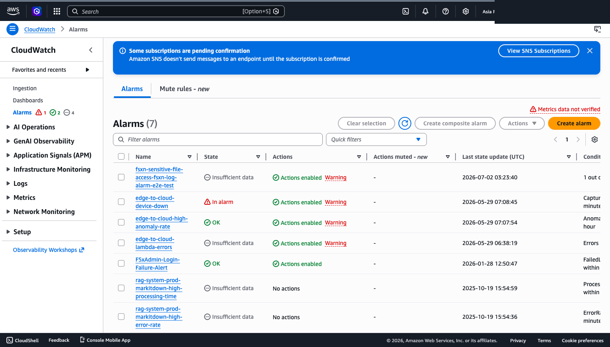
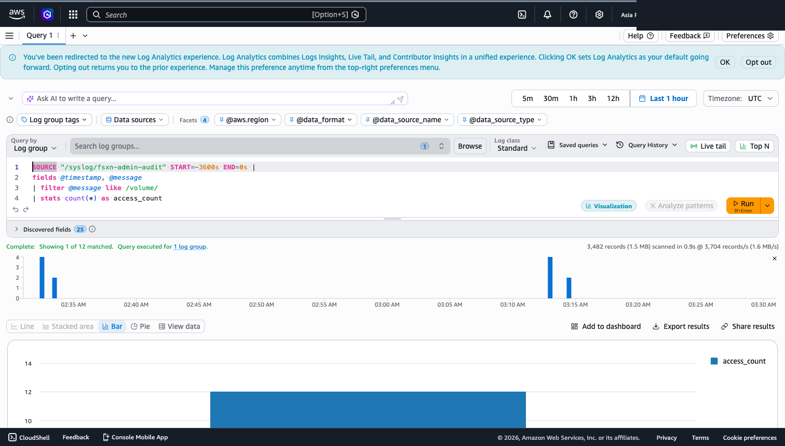
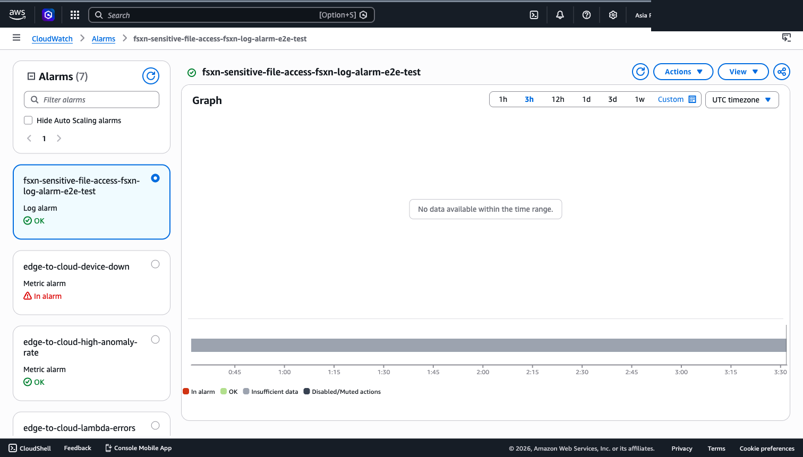
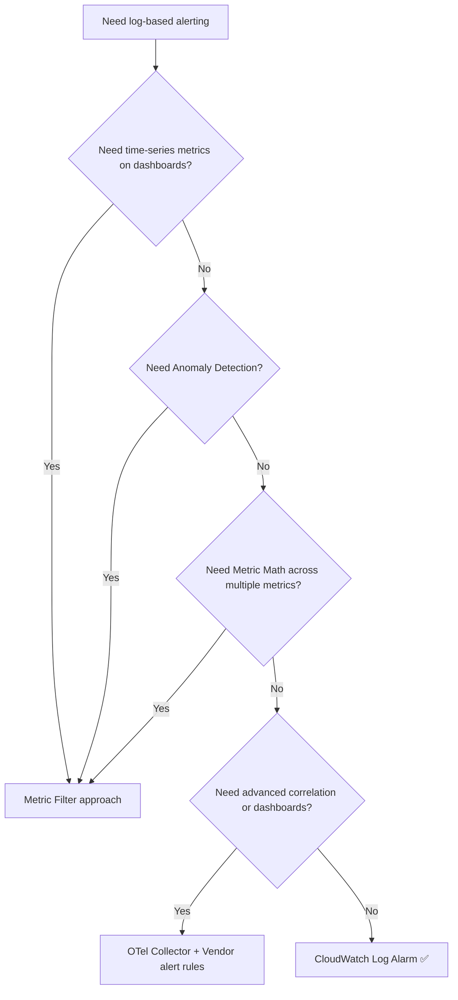

# CloudWatch Log Alarm — Direct Alarms from FSx for ONTAP Audit Logs

> **Template**: `shared/templates/cloudwatch-log-alarm.yaml`
> **Prerequisite**: FSx for ONTAP admin audit logs flowing to CloudWatch Logs ([Syslog VPC Endpoint Setup](./syslog-vpce-setup-guide.md))
> **AWS Announcement**: 2026-07-01
> **Time to deploy**: ~5 min deploy, ~10 min first evaluation (15 min total to verify)

---

## Quick Start Success Criteria

| # | Checkpoint | Method |
|---|-----------|--------|
| 1 | CloudFormation stack CREATE_COMPLETE | `aws cloudformation describe-stacks` |
| 2 | Alarm state transitions INSUFFICIENT_DATA → OK | Console or CLI (wait 5-10 min) |
| 3 | Test operation triggers ALARM + SNS notification | Run ONTAP CLI operation, check email |

---

## Target Audience

| Audience | Use Case |
|----------|----------|
| Security operations team | Immediate detection of unauthorized access, sensitive file access |
| SRE / Infrastructure ops | Storage anomaly detection (bulk deletion, volume offline) |
| Compliance officers | Audit trail and automated alerts for regulated data access |
| Storage administrators | Privileged user operation monitoring |

## Log Types

FSx for ONTAP has two types of audit logs. This template primarily targets **admin audit logs**.

| Log Type | Delivery Path | Format | Log Alarm Target |
|----------|-------------|--------|-----------------|
| **Admin Audit Logs** | Syslog → VPC Endpoint → CloudWatch Logs | Syslog text | ✅ This template |
| **File Access Audit Logs** | FSx for ONTAP S3 AP → EventBridge Scheduler → Lambda → Vendors | EVTX / XML binary | ❌ Separate pipeline |

Admin audit logs contain ONTAP CLI/API operation records (e.g., volume operations, Snapshot operations, user management, security configuration changes).

### Actual Log Format (Confirmed in E2E Validation)

ONTAP admin audit log format as received in CloudWatch Logs:

```
<190>Jul  2 03:17:37 FsxId...-02: FsxId...-02: 0000001c.000b7609 00f10e98
Thu Jul 02 2026 03:17:35 +00:00 [kern_audit:info:6392]
8003e90000027e24:8003e90000027e26 :: FsxId...:ssh :: <source-ip>:unknown ::
FsxId...:fsx-control-plane:admin ::
system node systemshell -node * -command "top -d 1 -s 1" :: Success: 2 entries were acted on.
```

**Key fields**:
- `[kern_audit:info:6392]` — Audit category and level
- `FsxId...:ssh` / `FsxId...:http` — Access protocol
- `<source-ip>` — Source IP address
- `fsx-control-plane:admin` — Executing user
- `system node systemshell ...` — Executed command
- `Success` / `Failure` — Result

> **File access audit logs** (NFS/SMB file operation records): To use Log Alarm with these, you need a custom pipeline that parses EVTX/XML via Lambda and forwards to CloudWatch Logs.

## Overview

Leverage the **CloudWatch Log Alarm** feature (announced July 2026) to create alarms directly from FSx for ONTAP audit logs — **no metric filters required**.

Previous workflow:

```
CloudWatch Logs → Metric Filter → Custom Metric → CloudWatch Alarm
```

New workflow (Log Alarm):

```
CloudWatch Logs → Logs Insights Query (scheduled) → Log Alarm → SNS
```

Eliminates intermediate steps and unifies log analysis with alerting in a single workflow.

---

## Architecture

```
┌────────────────────────────────────────────────────────────────┐
│  FSx for ONTAP                                                 │
│  (Syslog log-forwarding)                                       │
└───────────────┬────────────────────────────────────────────────┘
                │ Syslog TCP
                ▼
┌────────────────────────────────────────────────────────────────┐
│  CloudWatch Logs (/syslog/fsxn-admin-audit)                    │
└───────────────┬────────────────────────────────────────────────┘
                │ Scheduled Query (rate: 5 min)
                ▼
┌────────────────────────────────────────────────────────────────┐
│  CloudWatch Log Alarm                                          │
│  - Logs Insights query (string filter)                         │
│  - Aggregation: count(*)                                       │
│  - Threshold: count > 0 → ALARM                                │
└───────────────┬────────────────────────────────────────────────┘
                │ AlarmActions
                ▼
┌────────────────────────────────────────────────────────────────┐
│  Amazon SNS → Email / Slack / PagerDuty / EventBridge          │
│  (can include triggering log lines in notifications)           │
└────────────────────────────────────────────────────────────────┘
```

---

## Core Idea: String Matching → Count → Threshold Alert

CloudWatch Log Alarm does not alert on strings directly. Instead, it **counts events matching a string pattern via Logs Insights query, then fires when the count exceeds a threshold**.

Examples:

| Use Case | Query Filter | Aggregation | Threshold |
|----------|-------------|-------------|-----------|
| Sensitive file access | `filter @message like /confidential/` | `count(*)` | `> 0` |
| Auth failure spike | `filter @message like /Failure/` | `count(*)` | `> 10` |
| Bulk file deletion | `filter @message like /DELETE/` | `count(*)` | `> 50` |
| Specific user activity | `filter @message like /admin/` | `count(*)` | `> 0` |

The pattern:

1. **Count events matching a string** (count)
2. **Alert when count exceeds threshold** (threshold > 0)

This enables "alert immediately when someone accesses a specific file" requirements.

---

## E2E Validation (Screenshots)

We deployed the template in a real environment (Tokyo region) and confirmed the state transition end to end. Screenshots have account IDs / PII masked.

In the console, the alarm appears as a new **"Log alarm"** type, distinct from existing metric alarms.



Running the query in Logs Insights shows the audit logs matching as real data (below: `/volume/` filter, 12 matches, 3,482 records scanned). The bar chart shows per-window counts.



The alarm stays **OK** while there is no matching access (INSUFFICIENT_DATA → OK transition confirmed). With a `> 0` threshold, it flips to ALARM the moment a single access to a sensitive path appears.



---

## Deployment

### Deploy Script (Recommended)

```bash
# Sensitive file access detection
DETECTION_TYPE=sensitive-file-access \
TARGET_PATTERN="/vol/data/confidential" \
SNS_TOPIC_ARN=arn:aws:sns:ap-northeast-1:123456789012:fsxn-alerts \
  bash shared/scripts/deploy-log-alarm.sh

# Auto-create SNS topic
DETECTION_TYPE=sensitive-file-access \
TARGET_PATTERN="/vol/data/confidential" \
CREATE_SNS_TOPIC=true \
SNS_TOPIC_NAME=fsxn-security-alerts \
  bash shared/scripts/deploy-log-alarm.sh
```

### Prerequisites

1. FSx for ONTAP audit logs reaching CloudWatch Logs
2. SNS topic created for alarm notifications

### Sensitive File Access Detection

```bash
aws cloudformation deploy \
  --template-file shared/templates/cloudwatch-log-alarm.yaml \
  --stack-name fsxn-log-alarm-sensitive-access \
  --parameter-overrides \
    LogGroupName=/syslog/fsxn-admin-audit \
    DetectionType=sensitive-file-access \
    TargetPattern="/vol/data/confidential" \
    AlarmThreshold=0 \
    EvaluationFrequencyMinutes=5 \
    QueryResultsToEvaluate=3 \
    QueryResultsToAlarm=1 \
    AlarmSnsTopicArn=arn:aws:sns:ap-northeast-1:123456789012:fsxn-security-alerts \
    ActionLogLineCount=5 \
  --capabilities CAPABILITY_NAMED_IAM \
  --region ap-northeast-1
```

### Failed Access Detection

```bash
aws cloudformation deploy \
  --template-file shared/templates/cloudwatch-log-alarm.yaml \
  --stack-name fsxn-log-alarm-failed-access \
  --parameter-overrides \
    LogGroupName=/syslog/fsxn-admin-audit \
    DetectionType=failed-access-attempts \
    AlarmThreshold=10 \
    EvaluationFrequencyMinutes=5 \
    AlarmSnsTopicArn=arn:aws:sns:ap-northeast-1:123456789012:fsxn-security-alerts \
  --capabilities CAPABILITY_NAMED_IAM \
  --region ap-northeast-1
```

### Bulk Delete Detection (Ransomware Indicator)

```bash
aws cloudformation deploy \
  --template-file shared/templates/cloudwatch-log-alarm.yaml \
  --stack-name fsxn-log-alarm-bulk-delete \
  --parameter-overrides \
    LogGroupName=/syslog/fsxn-admin-audit \
    DetectionType=bulk-delete-operations \
    AlarmThreshold=50 \
    EvaluationFrequencyMinutes=5 \
    QueryResultsToEvaluate=3 \
    QueryResultsToAlarm=2 \
    AlarmSnsTopicArn=arn:aws:sns:ap-northeast-1:123456789012:fsxn-security-alerts \
  --capabilities CAPABILITY_NAMED_IAM \
  --region ap-northeast-1
```

### Custom Query

```bash
aws cloudformation deploy \
  --template-file shared/templates/cloudwatch-log-alarm.yaml \
  --stack-name fsxn-log-alarm-custom \
  --parameter-overrides \
    LogGroupName=/syslog/fsxn-admin-audit \
    DetectionType=custom \
    CustomQueryString="fields @timestamp, @message | filter @message like /volume.offline/ or @message like /vol.unmount/" \
    CustomAggregation="count(*)" \
    AlarmThreshold=0 \
    EvaluationFrequencyMinutes=1 \
    AlarmSnsTopicArn=arn:aws:sns:ap-northeast-1:123456789012:fsxn-security-alerts \
  --capabilities CAPABILITY_NAMED_IAM \
  --region ap-northeast-1
```

---

## Direct Creation via AWS CLI (No Template)

You can create Log Alarms directly with the `put-log-alarm` command:

```bash
aws cloudwatch put-log-alarm \
    --alarm-name "fsxn-sensitive-file-access" \
    --alarm-description "Alert on access to /vol/data/confidential" \
    --comparison-operator GreaterThanThreshold \
    --threshold 0 \
    --query-results-to-evaluate 3 \
    --query-results-to-alarm 1 \
    --treat-missing-data notBreaching \
    --alarm-actions "arn:aws:sns:ap-northeast-1:123456789012:fsxn-security-alerts" \
    --scheduled-query-configuration '{
        "QueryString": "fields @timestamp, @message | filter @message like /\\/vol\\/data\\/confidential/",
        "LogGroupIdentifiers": ["/syslog/fsxn-admin-audit"],
        "ScheduledQueryRoleARN": "arn:aws:iam::123456789012:role/fsxn-log-alarm-scheduled-query-role",
        "AggregationExpression": "count(*)",
        "ScheduleConfiguration": {
            "ScheduleExpression": "rate(5 minutes)",
            "StartTimeOffset": 300
        }
    }' \
    --action-log-line-count 5 \
    --action-log-line-role-arn "arn:aws:iam::123456789012:role/fsxn-log-alarm-log-line-role"
```

---

## Comparison with Metric Filter Approach

| Aspect | Metric Filter Approach | Log Alarm (New) |
|--------|----------------------|-----------------|
| Setup steps | 3 (filter → metric → alarm) | 1 (Log Alarm only) |
| Query flexibility | Pattern syntax only | Full Logs Insights syntax |
| Aggregation options | Count / Sum / Avg etc. | All Logs Insights aggregation functions |
| Log lines in notification | ❌ | ✅ (up to 50 lines) |
| IAM requirements | None (Logs → Metrics automatic) | ScheduledQueryRole + LogLineRole |
| CloudFormation | `AWS::Logs::MetricFilter` + `AWS::CloudWatch::Alarm` | `AWS::CloudWatch::LogAlarm` |
| Cost | Metric charges + Alarm | Scheduled Query execution + Alarm |
| Retroactive query | ❌ (only data after filter creation) | ✅ (queries existing logs) |

### When to Choose Log Alarm

- Alert on string patterns in logs
- Need flexible Logs Insights query syntax
- Want log lines included in notifications (faster investigation)
- Want to avoid managing intermediate metrics
- Need retroactive alerting on **existing** logs

### When to Choose Metric Filter

- Need time-series metrics on dashboards
- Want Anomaly Detection
- Need Metric Math to combine multiple metrics
- Want to avoid additional IAM roles

---

## FSx for ONTAP Audit Log Detection Patterns

### Pattern 1: Specific Path Access Detection

"Alert when any file under `/vol/finance/` is accessed"

```
fields @timestamp, @message
| filter @message like /\/vol\/finance\//
| limit 20
```

Aggregation: `count(*)` / Threshold: `> 0`

### Pattern 2: After-Hours Access Detection

> ⚠️ **Timezone**: ONTAP syslog timestamps and `@timestamp` in Logs Insights are **UTC**. If your business hours are local (e.g., JST 09:00–18:00), you must shift by the UTC offset or the window is wrong — JST business hours 09–18 are **UTC 00–09**. Bake the offset into the query (JST = UTC+9), or your "after-hours" alarm fires all afternoon and stays silent overnight.

```
# JST business hours (09:00-18:00 JST = 00:00-09:00 UTC).
# Adjust +9h into the comparison so the window matches local hours.
fields @timestamp, @message, (datefloor(@timestamp, 1h) + 9h) as jst_hour
| filter @message like /\/vol\/data\//
| filter tomillis(jst_hour) % 86400000 < 32400000       # before 09:00 JST
      or tomillis(jst_hour) % 86400000 >= 64800000      # at/after 18:00 JST
| limit 20
```

Aggregation: `count(*)` / Threshold: `> 0`

> If your on-call and log analysis are all in one region/timezone, the simplest robust option is to store the offset as a stack parameter and generate the query, rather than hand-editing UTC boundaries.

### Pattern 3: Administrative Operations by Specific User

```
fields @timestamp, @message
| filter @message like /admin/ and (@message like /volume/ or @message like /vserver/)
| limit 20
```

Aggregation: `count(*)` / Threshold: `> 0`

### Pattern 4: Volume Offline/Unmount

```
fields @timestamp, @message
| filter @message like /volume.offline/ or @message like /vol.unmount/ or @message like /vol.restrict/
| limit 20
```

Aggregation: `count(*)` / Threshold: `> 0`

### Pattern 5: Snapshot Deletion (Bulk Delete Detection)

```
fields @timestamp, @message
| filter @message like /snapshot.delete/ or @message like /snap.delete/
| limit 20
```

Aggregation: `count(*)` / Threshold: `> 5` (5+ snapshot deletions in 5 minutes is anomalous)

---

## IAM Role Requirements

Log Alarm requires 2 IAM roles:

### 1. Scheduled Query Execution Role (Required)

Allows CloudWatch Logs to execute scheduled queries:

```json
{
  "Version": "2012-10-17",
  "Statement": [
    {
      "Effect": "Allow",
      "Principal": { "Service": "logs.amazonaws.com" },
      "Action": "sts:AssumeRole"
    }
  ]
}
```

Permissions:

```json
{
  "Effect": "Allow",
  "Action": [
    "logs:StartQuery",
    "logs:StopQuery",
    "logs:GetQueryResults",
    "logs:DescribeLogGroups"
  ],
  "Resource": "arn:aws:logs:<region>:<account-id>:log-group:/syslog/fsxn-admin-audit:*"
}
```

### 2. Log Line Role (Optional — to include log lines in SNS notifications)

Allows CloudWatch to fetch log lines for SNS email notifications:

```json
{
  "Version": "2012-10-17",
  "Statement": [
    {
      "Effect": "Allow",
      "Principal": { "Service": "cloudwatch.amazonaws.com" },
      "Action": "sts:AssumeRole"
    }
  ]
}
```

Permissions:

```json
{
  "Effect": "Allow",
  "Action": ["logs:GetQueryResults"],
  "Resource": "arn:aws:logs:<region>:<account-id>:log-group:/syslog/fsxn-admin-audit:*"
}
```

> **Note**: The `cloudwatch-log-alarm.yaml` template creates these roles automatically.

---

## M-out-of-N Evaluation

Log Alarm uses M-out-of-N evaluation:

- **N** = `QueryResultsToEvaluate` — evaluates the last N query results
- **M** = `QueryResultsToAlarm` — alarms when M of those N breach threshold

### Recommended Settings

| Use Case | N (Evaluate) | M (Alarm) | Rationale |
|----------|-------------|-----------|-----------|
| Sensitive file access | 3 | 1 | Alert on single detection |
| Auth failure spike | 5 | 3 | Filter out typo noise |
| Bulk delete | 3 | 2 | Confirm sustained anomaly |
| Monitored user | 3 | 1 | Alert on single detection |

---

## Cost Estimate

### Log Alarm Standalone

| Log Volume/Day | Monthly Estimate | Notes |
|---------------|-----------------|-------|
| 100 MB | ~$6.6 | Small environment |
| 500 MB | ~$33 | Medium environment |
| 1 GB | ~$66 | Large environment |

### Comparison with Metric Filter Approach

| Item | Metric Filter Approach | Log Alarm Approach |
|------|----------------------|-------------------|
| Custom metric | ~$0.30/metric/month | Not needed |
| Alarm | ~$0.10/alarm/month | ~$0.30/alarm/month |
| Scheduled Query | Not needed | $0.0076/GB scanned |
| **Total (100MB/day)** | **~$3** | **~$6.6** |

Log Alarm costs ~2x more but provides:
- Log lines in notifications → **faster investigation** (reduces labor cost)
- Retroactive queries → **applies to existing logs**
- Single-step setup → **reduced operational complexity**

5-minute interval × 1 alarm × 288 executions/day.

### How Cost Scales (read before fanning out)

The table above is **per alarm**. Scan cost is driven by:

```
bytes scanned = (log group volume in the query window) × (query runs per day) × (number of alarms)
```

Each alarm runs its **own** Scheduled Query over the same log group, so ten alarms on one 100 MB/day log group is roughly **10×** the single-alarm figure — not a flat add-on. Model your estimate as *alarms × cadence × scan size*.

Two levers keep it bounded:

1. **Narrow each query** — `filter` early and add `limit` to reduce bytes scanned per run.
2. **Consolidate** — where multiple detections share a query shape, combine them into fewer alarms instead of one alarm per pattern.

> **Cost optimization**: Increase `EvaluationFrequencyMinutes` (15 min ≈ 1/3 of 5 min) or add `limit` to queries to reduce scan volume.

---

## Region Availability

Available in all commercial regions as of July 2026, except:

- ❌ Middle East (UAE)
- ❌ Middle East (Bahrain)

`ap-northeast-1` (Tokyo) is ✅ available.

---

## Security and Privacy Considerations

### Log Lines in SNS Notifications

When `ActionLogLineCount > 0`, alarm notifications include matching log lines. These may contain:

- Usernames / account names
- File paths (potentially including sensitive file names)
- Client IP addresses
- Operation details

**Recommendations**:
- For high-sensitivity logs, consider `ActionLogLineCount=0`
- Limit SNS topic subscribers to minimum required
- Enable encryption (SSE-KMS) on the SNS topic

#### Regulated environments (healthcare / finance / public sector): default to `ActionLogLineCount=0`

Once matched log lines enter SNS → email / Slack / PagerDuty, that data (usernames, file paths, client IPs — and in healthcare potentially **PHI**) has **left the CloudWatch boundary** and lands in systems that may not be in your compliance scope. For regulated data the safe default is:

```yaml
ActionLogLineCount: 0   # notify that something matched; keep the log lines in CloudWatch
```

Responders then pivot into Logs Insights (inside the audited boundary) for the detail. Treat `ActionLogLineCount > 0` as an explicit, reviewed decision when the notification path crosses a compliance boundary — not the default.

> **Governance caveat**: This template provides a detection *mechanism*, not a compliance attestation. Whether a given alarm, retention setting, or notification path satisfies APPI / FISC / ISMAP / HIPAA is a determination for your compliance team, not something a CloudWatch feature confers. Classify the fields in your audit log (see [data-classification.md](./data-classification.md)) before wiring notifications.

### Audit Trail of the Alert Itself

For regulated environments, detection is only half the requirement — you also need evidence that the alarm fired and who was notified. Three records back this up; confirm their retention before relying on them:

| Record | Where | Retention |
|--------|-------|-----------|
| Alarm state transitions (OK ↔ ALARM) | CloudWatch alarm history | **90 days** (fixed, not configurable) |
| State-change events | EventBridge (CloudWatch Alarm state-change) → route to S3/Firehose or a log group | Your policy |
| Alarm create/modify ("who configured this detection") | CloudTrail management events | Your CloudTrail policy |

> If your compliance scope requires proving "the alert fired at T and paged on-call" for multiple years, capture the EventBridge state-change event to S3 with your retention policy — the 90-day alarm history alone will not satisfy multi-year evidence requirements.

### Multi-Account Rollout

The deployment examples are single-account. To roll the same Log Alarm baseline across many accounts (MSP fleets, org-wide guardrails), wrap the template in the [multi-account StackSets pattern](./multi-account-deployment.md): one `AWS::CloudWatch::LogAlarm` definition deployed to every target account/Region, with the SNS/PagerDuty topic per account or centralized via cross-account SNS.

### KMS-Encrypted Log Groups (Confirmed in E2E)

**Conclusion: `ScheduledQueryExecutionRole` does NOT need `kms:Decrypt`.** Decryption is
performed by the CloudWatch Logs service via the KMS key policy, so the role only needs
its `logs:*` query permissions.

Instead, grant decryption to the CloudWatch Logs service principal in the **KMS key
policy**:

```json
{
  "Sid": "AllowCloudWatchLogs",
  "Effect": "Allow",
  "Principal": { "Service": "logs.<region>.amazonaws.com" },
  "Action": ["kms:Encrypt", "kms:Decrypt", "kms:ReEncrypt*", "kms:GenerateDataKey*", "kms:Describe*"],
  "Resource": "*",
  "Condition": {
    "ArnEquals": {
      "kms:EncryptionContext:aws:logs:arn": "arn:aws:logs:<region>:<account-id>:log-group:<log-group-name>"
    }
  }
}
```

> **Verified (2026-07-02)**: Created a Log Alarm against a KMS-encrypted log group with a
> role that has **no** `kms:Decrypt`. With only the key policy above, the alarm evaluated
> successfully (transitioned to ALARM on a match and fired the SNS action), not
> INSUFFICIENT_DATA. The role does not need `kms:Decrypt`.
>
> **Note**: The `cloudwatch-log-alarm.yaml` template does not modify the policy of an
> existing external KMS key. For a KMS-encrypted log group, apply the key policy grant
> above **separately** yourself.

### SNS Topic Access Policy

CloudWatch needs permission to publish to the SNS topic as an alarm action. For same-account, this works by default. For cross-account scenarios, an SNS resource policy is required.

---

## Operational Notes

### What the Admin Audit Log Can and Cannot See (scoping)

The presets in the template default to the **admin audit log** (`/syslog/fsxn-admin-audit`), which records **management-plane** operations only. It does **not** contain end-user file I/O over NFS/SMB. Concretely:

| Preset | On `/syslog/fsxn-admin-audit` it detects | It does NOT detect | For the "not" case, use |
|--------|------------------------------------------|--------------------|--------------------------|
| `bulk-delete-operations` | Admin-plane deletes (Snapshot delete, `volume delete`) | Ransomware encrypting/deleting user files over SMB | ONTAP ARP + FPolicy |
| `sensitive-file-access` | An admin *command* referencing the path | A user opening the file | File-access audit / FPolicy |
| `specific-user-activity` | Admin/CLI/API actions by the account | The account's NFS/SMB file access | File-access audit |

To run these presets against **user file activity**, point `LogGroupName` at a log group where the **file-access audit log** (EVTX/XML parsed to text) has been landed — not the admin audit log group. See [Detection Use Cases](./detection-use-cases.md) for which source each detection belongs to.

> System Manager (GUI) operations are executed via the ONTAP REST API internally, so they **are** captured in the admin audit log — a GUI-driven Snapshot delete is detected the same as a CLI one. (See Part 14 for the System Manager management-plane details.)

### `security audit` — What Gets Captured

What lands in the admin audit log is governed by ONTAP's `security audit` settings, **not** by log-forwarding. Read/GET operations are **off by default**:

```
security audit modify -cliget on -httpget on -ontapiget on
```

Without this, `sensitive-file-access` / `specific-user-activity` queries that rely on read operations return nothing. `cluster log-forwarding` only controls the destination — enable the right `security audit` categories first. (`cluster log-forwarding` also supports **multiple destinations**, so CloudWatch can be added alongside an existing on-prem SIEM without cutover.)

### Native ONTAP EMS Alerting vs Pushing to CloudWatch (right tool)

ONTAP EMS can notify **natively** — email and SNMP traps configured directly in ONTAP (`event notification destination` / `event notification`). You don't always need AWS in the path:

| Keep it in ONTAP (EMS native email/SNMP) | Push to CloudWatch (syslog → Log Alarm) |
|------------------------------------------|------------------------------------------|
| Storage team already watches ONTAP; few events | You want alerts unified with AWS-side signals (Lambda errors, DLQ, pipeline health) |
| No AWS-side correlation needed | You want Logs Insights queries, retroactive search, SNS→PagerDuty escalation |
| Air-gapped / minimal cloud dependency | You want one on-call surface across storage + serverless pipeline |

Neither is "better" — choose by where your operations team already lives.

### Metrics vs Logs (don't conflate)

Log Alarm is for **log/event text** (discrete audit/EMS events). Capacity and performance **trending** — volume utilization, IOPS, latency over time — belongs to **metrics**, via NetApp Harvest → Grafana or FSx for ONTAP CloudWatch metrics + metric alarms. Use Log Alarm to know "an admin deleted a Snapshot"; use metrics to know "this volume is 90% full and trending up." They are complementary, not substitutes.

### Dead-Man's Switch (detect upstream syslog delivery failure)

If ONTAP-side syslog delivery stops (network, VPC endpoint, or `log-forwarding` misconfig), a Log Alarm silently stays OK/INSUFFICIENT_DATA and your detection is dead without warning. Add a **heartbeat** alarm that fires when ingestion volume drops to zero:

```
fields @timestamp
| stats count(*) as events by bin(15m)
```

Alarm on `events < 1` (with `TreatMissingData: breaching`) over the log group — for an actively-managed cluster there should always be *some* admin/EMS traffic. This catches "the pipeline died" independently of any content detection. Pair it with the Scheduled Query monitoring below.

### DR / Multi-Region

Log Alarms are **regional**. In an Active-Passive DR design, deploy the same Log Alarm stack in the DR Region so detection survives a failover, and so DR-side EMS events (`sms.vol.full` on the SnapMirror destination) are visible. See [cross-region-replication.md](./cross-region-replication.md).

### Who Can Silence the Detection (tamper resistance)

Detection you can't trust to still be running is not detection. A principal with CloudWatch/CloudFormation permissions can **delete the alarm or the log group** and silence everything — and the dead-man's-switch above catches *ingestion* stopping, not *alarm deletion*. Harden accordingly:

- **Separate the "delete alarm / delete log group" permission** from day-to-day roles. Guard it with an SCP (deny `cloudwatch:DeleteAlarms`, `logs:DeleteLogGroup` on the detection resources except for a break-glass role).
- **Detect alarm/log-group deletion** via CloudTrail management events → EventBridge → notify (an attacker who disables detection should itself trigger an alert).
- **Prevent, don't just detect, on the storage side**: the admin-plane "Snapshot delete" detection pairs with **SnapLock** — tamper-proof (WORM) Snapshots that *cannot* be deleted before expiry. Detection tells you someone tried; SnapLock makes sure your recovery points survive the attempt. Treat them as prevention + detection, not either/or.

### MITRE ATT&CK Mapping

Mapping the detections to ATT&CK gives SOC teams a shared vocabulary and clarifies coverage:

| Detection (this template) | ATT&CK Technique | Why it maps |
|---------------------------|------------------|-------------|
| Snapshot delete (admin audit) | **T1490 Inhibit System Recovery** | Deleting Snapshots removes restore points before ransomware/destruction |
| Bulk admin delete / `volume delete` | **T1485 Data Destruction** | Management-plane destruction of data/volumes |
| Privileged-user / `security login` changes | **T1078 Valid Accounts**, **T1098 Account Manipulation** | Stolen-credential use, role/account tampering |
| Failed access spike | **T1110 Brute Force** | Repeated auth failures |
| User-file encryption (ARP, Part 3) | **T1486 Data Encrypted for Impact** | Ransomware encryption at the storage layer |

> Note the division of labor: T1486 (encryption) is ARP's job; **T1490 (Inhibit System Recovery)** — an attacker deleting Snapshots so you *can't* roll back the encryption — is exactly what the admin-audit Log Alarm adds. The two together close a gap either alone would leave.

### Detection Coverage Map (one-slide view for leadership)

| Plane | What an attacker does | Primary control | This project |
|-------|----------------------|-----------------|--------------|
| Storage | Encrypts user files | ARP (ML) | Part 3 |
| File protocol | Mass delete/rename over NFS/SMB | FPolicy | Part 4 |
| Admin/management | Deletes Snapshots, offlines volumes, alters accounts | Admin audit + Log Alarm | This article |
| Recovery integrity | Removes restore points | SnapLock (prevention) | Complementary |

### Query Validation (avoid silent false-negatives)

A typo in a Logs Insights query produces a **silent no-match** — the alarm sits at OK forever and you believe you're covered. The dead-man's switch catches ingestion loss, not a bad query. Before deploying:

1. Run the exact query in the **Logs Insights console** against a window you *know* contains a matching event; confirm a non-zero count.
2. Generate a matching event (e.g., a test Snapshot delete on a scratch volume) and confirm the alarm transitions OK → ALARM.
3. In CI, at minimum lint the query string and assert it is non-empty and references the intended log group; a full behavioral test requires a live log group with seeded events.

### ONTAP Minimum Version & FSx Notes

- EMS-over-syslog (`event notification destination create -syslog ...`) and admin-audit `cluster log-forwarding` are available on modern ONTAP 9.x; confirm the exact minor version on your FSx for ONTAP file system with `version` / `system node image show`.
- **Multi-AZ vs Single-AZ**: node/stream naming differs (`FsxId...-01/-02` on Multi-AZ). Query the whole log group (see above) so AZ topology doesn't change your detection.
- **`fsxadmin` scoping**: on FSx, `fsxadmin` is the primary admin. A `specific-user-activity` alarm on `fsxadmin` will match *all* admin activity — scope it to specific commands, or reserve it for genuinely separated roles.

### Service Quotas

CloudWatch limits the number of alarms and concurrent Scheduled Queries per account/Region. Before fanning out many presets (or many accounts via StackSets), check the current quotas in Service Quotas and request increases if your detection catalog is large.

### Log Retention vs Query Window

Retroactive queries only reach as far back as the **log group retention**. If retention is shorter than your query/evaluation window you get silent gaps; if it's very long you pay for storage you may not query. Set the log group retention deliberately (a common baseline for audit is 90–400 days depending on the compliance framework) and keep it ≥ your longest Log Alarm window.

### Compliance Framework Breadth

Beyond APPI / FISC / ISMAP / HIPAA, admin-audit alerting commonly supports evidence for **PCI-DSS Requirement 10** (audit trails / monitoring), **SOC 2** (CC7.2 detection of anomalies), and **ISO/IEC 27001 A.12.4** (logging and monitoring). As always this is a *mechanism*; which control it satisfies is your auditor's determination.

### Notification Path Reliability & Encryption Boundary

- **Delivery reliability**: the alarm firing is not the end — the SNS delivery can fail (unconfirmed subscription, endpoint 5xx, PagerDuty outage). Enable an SNS **delivery-status/DLQ** configuration on the topic and monitor `NumberOfNotificationsFailed` so a missed page doesn't go unnoticed.
- **Encryption boundary**: SSE-KMS on the SNS topic and KMS on the log group protect data **at rest and in transit** — they do **not** protect the matched log lines once a human reads them in email/Slack/PagerDuty. KMS is not a substitute for the `ActionLogLineCount=0` decision in regulated environments.

### Composite Alarms (reduce noise)

To require two independent signals before paging, wrap a Log Alarm and a metric alarm in a **CloudWatch composite alarm** (`AWS::CloudWatch::CompositeAlarm`) with an `ALARM(logAlarm) AND ALARM(metricAlarm)` rule — e.g., "Snapshot-delete detected **and** volume throughput spiked". This cuts false pages where a single signal is ambiguous, at the cost of some sensitivity.

### Multi-Node Log Streams (ONTAP)

The admin audit log is cluster-scoped, but FSx for ONTAP delivers it **per node** — you will see streams prefixed `FsxId...-01`, `FsxId...-02`. Query the whole **log group** (do not pin `@logStream`) so the Log Alarm sees activity regardless of which node handled the request. An alarm scoped to a single stream silently misses half your traffic during HA takeover or normal LIF distribution.

### Baselining a Threshold Before Enabling (bulk-delete, etc.)

Scheduled bulk operations (nightly backups, batch ETL, archive cleanup) can legitimately exceed a count threshold and page on-call for nothing. Before enabling a count-based alarm in production, baseline your normal volume for a few days **without** an alarm action:

```
fields @timestamp, @message
| filter @message like /delete/
| stats count(*) as deletes by bin(5m)
| sort deletes desc
```

Read the top `deletes` values (your routine peak), then set the threshold above it — or exclude known service accounts / maintenance windows in the query.

### Monitoring Scheduled Query Execution

To detect failures in the Scheduled Query itself (the foundation of Log Alarms):

```
CloudWatch Console → Logs → Scheduled Queries → Check status
```

If Scheduled Queries fail continuously, the alarm enters `INSUFFICIENT_DATA` state.

### Testing Procedure

To verify the alarm fires correctly:

1. Execute an intentionally matching operation via ONTAP CLI (e.g., operation on a test volume)
2. Confirm syslog delivery (event reaches CloudWatch Logs)
3. Wait for next scheduled execution (up to `EvaluationFrequencyMinutes`) and verify alarm fires

### Common Pitfall: Sparse Patterns Rarely Reach ALARM (Confirmed in E2E)

You created a `count(*) > 0` (threshold 0) alarm, but it stays OK forever and never
reaches ALARM. We hit this exact behavior during E2E validation. Two causes:

1. **`stats count(*)` returns *no result row* when zero events match** (not a row with
   value `0`, but no row at all). This is treated as missing data, and with
   `TreatMissingData: notBreaching` it is evaluated as OK.
2. **The alarm only fires when at least one match lands inside an evaluation window.**
   If a pattern produces only ~12 matches per hour, most 5-minute windows have zero
   matches. In our test, 5 of 6 consecutive windows had 0 matches; only 1 had 4.

So detecting sparse events with `count(*) > 0` means the alarm enters ALARM only during
the window that actually contains a match, then returns to OK right after. SNS still
fires on the OK→ALARM transition, so detection works — but **to verify behavior
reliably, use a dense pattern (e.g., `ssh`, hundreds of matches per 10 min) or generate
a burst of matching events right before testing.**

> For "always want to know when it happens" use cases, this behavior is fine (a single
> match triggers the notification). It is not suited for visualizing "has been OK for a
> sustained period."

### StartTimeOffset Recommendations

To account for log delivery latency, set `StartTimeOffset` slightly longer than the query frequency:

| EvaluationFrequencyMinutes | Recommended StartTimeOffset (seconds) | Rationale |
|---------------------------|--------------------------------------|-----------|
| 1 | 90 | 30s buffer |
| 5 | 330 | 30s buffer |
| 10 | 660 | 60s buffer |
| 15 | 960 | 60s buffer |

> **Note**: The current template uses `StartTimeOffset = EvaluationFrequencyMinutes × 60`. If delivery latency is an issue, use `DetectionType=custom` to manually adjust `StartTimeOffset`, or edit the template directly.

### CloudWatch Log Alarm vs OTel Collector Alert Rules

This project also provides OTel Collector paths for log delivery to vendors. Selection guidance:

### Selection Flowchart



### Pipeline Positioning

| Path | Best for | Additional Infra | Cost |
|------|---------|-----------------|------|
| **Log Alarm** (this template) | Simple threshold alerts, immediate detection | None (managed) | ~$6.6/month (100MB/day) |
| **Lambda → Vendor** | Advanced dashboards, correlation, SIEM | Lambda | Vendor billing dependent |
| **OTel Collector** | Multi-backend, PII redaction, protocol translation | Collector | Collector ops + vendor |

> Log Alarm does not "complete" your monitoring. Use it as first-alert for security detection, then investigate in detail with vendor tools (Datadog/Splunk/Grafana).

### Detailed Comparison

| Aspect | CloudWatch Log Alarm | OTel + Vendor Alerts |
|--------|---------------------|---------------------|
| Additional infra | None (managed) | Collector instance |
| Query flexibility | Logs Insights syntax | Vendor-specific powerful queries |
| Correlation | Limited (logs only) | Metrics + traces + logs |
| Cost | Scheduled Query usage | Collector ops + vendor billing |
| Vendor lock-in | None (AWS native) | Moderate (backend dependent) |
| Best for | Simple threshold alerts | Advanced analysis, correlation, dashboards |

**Recommendation**: Use Log Alarm for immediate simple pattern-match alerts. Use vendor alert rules for complex conditions and correlation analysis.

---

## Runbook

Response procedures when alarm fires: [Log Alarm Runbook](./runbooks/log-alarm-triggered.md)

---

## E2E Validation Results (2026-07-02)

E2E validation performed in `ap-northeast-1`:

| Validation Item | Result | Notes |
|----------------|--------|-------|
| CloudFormation deploy | ✅ Success | `AWS::CloudWatch::LogAlarm` supported |
| IAM role auto-creation | ✅ Success | ScheduledQueryRole + LogLineRole |
| Scheduled Query execution | ✅ Success | INSUFFICIENT_DATA → OK transition confirmed |
| Console display | ✅ "Log alarm" type | Distinct from "Metric alarm" |
| Logs Insights query | ✅ Working | `filter @message like /ssh/` → 472 matches (10 min) |
| SNS integration | ✅ Configured | Subscription confirmation email sent |

### Observed State Transitions

```
After creation: INSUFFICIENT_DATA (query not yet executed)
  ↓ (~5-10 min)
OK (query executed, below threshold)
  ↓ (when matching logs exceed threshold)
ALARM (SNS notification fires)
```

### Caveats Discovered During Validation

1. **AWS CLI not supported**: `put-log-alarm` not available in CLI v2.35.x. Use CloudFormation or Console
2. **cfn-lint unrecognized**: `AWS::CloudWatch::LogAlarm` not in cfn-lint resource spec (E3006). Deploy works correctly. For CI/CoE standardization, suppress it **per resource** (not a blanket disable) so the check re-activates once the spec catches up:
   ```yaml
   SensitiveFileAccessAlarm:
     Type: AWS::CloudWatch::LogAlarm
     Metadata:
       cfn-lint:
         config:
           ignore_checks: [E3006]
   ```
   Or in CI: `cfn-lint --ignore-checks E3006`. Note that drift detection will not cover a resource type the CLI cannot yet describe — treat CloudFormation as the single source of truth until the API surface completes.
3. **Initial evaluation delay**: First query execution takes 5-10 min after stack creation
4. **M-out-of-N**: With threshold > 0, alarm requires M consecutive breaches. For immediate detection, set `QueryResultsToAlarm=1`

### Cleanup

```bash
# Delete specific stack
STACK_NAME=fsxn-log-alarm-sensitive-file-access \
  bash shared/scripts/cleanup-log-alarm.sh

# Delete all Log Alarm stacks
bash shared/scripts/cleanup-log-alarm.sh --all

# Include SNS topic deletion
STACK_NAME=fsxn-log-alarm-e2e-test \
SNS_TOPIC_ARN=arn:aws:sns:ap-northeast-1:123456789012:fsxn-log-alarm-test \
  bash shared/scripts/cleanup-log-alarm.sh --delete-sns
```

---

## Related Documents

- [Syslog VPC Endpoint Setup Guide](./syslog-vpce-setup-guide.md) — Prerequisite for delivering audit logs to CloudWatch Logs
- [Detection Use Cases](./detection-use-cases.md) — Detection patterns by event source
- [Pipeline SLO](./pipeline-slo.md) — Service level objectives for monitoring pipeline
- [Security Best Practices](./security-best-practices.md)
- [AWS Documentation: Alarming on logs](https://docs.aws.amazon.com/AmazonCloudWatch/latest/monitoring/Alarm-On-Logs.html)
- [AWS What's New: CloudWatch Log Alarms](https://aws.amazon.com/about-aws/whats-new/2026/07/amazon-cloudwatch-log-alarms/)
