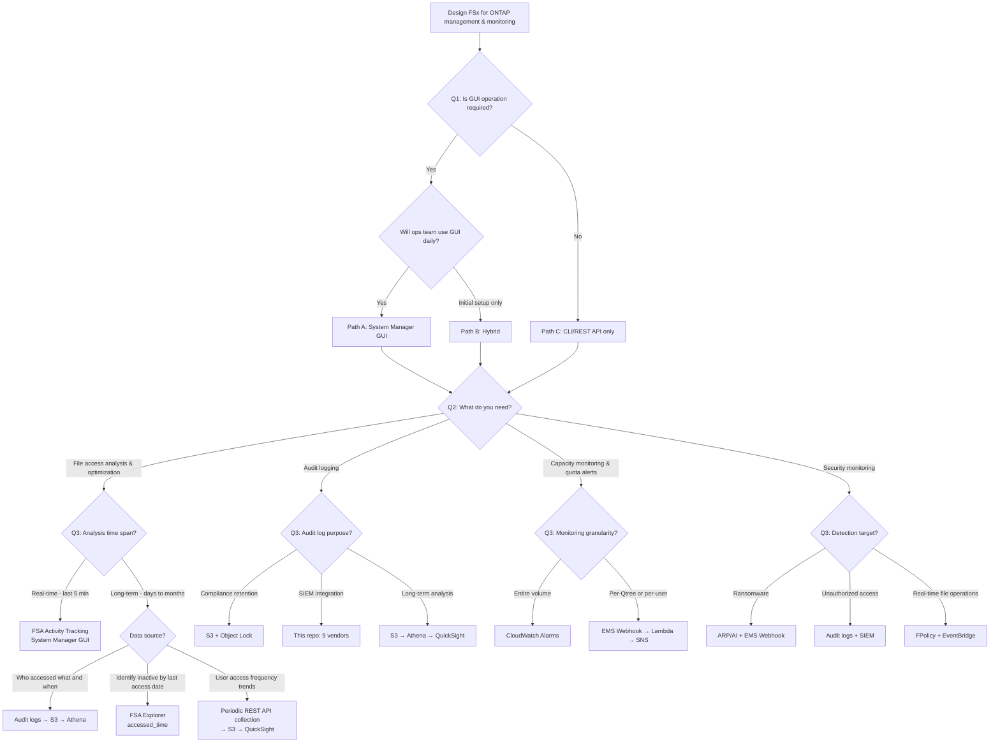

# FSx for ONTAP Management & Monitoring Decision Tree

🌐 [日本語](../ja/decision-tree-management-monitoring.md) | **English** (this page)

## Overview

This document guides you through choosing the optimal management and monitoring architecture for FSx for ONTAP based on your requirements.

All content is based on **hands-on verification on May 28, 2026**, with source links and screenshots attached.

> **Test environment**: ONTAP 9.17.1P6 / SINGLE_AZ_1 / NetApp Console + Link (Lambda)

---

## Verified Facts

### Accessing System Manager

| Fact | Screenshot | Source |
|------|-----------|--------|
| Direct browser access to management endpoint does NOT display System Manager UI (404) | — | Hands-on verification |
| NetApp Console > Systems > FSx for ONTAP card > right panel SERVICES > **System Manager: Open** | [48-systems-card-selected.png](../../integrations/netapp-console/system-manager/screenshots/48-systems-card-selected.png) | [AWS Docs](https://docs.aws.amazon.com/fsx/latest/ONTAPGuide/managing-resources-ontap-apps.html) |
| System Manager URL: `https://console.netapp.com/system-manager/<file-system-id>` | [49-system-manager-dashboard.png](../../integrations/netapp-console/system-manager/screenshots/49-system-manager-dashboard.png) | Hands-on verification |
| Link (Lambda < $1/month) is sufficient. Console Agent (EC2 t3.xlarge ~$120/month) not required | — | [NetApp Docs - Quick Start](https://docs.netapp.com/us-en/storage-management-fsx-ontap/start/task-getting-started-fsx.html) |
| Credential management: `console.workloads.netapp.com` > Menu > Administration > Credentials | [13-workload-factory-administration.png](../../integrations/netapp-console/system-manager/screenshots/13-workload-factory-administration.png) | [NetApp Docs - Add Credentials](https://docs.netapp.com/us-en/workload-setup-admin/add-credentials.html) |

### Operations Available in System Manager GUI

| Operation | System Manager Path | Screenshot | Source |
|-----------|-------------------|-----------|--------|
| Volume management | Storage > Volumes | [51-sm-volumes-list.png](../../integrations/netapp-console/system-manager/screenshots/51-sm-volumes-list.png) | Verified |
| Audit log configuration | Storage VMs → Settings → Audit | [60-sm-audit-logs.png](../../integrations/netapp-console/system-manager/screenshots/60-sm-audit-logs.png) | [AWS Docs - Auditing](https://docs.aws.amazon.com/fsx/latest/ONTAPGuide/file-access-auditing.html) |
| Qtree creation | Storage → Qtrees | [58-sm-qtrees.png](../../integrations/netapp-console/system-manager/screenshots/58-sm-qtrees.png) | [NetApp Docs - Quotas](https://docs.netapp.com/us-en/ontap/task_quotas_to_limit_resources.html) |
| Quota configuration | Storage → Quotas | [59-sm-quotas.png](../../integrations/netapp-console/system-manager/screenshots/59-sm-quotas.png) | Same |
| Quota Usage | Volumes → [vol] → Quota Usage tab | [57-sm-quota-usage.png](../../integrations/netapp-console/system-manager/screenshots/57-sm-quota-usage.png) | Verified |
| **FSA Activity Tracking** | Volumes → [vol] → File system → Activity | [54-sm-fsa-activity.png](../../integrations/netapp-console/system-manager/screenshots/54-sm-fsa-activity.png) | [NetApp Docs - Activity Tracking](https://docs.netapp.com/us-en/ontap/file-system-analytics/activity-tracking-task.html) |
| **FSA Explorer** | Volumes → [vol] → File system → Explorer | [55-sm-fsa-explorer.png](../../integrations/netapp-console/system-manager/screenshots/55-sm-fsa-explorer.png) | [NetApp Docs - View Activity](https://docs.netapp.com/us-en/ontap/task_nas_file_system_analytics_view.html) |
| **FSA Usage** | Volumes → [vol] → File system → Usage | [56-sm-fsa-usage.png](../../integrations/netapp-console/system-manager/screenshots/56-sm-fsa-usage.png) | Same |
| SMB share management | Storage → SMB shares | — | Verified |
| Performance monitoring | Dashboard (Latency, IOPS, Throughput) | [50-system-manager-loaded.png](../../integrations/netapp-console/system-manager/screenshots/50-system-manager-loaded.png) | Verified |
| EMS Webhook setup | ❌ Not in GUI | — | CLI only |
| FPolicy setup | ❌ Not in GUI | — | CLI only |

### FSA (File System Analytics) Data Characteristics

| Item | Value | Source |
|------|-------|--------|
| Activity Tracking refresh interval | Every 10-15 seconds | [Activity Tracking](https://docs.netapp.com/us-en/ontap/file-system-analytics/activity-tracking-task.html): "refresh every 10 to 15 seconds" |
| Data granularity | Previous 5-second interval hotspots | Same: "pertaining to hot spots seen in the system over the previous five-second interval" |
| Timeline retention | **Previous 5 minutes only** | Same: "retaining the previous five minutes of data" |
| CSV download | **Point-in-time snapshot** | Same: "display all the point-in-time data captured for the selected volume" |
| Timeline limitation | Only collected while page is visible. Stops on navigation | Same: "automatically be disabled when you navigate away from the Activity tab" |

### FSA Enablement Considerations

| Consideration | Details | Source |
|--------------|---------|--------|
| **Performance impact** | Latency may increase during FSA initial scan | [NetApp KB: High or fluctuating latency after turning on FSA](https://kb.netapp.com/Advice_and_Troubleshooting/Data_Storage_Software/ONTAP_OS/High_or_fluctuating_latency_after_turning_on_NetApp_ONTAP_File_System_Analytics) |
| **`-atime-update` prerequisite** | If disabled, Explorer shows only `modified_time`, not `accessed_time`, making inactive file detection unreliable | [View Activity](https://docs.netapp.com/us-en/ontap/task_nas_file_system_analytics_view.html) |
| **Initial scan time** | Proportional to file count in volume. May take hours for large volumes | [FSA Overview](https://docs.netapp.com/us-en/ontap/concept_nas_file_system_analytics_overview.html) |
| **Activity Tracking data may not display immediately** | Data appears based on 5-second sampling intervals; timing-dependent | [classmethod verification](https://dev.classmethod.jp/articles/amazon-fsx-for-netapp-ontap-netapp-console/) |
| **Recommendation**: Test on a non-production volume before enabling on production | — | — |
| Monitoring categories | Directories, Files, Clients, Users | Same |
| Metrics | Read/Write IOPS, Read/Write throughput | Same |
| Explorer inactive period | Customizable (default 1 year) | [View Activity](https://docs.netapp.com/us-en/ontap/task_nas_file_system_analytics_view.html): "you can customize the range to be reported" |
| accessed_time display condition | Only when `-atime-update` is enabled | Same: "if the volume default has been altered...only last modified time is shown" |

### FSA Enablement Cautions

| Caution | Details | Source |
|---------|---------|--------|
| **Performance impact** | Latency may increase during FSA initial scan | [NetApp KB: High or fluctuating latency after turning on FSA](https://kb.netapp.com/Advice_and_Troubleshooting/Data_Storage_Software/ONTAP_OS/High_or_fluctuating_latency_after_turning_on_NetApp_ONTAP_File_System_Analytics) |
| **`-atime-update` prerequisite** | If disabled, Explorer's accessed_time is not updated and inactive file analysis will not function | [View Activity](https://docs.netapp.com/us-en/ontap/task_nas_file_system_analytics_view.html) |
| **Initial scan time** | Proportional to the number of files in the volume. May take several hours for volumes with many files | [FSA Overview](https://docs.netapp.com/us-en/ontap/concept_nas_file_system_analytics_overview.html) |
| **Recommendation**: Verify impact on a test volume before enabling in production | — | — |

---

## Decision Tree Flowchart



---

## Path Implementation Guides

### NetApp Console Connection Method

| Method | Component | Monthly Cost | Purpose |
|--------|-----------|-------------|---------|
| **Link (recommended)** | AWS Lambda + IAM role | **< $1** | System Manager access, ONTAP REST API |
| Console Agent | EC2 t3.xlarge | ~$120-150 | CVO deployment (not needed for FSx for ONTAP) |

**IAM permissions required for Link creation**:

```json
{
  "Action": [
    "lambda:CreateFunction", "lambda:InvokeFunction", "lambda:GetFunction",
    "iam:CreateRole", "iam:AttachRolePolicy", "iam:PassRole",
    "cloudformation:CreateStack", "cloudformation:DescribeStacks",
    "ec2:DescribeNetworkInterfaces", "ec2:DescribeVpcs",
    "ec2:DescribeSubnets", "ec2:DescribeSecurityGroups",
    "fsx:DescribeFileSystems", "fsx:DescribeStorageVirtualMachines"
  ]
}
```

Source: [NetApp Docs - Add Credentials](https://docs.netapp.com/us-en/workload-setup-admin/add-credentials.html) + hands-on verification

Screenshot: [26-cloudformation-quick-create.png](../../integrations/netapp-console/system-manager/screenshots/26-cloudformation-quick-create.png)

---

### Path A: System Manager GUI Operations

**Access path**: NetApp Console > Systems > FSx for ONTAP card > SERVICES > System Manager: Open

Screenshot: [48-systems-card-selected.png](../../integrations/netapp-console/system-manager/screenshots/48-systems-card-selected.png)

```
Setup time: 1-2 business days
Monthly cost: Link < $1
```

| Operation | GUI Path | CLI Required? |
|-----------|---------|--------------|
| Enable audit logging | Storage VMs → Audit | GUI available |
| Create Qtree | Storage → Qtrees | GUI available |
| Configure & initialize quotas | Storage → Quotas | GUI available |
| Enable FSA Activity Tracking | Volumes → File system → Activity toggle | GUI available |
| FSA Explorer (identify inactive files) | Volumes → File system → Explorer | GUI available |
| Quota Usage check | Volumes → Quota Usage | GUI available |
| EMS Webhook setup | — | **CLI only** |
| FPolicy setup | — | **CLI only** |

### Path B: Hybrid (Recommended)

```
Phase 1 (same day): CLI/REST API for initial setup
  - Enable audit logging
  - Qtree + quota configuration
  - EMS Webhook setup
  - Enable FSA + Activity Tracking

Phase 2 (1-2 days later): NetApp Console setup
  - System Manager for daily monitoring
  - FSA Explorer for inactive data review
  - Quota Usage for capacity checks
```

### Path C: CLI/REST API Only

```
Setup time: Same day
Monthly cost: Lambda/SNS ~$5 (notifications only)
```

---

## Telemetry Cost Estimates

> ⚠️ The following are **sizing reference values**, not service limits or guaranteed prices. Actual costs vary by usage, region, and data transfer volume.

### Assumptions

- FSx for ONTAP: 1 file system, 4 SVMs, 12 volumes
- CIFS users: 50, averaging 500 file accesses/user/day
- Audit log volume: ~25,000 events/day → ~50MB/day → **~1.5GB/month**
- EMS events: ~10-50/month (quota exceeded, ARP, etc.)

### Cost Comparison Table

| Component | Monthly Cost | Breakdown |
|-----------|-------------|-----------|
| **Link (Lambda)** | < $1-2 | Lambda invocations (periodic execution every 30 min: ~1,440/month + on-demand operations) |
| **EMS Notifications (Lambda + SNS)** | ~$5 | Lambda: ~$1, SNS: ~$0.50, API Gateway: ~$3 |
| **Audit Log Storage (S3)** | ~$0.04 | 1.5GB × $0.025/GB (S3 Standard) |
| **Athena Queries (10/month)** | ~$0.08 | 1.5GB scanned × 10 queries × $0.005/GB |
| **CloudWatch Alarms (3)** | ~$0.30 | $0.10/alarm × 3 |
| **Total (AWS native)** | **~$6-7/month** | |

### Additional Cost with Grafana Cloud

| Component | Monthly Cost | Breakdown |
|-----------|-------------|-----------|
| Loki (logs) | ~$5-15 | 1.5GB/month (plan-dependent) |
| Mimir (metrics) | ~$3-8 | FSA + CW metrics |
| Grafana (dashboards) | $0 (Free tier) | Up to 3 users free |
| **Total (Grafana Cloud additional)** | **~$8-23/month** | |

### Self-hosted Grafana (Harvest + AMP + AMG)

| Component | Monthly Cost |
|-----------|-------------|
| Harvest (ECS Fargate) | ~$36 |
| NAT Gateway | ~$45 |
| AMP | ~$5 |
| AMG | ~$9 |
| **Total** | **~$95-250/month** |

Reference: [management-console/README.md](../../management-console/README.md)

---

## File Access Analysis Design Guide

### Q: "I want to revoke permissions for inactive users and delete unused files"

This requirement needs **a combination of multiple data sources**.

| Analysis Goal | Best Data Source | Time Span | GUI Available | Source |
|--------------|-----------------|-----------|--------------|--------|
| **Current hotspots** | FSA Activity Tracking | Last 5 sec to 5 min | ✅ System Manager | [Activity Tracking](https://docs.netapp.com/us-en/ontap/file-system-analytics/activity-tracking-task.html) |
| **Files not accessed for a long time** | FSA Explorer (accessed_time) | Last access date (customizable, default 1 year) | ✅ System Manager | [View Activity](https://docs.netapp.com/us-en/ontap/task_nas_file_system_analytics_view.html) |
| **Who accessed what and when (history)** | Audit logs (EVTX/JSON) | Unlimited (S3 storage) | ❌ CLI + pipeline | [AWS Docs - Auditing](https://docs.aws.amazon.com/fsx/latest/ONTAPGuide/file-access-auditing.html) |
| **User access frequency trends** | Audit log aggregation or periodic REST API collection | Unlimited (S3 storage) | ❌ Lambda + Athena | This repository |
| **Quota exceeded notifications** | EMS Webhook | Real-time | ❌ CLI setup | This repo `docs/en/event-sources.md` |

### About FSA Activity Tracking CSV Download

> ⚠️ **Important**: CSV download is a **point-in-time snapshot**. It does NOT accumulate or export long-term time-series data.

Source: [Activity Tracking](https://docs.netapp.com/us-en/ontap/file-system-analytics/activity-tracking-task.html)
> "Activity data can be downloaded in a CSV format that will display all the point-in-time data captured for the selected volume."

Even with Timeline enabled (ONTAP 9.11.1+), retention is **only the previous 5 minutes**:
> "retaining the previous five minutes of data"
> "Timeline data is only retained for fields that are visible area of the page."

### Recommended Architecture: Long-term File Access Analysis

```
┌─────────────────────────────────────────────────────────────────┐
│ Real-time Analysis (FSA — System Manager GUI)                    │
├─────────────────────────────────────────────────────────────────┤
│  Activity Tracking: Top files/users by IOPS/throughput (5s)      │
│  Explorer: Directory structure + last access date + inactive %   │
│  Usage: Per-user storage consumption                             │
│  → CSV download available (point-in-time snapshot)               │
└─────────────────────────────────────────────────────────────────┘

┌─────────────────────────────────────────────────────────────────┐
│ Long-term Analysis (Audit Logs + Pipeline)                        │
├─────────────────────────────────────────────────────────────────┤
│  Audit logs (EVTX/JSON)                                          │
│    → S3 bucket (unlimited retention)                             │
│    → Athena (SQL analysis)                                       │
│    → QuickSight dashboard                                        │
│      - Inactive users (no access for 90+ days)                   │
│      - User access frequency ranking (monthly trends)            │
│      - Directory capacity + last access date                     │
│                                                                  │
│  Or: This repository's Observability pipeline                    │
│    → Datadog / Splunk / Grafana etc. (9 vendors E2E verified)    │
└─────────────────────────────────────────────────────────────────┘
```

---

## Capacity Monitoring & Notification Design Guide

| Target | Method | Real-time | GUI Setup | Source |
|--------|--------|-----------|-----------|--------|
| Volume capacity 80%/90% | CloudWatch Alarms | 5-min interval | ✅ AWS Console | [AWS Docs - CloudWatch](https://docs.aws.amazon.com/fsx/latest/ONTAPGuide/monitoring-cloudwatch.html) |
| **Qtree quota exceeded** | EMS Webhook → Lambda → SNS | Real-time | ❌ CLI setup | This repo `docs/en/event-sources.md` |
| Quota Usage check | System Manager GUI | Manual | ✅ | [57-sm-quota-usage.png](../../integrations/netapp-console/system-manager/screenshots/57-sm-quota-usage.png) |

> **CloudWatch cannot monitor at Qtree level**. EMS Webhook is required for per-Qtree quota notifications.

---

## FAQ

### Q1: Is System Manager free?

**A**: Yes, it's free. Access via NetApp Console > Systems > FSx for ONTAP > SERVICES > System Manager: Open. Requires Link (Lambda < $1/month). Console Agent (EC2 ~$120/month) is NOT required.

**Measured cost**: In our environment, Lambda Link invocations averaged 113/day (~$0.008/month). Even with active operations, monthly cost stays well under $1.

> ⚠️ **Link creation note**: "Create automatically" may create the Lambda outside the VPC in some cases. If System Manager fails to load, recreate the Link using "Create manually" and explicitly specify VPC, subnet, and security group. See [classmethod verification](https://dev.classmethod.jp/articles/amazon-fsx-for-netapp-ontap-netapp-console/) for the manual creation fallback procedure.

Screenshot: [48-systems-card-selected.png](../../integrations/netapp-console/system-manager/screenshots/48-systems-card-selected.png)

### Q2: Can audit logs and quotas be configured via GUI?

**A**: Yes, all configurable in System Manager. Only EMS Webhook and FPolicy require CLI.

### Q3: Can FSA provide long-term time-series data?

**A**: No. Activity Tracking CSV is a point-in-time snapshot, and Timeline retains only the last 5 minutes. For long-term analysis, use **audit logs (S3 → Athena)**.

Source: [Activity Tracking](https://docs.netapp.com/us-en/ontap/file-system-analytics/activity-tracking-task.html)

### Q4: Can I identify inactive files via GUI?

**A**: Yes. FSA Explorer (Volumes → File system → Explorer) shows inactive data ratio based on last access date. The inactive period is customizable (default 1 year).

**Success metric examples**:
- Reduce file capacity with no access for 90+ days by 30% (migrate to cold tier)
- Identify user accounts with no access for 180+ days and achieve 100% permission review rate
- Generate monthly reports of inactive data ratio per Qtree

Screenshot: [55-sm-fsa-explorer.png](../../integrations/netapp-console/system-manager/screenshots/55-sm-fsa-explorer.png)

Source: [View Activity](https://docs.netapp.com/us-en/ontap/task_nas_file_system_analytics_view.html)

### Q5: How do I get email notifications when quota is exceeded?

**A**: EMS Webhook + Lambda + SNS. CloudWatch only monitors volume-level. Per-Qtree requires EMS.

### Q6: How should PII (Personally Identifiable Information) in audit logs be handled?

**A**: Audit logs contain the following PII:

| Field | PII Classification | Handling Policy |
|-------|-------------------|-----------------|
| Username (user_name) | Personal identifier | Hash or mask recommended (when sending externally) |
| File path (object_name) | Business information | Mask if path contains personal names |
| Client IP | Network information | Internal analysis only. Exclude when sending externally |
| SID / Domain name | Organizational information | Internal use only |

**Recommended approach**:
- S3 storage: Encryption (SSE-S3 or SSE-KMS) + bucket policy access restrictions
- External Observability tool delivery: Mask PII fields using OTel Collector `transform` processor
- Athena analysis: Restrict analysts via IAM policies
- Retention period: Set based on compliance requirements (e.g., financial 7 years, general 1 year)

Reference: [Data Classification Guide](data-classification.md) | [PII Redaction Cookbook](../../integrations/otel-collector/docs/en/pii-redaction-cookbook.md)

---

## FSA Metrics → Grafana / Prometheus Collection Pattern

FSA Activity Tracking provides real-time hotspot data (5-second intervals), but retains only 5 minutes of history. To build long-term dashboards in Grafana, collect FSA metrics periodically via ONTAP REST API.

### Architecture

```
EventBridge Scheduler (every 60s)
  → Lambda (ONTAP REST API call)
  → Prometheus Remote Write (AMP or self-hosted)
  → Grafana Dashboard

Alternative:
  NetApp Harvest (ECS Fargate)
  → Prometheus (AMP)
  → Grafana Cloud / AMG
```

### Option A: Lambda + ONTAP REST API → Prometheus Remote Write

Lightweight, serverless approach for FSA-specific metrics:

```python
# Lambda collects FSA metrics via ONTAP REST API
# Endpoint: GET /api/storage/volumes/{uuid}/files?analytics=true
# Metrics to collect:
#   - bytes_read, bytes_written (per volume)
#   - iops_read, iops_written (per volume)
#   - top_clients, top_files (from Activity Tracking)

# Push to Amazon Managed Prometheus (AMP) via remote_write
```

| Metric | ONTAP REST API Endpoint | Grafana Panel |
|--------|------------------------|---------------|
| Volume IOPS | `/api/cluster/counter/tables/volume:node` | Time series |
| Top clients | `/api/storage/volumes/{uuid}/top-metrics/clients` | Table / Bar |
| Top files | `/api/storage/volumes/{uuid}/top-metrics/files` | Table |
| Top directories | `/api/storage/volumes/{uuid}/top-metrics/directories` | Tree map |
| Capacity used | `/api/storage/volumes/{uuid}` (fields: space) | Gauge |

### Option B: NetApp Harvest (Recommended for 300+ Metrics)

For comprehensive ONTAP metrics (performance, capacity, network, protocol), use [NetApp Harvest](https://github.com/NetApp/harvest):

```
NetApp Harvest (ECS Fargate, linux/amd64)
  → Prometheus exporter (:12990)
  → Amazon Managed Prometheus (AMP)
  → Amazon Managed Grafana (AMG) or Grafana Cloud
```

| Aspect | Lambda + REST API | NetApp Harvest |
|--------|------------------|----------------|
| Metrics count | 10-20 (FSA-focused) | 300+ (full ONTAP) |
| Collection interval | 60s (Scheduler) | 60s (built-in) |
| Infrastructure | Serverless (Lambda) | ECS Fargate (~$36/month) |
| Dashboards | Custom build | Pre-built (Harvest includes Grafana JSON) |
| Maintenance | Minimal | Harvest version updates |

### Option C: Grafana Alloy (OpenTelemetry-native)

For teams already using Grafana Alloy as their telemetry collector:

```
Grafana Alloy (ECS Fargate)
  → prometheus.scrape (Harvest exporter)
  → prometheus.remote_write (Grafana Cloud Mimir)
```

### Grafana Alerting Rules for FSA Metrics

```yaml
# Example: Alert when volume IOPS exceeds threshold
groups:
  - name: fsxn-fsa-alerts
    rules:
      - alert: HighVolumeIOPS
        expr: ontap_volume_read_ops + ontap_volume_write_ops > 5000
        for: 5m
        labels:
          severity: warning
        annotations:
          summary: "High IOPS on volume {{ $labels.volume }}"

      - alert: InactiveDataRatioHigh
        expr: ontap_volume_inactive_data_bytes / ontap_volume_used_bytes > 0.7
        for: 1h
        labels:
          severity: info
        annotations:
          summary: "70%+ inactive data on {{ $labels.volume }} — consider tiering"
```

### Cost Comparison

| Approach | Monthly Cost | Metrics Scope |
|----------|-------------|---------------|
| Lambda + REST API (FSA only) | ~$2-5 | 10-20 metrics |
| Harvest + AMP + AMG | ~$95-250 | 300+ metrics |
| Harvest + Grafana Cloud | ~$50-100 | 300+ metrics (managed) |
| CloudWatch only | ~$0.30 | FSx-level only (5 metrics) |

> **Recommendation**: Start with CloudWatch for volume-level monitoring. Add Lambda + REST API for FSA-specific metrics. Graduate to Harvest when you need full ONTAP observability (protocol-level, aggregate-level, node-level metrics).

---

## References

### AWS Documentation
- [FSx for ONTAP — Managing with NetApp Applications](https://docs.aws.amazon.com/fsx/latest/ONTAPGuide/managing-resources-ontap-apps.html)
- [FSx for ONTAP — File Access Auditing](https://docs.aws.amazon.com/fsx/latest/ONTAPGuide/file-access-auditing.html)
- [FSx for ONTAP — CloudWatch Metrics](https://docs.aws.amazon.com/fsx/latest/ONTAPGuide/monitoring-cloudwatch.html)
- [FSx for ONTAP — EMS Event Monitoring](https://docs.aws.amazon.com/fsx/latest/ONTAPGuide/ems-events.html)

### NetApp Documentation
- [System Manager Integration with NetApp Console](https://docs.netapp.com/us-en/ontap/concepts/sysmgr-integration-console-concept.html)
- [FSx for ONTAP — NetApp Console Quick Start](https://docs.netapp.com/us-en/storage-management-fsx-ontap/start/task-getting-started-fsx.html)
- [File System Analytics Overview](https://docs.netapp.com/us-en/ontap/concept_nas_file_system_analytics_overview.html)
- [Enable Activity Tracking](https://docs.netapp.com/us-en/ontap/file-system-analytics/activity-tracking-task.html)
- [View File System Activity](https://docs.netapp.com/us-en/ontap/task_nas_file_system_analytics_view.html)
- [Quota Management in System Manager](https://docs.netapp.com/us-en/ontap/task_quotas_to_limit_resources.html)
- [Add Credentials (Workload Factory)](https://docs.netapp.com/us-en/workload-setup-admin/add-credentials.html)

### This Repository
- [Event Sources Guide](event-sources.md)
- [Pipeline SLO Definitions](pipeline-slo.md)
- [Vendor Comparison](vendor-comparison.md)
- [NetApp Console Integration](../../integrations/netapp-console/)
- [Self-hosted Management Console](../../management-console/README.md)
