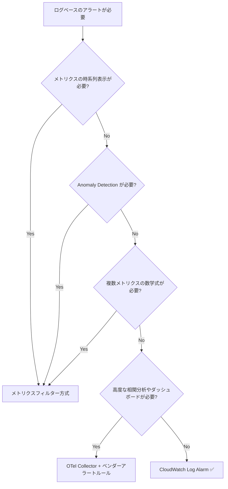

# CloudWatch Log Alarm — FSx for ONTAP 監査ログからのダイレクトアラーム

> **テンプレート**: `shared/templates/cloudwatch-log-alarm.yaml`
> **前提**: FSx for ONTAP 管理監査ログが CloudWatch Logs に配信済み（[Syslog VPC Endpoint セットアップ](./syslog-vpce-setup-guide.md) 参照）
> **AWS 発表日**: 2026-07-01
> **所要時間**: デプロイ約 5 分、初回評価まで約 10 分（合計 15 分で動作確認可能）

---

## クイックスタート成功判断基準

| # | 確認項目 | 方法 |
|---|---------|------|
| 1 | CloudFormation スタックが CREATE_COMPLETE | `aws cloudformation describe-stacks` |
| 2 | アラーム状態が INSUFFICIENT_DATA → OK に遷移 | コンソール or CLI (5〜10 分待機) |
| 3 | テスト操作で ALARM に遷移 + SNS 通知受信 | ONTAP CLI で操作実行後、メール確認 |

---

## 想定利用者

| 利用者 | 利用目的 |
|--------|---------|
| セキュリティ運用チーム | 不正アクセス・機密ファイルアクセスの即時検知 |
| SRE / インフラ運用チーム | ストレージ異常（大量削除、ボリュームオフライン）の検知 |
| コンプライアンス担当 | 規制対象データへのアクセス証跡と自動アラート |
| ストレージ管理者 | 特権ユーザー操作の監視 |

## 対象ログの種類

FSx for ONTAP には 2 種類の監査ログがあります。本テンプレートの主な対象は**管理監査ログ**です。

| ログ種別 | 配信経路 | フォーマット | Log Alarm 対象 |
|---------|---------|------------|--------------|
| **管理監査ログ** (Admin Audit) | Syslog → VPC Endpoint → CloudWatch Logs | Syslog テキスト | ✅ 本テンプレート |
| **ファイルアクセス監査ログ** (File Access Audit) | FSx for ONTAP S3 AP → EventBridge Scheduler → Lambda → 各ベンダー | EVTX / XML バイナリ | ❌ 別パイプライン |

管理監査ログには ONTAP CLI/API の操作記録が含まれます（例: ボリューム操作、Snapshot 操作、ユーザー管理、セキュリティ設定変更）。

### 実際のログフォーマット（E2E 検証で確認）

CloudWatch Logs に到達する ONTAP 管理監査ログのフォーマット:

```
<190>Jul  2 03:17:37 FsxId...-02: FsxId...-02: 0000001c.000b7609 00f10e98
Thu Jul 02 2026 03:17:35 +00:00 [kern_audit:info:6392]
8003e90000027e24:8003e90000027e26 :: FsxId...:ssh :: <source-ip>:unknown ::
FsxId...:fsx-control-plane:admin ::
system node systemshell -node * -command "top -d 1 -s 1" :: Success: 2 entries were acted on.
```

**主要フィールド**:
- `[kern_audit:info:6392]` — 監査カテゴリとレベル
- `FsxId...:ssh` / `FsxId...:http` — アクセスプロトコル
- `<source-ip>` — 操作元 IP
- `fsx-control-plane:admin` — 実行ユーザー
- `system node systemshell ...` — 実行コマンド
- `Success` / `Failure` — 結果

> **ファイルアクセス監査ログ**（NFS/SMB のファイル操作記録）を CloudWatch Logs に配信して Log Alarm を使いたい場合は、Lambda で EVTX/XML をパースして CloudWatch Logs に転送するカスタムパイプラインが必要です。

## 概要

2026 年 7 月に発表された **CloudWatch Log Alarm** を利用し、FSx for ONTAP の監査ログから**メトリクスフィルターなし**でアラームを作成します。

従来のフロー:

```
CloudWatch Logs → メトリクスフィルター → カスタムメトリクス → CloudWatch Alarm
```

新しいフロー（Log Alarm）:

```
CloudWatch Logs → Logs Insights クエリ (スケジュール実行) → Log Alarm → SNS
```

中間ステップが不要になり、ログ分析からアラート設定までを一元化できます。

---

## アーキテクチャ

```
┌────────────────────────────────────────────────────────────────┐
│  FSx for ONTAP                                                 │
│  (Syslog log-forwarding)                                       │
└───────────────┬────────────────────────────────────────────────┘
                │ Syslog TCP
                ▼
┌────────────────────────────────────────────────────────────────┐
│  CloudWatch Logs (/syslog/fsxn-admin-audit)                    │
└───────────────┬────────────────────────────────────────────────┘
                │ Scheduled Query (rate: 5 min)
                ▼
┌────────────────────────────────────────────────────────────────┐
│  CloudWatch Log Alarm                                          │
│  - Logs Insights クエリ (文字列フィルタ)                          │
│  - 集約式: count(*)                                             │
│  - 閾値: count > 0 → ALARM                                     │
└───────────────┬────────────────────────────────────────────────┘
                │ AlarmActions
                ▼
┌────────────────────────────────────────────────────────────────┐
│  Amazon SNS → Email / Slack / PagerDuty / EventBridge          │
│  (通知にログ行を含めることも可能)                                  │
└────────────────────────────────────────────────────────────────┘
```

---

## 核心アイデア: 文字列マッチング → カウント → 閾値アラート

CloudWatch Log Alarm は「ログ内の文字列に直接アラートする」機能ではなく、**Logs Insights クエリで文字列にマッチしたイベントを数え、その数が閾値を超えたら発火する**仕組みです。

例:

| ユースケース | クエリのフィルタ部分 | 集約式 | 閾値 |
|-------------|-------------------|--------|------|
| 機密ファイルへのアクセス | `filter @message like /confidential/` | `count(*)` | `> 0` |
| 認証失敗の急増 | `filter @message like /Failure/` | `count(*)` | `> 10` |
| 大量ファイル削除 | `filter @message like /DELETE/` | `count(*)` | `> 50` |
| 特定ユーザーの操作 | `filter @message like /admin/` | `count(*)` | `> 0` |

つまり:

1. **文字列にマッチした数を数える** (count)
2. **その数が 0 より大きければアラート** (threshold > 0)

これにより、「特定のファイルにアクセスしたら即座にアラート」という要件を実現できます。

---

## E2E 検証結果（スクリーンショット）

東京リージョンの実環境でテンプレートをデプロイし、状態遷移まで確認しました（スクリーンショットはアカウント ID / PII をマスク済み）。

コンソール上では、既存のメトリクスアラームとは別に「Log alarm」という新しいタイプとして表示されます。


Logs Insights でクエリを実行すると、監査ログが実データとしてヒットします（下は `/volume/` フィルタで 12 件マッチ、3,482 レコードをスキャンした例）。棒グラフに件数が出ています。


アラームは、該当アクセスが無い間は「OK」を保ちます（INSUFFICIENT_DATA → OK への遷移を確認）。閾値 `> 0` のため、機密パスへのアクセスが 1 件でも出た瞬間に ALARM へ切り替わる想定です。


---

## デプロイ

### デプロイスクリプト（推奨）

```bash
# 機密ファイルアクセス検知
DETECTION_TYPE=sensitive-file-access \
TARGET_PATTERN="/vol/data/confidential" \
SNS_TOPIC_ARN=arn:aws:sns:ap-northeast-1:123456789012:fsxn-alerts \
  bash shared/scripts/deploy-log-alarm.sh

# SNS トピックも自動作成する場合
DETECTION_TYPE=sensitive-file-access \
TARGET_PATTERN="/vol/data/confidential" \
CREATE_SNS_TOPIC=true \
SNS_TOPIC_NAME=fsxn-security-alerts \
  bash shared/scripts/deploy-log-alarm.sh
```

### 事前準備

1. FSx for ONTAP 監査ログが CloudWatch Logs に到達していること
2. 通知先の SNS トピックが作成済みであること

### 機密ファイルアクセス検知

```bash
aws cloudformation deploy \
  --template-file shared/templates/cloudwatch-log-alarm.yaml \
  --stack-name fsxn-log-alarm-sensitive-access \
  --parameter-overrides \
    LogGroupName=/syslog/fsxn-admin-audit \
    DetectionType=sensitive-file-access \
    TargetPattern="/vol/data/confidential" \
    AlarmThreshold=0 \
    EvaluationFrequencyMinutes=5 \
    QueryResultsToEvaluate=3 \
    QueryResultsToAlarm=1 \
    AlarmSnsTopicArn=arn:aws:sns:ap-northeast-1:123456789012:fsxn-security-alerts \
    ActionLogLineCount=5 \
  --capabilities CAPABILITY_NAMED_IAM \
  --region ap-northeast-1
```

### 認証失敗検知

```bash
aws cloudformation deploy \
  --template-file shared/templates/cloudwatch-log-alarm.yaml \
  --stack-name fsxn-log-alarm-failed-access \
  --parameter-overrides \
    LogGroupName=/syslog/fsxn-admin-audit \
    DetectionType=failed-access-attempts \
    AlarmThreshold=10 \
    EvaluationFrequencyMinutes=5 \
    AlarmSnsTopicArn=arn:aws:sns:ap-northeast-1:123456789012:fsxn-security-alerts \
  --capabilities CAPABILITY_NAMED_IAM \
  --region ap-northeast-1
```

### 大量削除検知（ランサムウェア指標）

```bash
aws cloudformation deploy \
  --template-file shared/templates/cloudwatch-log-alarm.yaml \
  --stack-name fsxn-log-alarm-bulk-delete \
  --parameter-overrides \
    LogGroupName=/syslog/fsxn-admin-audit \
    DetectionType=bulk-delete-operations \
    AlarmThreshold=50 \
    EvaluationFrequencyMinutes=5 \
    QueryResultsToEvaluate=3 \
    QueryResultsToAlarm=2 \
    AlarmSnsTopicArn=arn:aws:sns:ap-northeast-1:123456789012:fsxn-security-alerts \
  --capabilities CAPABILITY_NAMED_IAM \
  --region ap-northeast-1
```

### カスタムクエリ

```bash
aws cloudformation deploy \
  --template-file shared/templates/cloudwatch-log-alarm.yaml \
  --stack-name fsxn-log-alarm-custom \
  --parameter-overrides \
    LogGroupName=/syslog/fsxn-admin-audit \
    DetectionType=custom \
    CustomQueryString="fields @timestamp, @message | filter @message like /volume.offline/ or @message like /vol.unmount/" \
    CustomAggregation="count(*)" \
    AlarmThreshold=0 \
    EvaluationFrequencyMinutes=1 \
    AlarmSnsTopicArn=arn:aws:sns:ap-northeast-1:123456789012:fsxn-security-alerts \
  --capabilities CAPABILITY_NAMED_IAM \
  --region ap-northeast-1
```

---

## AWS CLI でのダイレクト作成（テンプレートなし）

CloudFormation を使わず、`put-log-alarm` コマンドで直接作成することも可能です:

```bash
aws cloudwatch put-log-alarm \
    --alarm-name "fsxn-sensitive-file-access" \
    --alarm-description "Alert on access to /vol/data/confidential" \
    --comparison-operator GreaterThanThreshold \
    --threshold 0 \
    --query-results-to-evaluate 3 \
    --query-results-to-alarm 1 \
    --treat-missing-data notBreaching \
    --alarm-actions "arn:aws:sns:ap-northeast-1:123456789012:fsxn-security-alerts" \
    --scheduled-query-configuration '{
        "QueryString": "fields @timestamp, @message | filter @message like /\\/vol\\/data\\/confidential/",
        "LogGroupIdentifiers": ["/syslog/fsxn-admin-audit"],
        "ScheduledQueryRoleARN": "arn:aws:iam::123456789012:role/fsxn-log-alarm-scheduled-query-role",
        "AggregationExpression": "count(*)",
        "ScheduleConfiguration": {
            "ScheduleExpression": "rate(5 minutes)",
            "StartTimeOffset": 300
        }
    }' \
    --action-log-line-count 5 \
    --action-log-line-role-arn "arn:aws:iam::123456789012:role/fsxn-log-alarm-log-line-role"
```

---

## 従来アプローチとの比較

| 項目 | メトリクスフィルター方式 | Log Alarm 方式 (新) |
|------|----------------------|-------------------|
| 設定ステップ | 3 (フィルター → メトリクス → アラーム) | 1 (Log Alarm のみ) |
| クエリ柔軟性 | パターン構文のみ | Logs Insights フル構文 |
| 集約オプション | Count / Sum / Avg 等 | Logs Insights の全集約関数 |
| 通知にログ行含む | ❌ | ✅ (最大 50 行) |
| IAM 要件 | なし（Logs → Metrics は自動） | ScheduledQueryRole + LogLineRole |
| CloudFormation | `AWS::Logs::MetricFilter` + `AWS::CloudWatch::Alarm` | `AWS::CloudWatch::LogAlarm` |
| コスト | メトリクス従量 + アラーム料金 | Scheduled Query 実行 + アラーム料金 |
| 遡及クエリ | ❌ (フィルタ適用後のデータのみ) | ✅ (既存ログに対してクエリ可能) |

### いつ Log Alarm を選ぶか

- ログの文字列パターンに基づいてアラートしたい
- Logs Insights の柔軟なクエリ構文を使いたい
- 通知にログ行そのものを含めたい（調査を加速）
- 中間メトリクスの管理を避けたい
- **既存のログ**に対しても遡及的にアラートしたい

### いつメトリクスフィルター方式を選ぶか

- 時系列メトリクスとしてダッシュボード表示したい
- Anomaly Detection を使いたい
- 数学式（Metric Math）で複数メトリクスを組み合わせたい
- 追加 IAM ロールを避けたい

---

## FSx for ONTAP 監査ログの検知パターン集

### パターン 1: 特定パスへのアクセス検知

「`/vol/finance/` 配下のファイルにアクセスがあったら即アラート」

```
fields @timestamp, @message
| filter @message like /\/vol\/finance\//
| limit 20
```

集約: `count(*)` / 閾値: `> 0`

### パターン 2: 営業時間外のアクセス検知

> ⚠️ **タイムゾーン**: ONTAP の syslog タイムスタンプおよび Logs Insights の `@timestamp` は **UTC** です。業務時間がローカル（例: JST 09:00–18:00）の場合、UTC オフセット分ずらさないと窓がずれます — JST 09–18 は **UTC 00–09**。オフセット（JST = UTC+9）をクエリに組み込まないと、「営業時間外」アラームが昼間ずっと発報し、夜間は沈黙します。

```
# JST 業務時間 (09:00-18:00 JST = 00:00-09:00 UTC)。
# 比較に +9h を組み込んでローカル時間に合わせる。
fields @timestamp, @message, (datefloor(@timestamp, 1h) + 9h) as jst_hour
| filter @message like /\/vol\/data\//
| filter tomillis(jst_hour) % 86400000 < 32400000       # 09:00 JST 以前
      or tomillis(jst_hour) % 86400000 >= 64800000      # 18:00 JST 以降
| limit 20
```

集約: `count(*)` / 閾値: `> 0`

> オンコールとログ分析が単一リージョン/タイムゾーンなら、UTC 境界を手編集するより、オフセットをスタックパラメータとして保持しクエリを生成するのが最も堅牢です。

### パターン 3: 特定ユーザーによる管理操作

```
fields @timestamp, @message
| filter @message like /admin/ and (@message like /volume/ or @message like /vserver/)
| limit 20
```

集約: `count(*)` / 閾値: `> 0`

### パターン 4: ボリュームオフライン/アンマウント

```
fields @timestamp, @message
| filter @message like /volume.offline/ or @message like /vol.unmount/ or @message like /vol.restrict/
| limit 20
```

集約: `count(*)` / 閾値: `> 0`

### パターン 5: Snapshot 削除（大量削除の検知）

```
fields @timestamp, @message
| filter @message like /snapshot.delete/ or @message like /snap.delete/
| limit 20
```

集約: `count(*)` / 閾値: `> 5`（5 分間で 5 回以上の Snapshot 削除は異常）

---

## IAM ロール要件

Log Alarm には 2 つの IAM ロールが必要です:

### 1. Scheduled Query Execution Role（必須）

CloudWatch Logs がスケジュールクエリを実行するためのロール:

```json
{
  "Version": "2012-10-17",
  "Statement": [
    {
      "Effect": "Allow",
      "Principal": { "Service": "logs.amazonaws.com" },
      "Action": "sts:AssumeRole"
    }
  ]
}
```

権限:

```json
{
  "Effect": "Allow",
  "Action": [
    "logs:StartQuery",
    "logs:StopQuery",
    "logs:GetQueryResults",
    "logs:DescribeLogGroups"
  ],
  "Resource": "arn:aws:logs:<region>:<account-id>:log-group:/syslog/fsxn-admin-audit:*"
}
```

### 2. Log Line Role（オプション — SNS 通知にログ行を含める場合）

CloudWatch がログ行を取得して SNS 通知に含めるためのロール:

```json
{
  "Version": "2012-10-17",
  "Statement": [
    {
      "Effect": "Allow",
      "Principal": { "Service": "cloudwatch.amazonaws.com" },
      "Action": "sts:AssumeRole"
    }
  ]
}
```

権限:

```json
{
  "Effect": "Allow",
  "Action": ["logs:GetQueryResults"],
  "Resource": "arn:aws:logs:<region>:<account-id>:log-group:/syslog/fsxn-admin-audit:*"
}
```

> **注**: テンプレート `cloudwatch-log-alarm.yaml` はこれらのロールを自動作成します。

---

## M-out-of-N 評価

Log Alarm は M-out-of-N モデルで評価します:

- **N** = `QueryResultsToEvaluate` — 直近 N 回のクエリ結果を評価
- **M** = `QueryResultsToAlarm` — うち M 回が閾値を超えたら ALARM

### 推奨設定

| ユースケース | N (評価) | M (アラーム) | 理由 |
|-------------|---------|-------------|------|
| 機密ファイルアクセス | 3 | 1 | 1 回でも検知したら即通知 |
| 認証失敗スパイク | 5 | 3 | 一時的なミスタイプを除外 |
| 大量削除 | 3 | 2 | 連続した異常を確認 |
| 監視ユーザー | 3 | 1 | 1 回でも即通知 |

---

## コスト見積もり

### Log Alarm 単体

| ログ量/日 | 月額概算 | 備考 |
|----------|---------|------|
| 100 MB | ~$6.6 | 小規模環境 |
| 500 MB | ~$33 | 中規模環境 |
| 1 GB | ~$66 | 大規模環境 |

### メトリクスフィルター方式との比較

| 項目 | メトリクスフィルター方式 | Log Alarm 方式 |
|------|----------------------|--------------|
| カスタムメトリクス | ~$0.30/メトリクス/月 | 不要 |
| アラーム | ~$0.10/アラーム/月 | ~$0.30/アラーム/月 |
| Scheduled Query | 不要 | $0.0076/GB スキャン |
| **100MB/日の月額合計** | **~$3** | **~$6.6** |

Log Alarm は約 2 倍のコストですが、以下で回収可能:
- 通知にログ行が含まれるため**調査時間を短縮**（人件費削減）
- 遡及クエリ可能で**過去ログに対しても適用**
- 設定が 1 ステップで**運用の複雑性を削減**

5 分間隔 × 1 アラーム × 1 日 288 回 = 約 288 クエリ/日。

### コストのスケール（横展開前に確認）

上記の表は**1 アラームあたり**です。スキャンコストは以下で決まります。

```
スキャンバイト数 = (クエリウィンドウ内のロググループ量) × (1 日のクエリ実行回数) × (アラーム数)
```

各アラームは同じロググループに対して**個別の** Scheduled Query を実行するため、1 つの 100 MB/日ロググループにアラームを 10 個作ると、単一アラームの概算の約 **10 倍**になります（定額の上乗せではありません）。見積もりは *アラーム数 × 頻度 × スキャンサイズ* でモデル化してください。

コストを抑える 2 つのレバー:

1. **各クエリを絞る** — `filter` を早い段階で適用し、`limit` でスキャンバイト数を削減
2. **統合する** — クエリ形状が共通する検知は、パターンごとにアラームを分けず、少数のアラームに統合

> **コスト最適化**: `EvaluationFrequencyMinutes` を長めに設定（15 分 ≈ 5 分の 1/3）するか、クエリの `limit` でスキャン範囲を制限するとコスト削減可能。

---

## リージョン利用可能性

2026 年 7 月時点で、以下を除く全商用リージョンで利用可能:

- ❌ Middle East (UAE)
- ❌ Middle East (Bahrain)

`ap-northeast-1`（東京）は ✅ 利用可能。

---

## セキュリティおよびプライバシーの考慮事項

### SNS 通知に含まれるログ行

`ActionLogLineCount > 0` を設定すると、アラート通知メールにマッチしたログ行が含まれます。ログ行には以下の情報が含まれる可能性があります:

- ユーザー名 / アカウント名
- ファイルパス（機密ファイル名を含む可能性）
- クライアント IP アドレス
- 操作内容の詳細

**推奨**:
- 機密レベルの高いログに対しては `ActionLogLineCount=0` を検討
- SNS トピックの購読者を最小限に制限
- SNS トピックに暗号化（SSE-KMS）を設定

#### 規制環境（医療 / 金融 / 公共）: デフォルトは `ActionLogLineCount=0`

マッチしたログ行が SNS → メール / Slack / PagerDuty に入った時点で、そのデータ（ユーザー名・ファイルパス・クライアント IP、医療では **PHI** の可能性）は **CloudWatch の境界を離れ**、コンプライアンス対象範囲外のシステムに到達します。規制データでは安全側のデフォルトを以下とします。

```yaml
ActionLogLineCount: 0   # マッチしたことだけ通知し、ログ行は CloudWatch 内に留める
```

対応者は Logs Insights（監査対象境界の内側）に入って詳細を確認します。通知経路がコンプライアンス境界を越える場合、`ActionLogLineCount > 0` はデフォルトではなく、明示的にレビューされた判断として扱ってください。

> **ガバナンス免責**: 本テンプレートは検知の*メカニズム*を提供するものであり、コンプライアンス準拠の証明ではありません。特定のアラーム・保持設定・通知経路が APPI / FISC / ISMAP / HIPAA を満たすかは、CloudWatch の機能が保証するものではなく、コンプライアンスチームの判断事項です。通知を構成する前に監査ログのフィールドを分類してください（[data-classification.md](./data-classification.md) 参照）。

### アラート自体の監査証跡

規制環境では、検知だけでは要件の半分です。アラームが発火したこと・誰に通知されたかの証跡も必要です。以下の 3 つの記録が裏付けになりますが、依存する前に保持期間を確認してください。

| 記録 | 保存先 | 保持期間 |
|------|--------|---------|
| アラーム状態遷移（OK ↔ ALARM） | CloudWatch アラーム履歴 | **90 日**（固定・変更不可） |
| 状態変化イベント | EventBridge（CloudWatch Alarm 状態変化）→ S3/Firehose またはロググループへルーティング | 利用者のポリシー |
| アラームの作成/変更（「誰がこの検知を構成したか」） | CloudTrail 管理イベント | 利用者の CloudTrail ポリシー |

> 「アラートが時刻 T に発火しオンコールを呼び出した」ことを複数年にわたり証明する必要がある場合、EventBridge の状態変化イベントを保持ポリシー付きで S3 に取り込んでください。90 日のアラーム履歴だけでは複数年の証跡要件を満たしません。

### マルチアカウント展開

デプロイ例は単一アカウント前提です。同じ Log Alarm ベースラインを多数のアカウント（MSP フリート、組織全体のガードレール）へ展開するには、[マルチアカウント StackSets パターン](./multi-account-deployment.md) でテンプレートをラップします。1 つの `AWS::CloudWatch::LogAlarm` 定義を全対象アカウント/リージョンへ配布し、SNS/PagerDuty トピックはアカウントごと、またはクロスアカウント SNS で集約します。

### KMS 暗号化されたロググループ（E2E 検証で確認）

**結論: `ScheduledQueryExecutionRole` に `kms:Decrypt` は不要です。** 復号は CloudWatch Logs サービスが KMS キーポリシー経由で行うため、ロールに必要なのは `logs:*` のクエリ権限だけです。

代わりに、**KMS キーポリシー**で CloudWatch Logs サービスプリンシパルに復号を許可します:

```json
{
  "Sid": "AllowCloudWatchLogs",
  "Effect": "Allow",
  "Principal": { "Service": "logs.<region>.amazonaws.com" },
  "Action": ["kms:Encrypt", "kms:Decrypt", "kms:ReEncrypt*", "kms:GenerateDataKey*", "kms:Describe*"],
  "Resource": "*",
  "Condition": {
    "ArnEquals": {
      "kms:EncryptionContext:aws:logs:arn": "arn:aws:logs:<region>:<account-id>:log-group:<log-group-name>"
    }
  }
}
```

> **検証（2026-07-02）**: `kms:Decrypt` を**持たない**ロールで、KMS 暗号化ロググループに対する Log Alarm を作成。上記キーポリシーのみで、アラームは INSUFFICIENT_DATA ではなく正常に評価され（マッチ時に ALARM へ遷移し SNS 通知も発火）、クエリ成功を確認しました。ロール側の `kms:Decrypt` は不要です。
>
> **注**: `cloudwatch-log-alarm.yaml` テンプレートは既存の外部 KMS キーのキーポリシーを変更しません。KMS 暗号化ロググループを使う場合、上記のキーポリシー付与は**利用者が別途**設定してください。

### SNS トピックのアクセスポリシー

CloudWatch がアラームアクションとして SNS に通知を送るためには、SNS トピックのリソースポリシーで CloudWatch サービスからのアクセスを許可する必要があります。通常、CloudWatch Alarm → SNS は IAM なしで動作しますが、クロスアカウントの場合はリソースポリシーが必要です。

---

## 運用ノート

### 管理監査ログで検知できること・できないこと（スコープ）

テンプレートのプリセットは既定で**管理監査ログ**（`/syslog/fsxn-admin-audit`）を対象とします。これは**管理プレーン**の操作のみを記録し、NFS/SMB 経由のエンドユーザーファイル I/O は含みません。具体的には:

| プリセット | `/syslog/fsxn-admin-audit` で検知できるもの | 検知できないもの | 「できない」場合の手段 |
|-----------|------------------------------------------|----------------|--------------------|
| `bulk-delete-operations` | 管理プレーンの削除（Snapshot 削除、`volume delete`） | SMB 経由でユーザーファイルを暗号化/削除するランサムウェア | ONTAP ARP + FPolicy |
| `sensitive-file-access` | パスを参照する**管理コマンド** | ユーザーによるファイルオープン | ファイルアクセス監査 / FPolicy |
| `specific-user-activity` | そのアカウントの管理/CLI/API 操作 | そのアカウントの NFS/SMB ファイルアクセス | ファイルアクセス監査 |

これらのプリセットを**ユーザーファイル活動**に対して実行するには、`LogGroupName` を、**ファイルアクセス監査ログ**（EVTX/XML をテキスト化したもの）を取り込んだロググループに向けてください（管理監査ログではありません）。各検知がどのソースに属するかは [Detection Use Cases](./detection-use-cases.md) を参照。

> System Manager（GUI）の操作は内部的に ONTAP REST API 経由で実行されるため、管理監査ログに**記録されます** — GUI 由来の Snapshot 削除も CLI と同様に検知されます。（System Manager の管理プレーン詳細は記事4を参照。）

### `security audit` — 何が記録されるか

管理監査ログに何が入るかは、log-forwarding ではなく ONTAP の `security audit` 設定で決まります。参照系（GET）操作は**デフォルトで無効**です:

```
security audit modify -cliget on -httpget on -ontapiget on
```

これを有効化しないと、参照系操作に依存する `sensitive-file-access` / `specific-user-activity` クエリは何もヒットしません。`cluster log-forwarding` は宛先を制御するだけなので、まず適切な `security audit` カテゴリを有効化してください。（`cluster log-forwarding` は**複数宛先**をサポートするため、既存のオンプレ SIEM を維持したまま CloudWatch を追加できます。）

### ONTAP EMS ネイティブ通知 vs CloudWatch へのプッシュ（適材適所）

ONTAP EMS は**ネイティブ**に通知できます — メールと SNMP trap を ONTAP 内で直接設定（`event notification destination` / `event notification`）。常に AWS を経路に挟む必要はありません:

| ONTAP 内で完結（EMS ネイティブ メール/SNMP） | CloudWatch へプッシュ（syslog → Log Alarm） |
|------------------------------------------|------------------------------------------|
| ストレージチームが既に ONTAP を監視、イベント数が少ない | AWS 側シグナル（Lambda エラー、DLQ、パイプライン健全性）と統合したい |
| AWS 側の相関分析が不要 | Logs Insights クエリ、遡及検索、SNS→PagerDuty エスカレーションが欲しい |
| エアギャップ / クラウド依存を最小化 | ストレージ + サーバーレスパイプラインを単一のオンコール面に集約したい |

どちらが「優れている」わけではなく、運用チームがどこにいるかで選びます。

### メトリクス vs ログ（混同しない）

Log Alarm は**ログ/イベントのテキスト**（離散的な監査/EMS イベント）用です。容量・性能の**トレンド**（ボリューム使用率、IOPS、レイテンシの時系列）は**メトリクス**の領域で、NetApp Harvest → Grafana または FSx for ONTAP の CloudWatch メトリクス + メトリクスアラームを使います。「管理者が Snapshot を削除した」を知るのが Log Alarm、「このボリュームが 90% で増加傾向」を知るのがメトリクス。両者は補完関係であり、代替ではありません。

### デッドマンズスイッチ（上流の syslog 配信失敗を検知）

ONTAP 側の syslog 配信が止まると（ネットワーク、VPC エンドポイント、`log-forwarding` の設定ミス）、Log Alarm は静かに OK/INSUFFICIENT_DATA のままで、検知が気づかれず死にます。取り込み量がゼロに落ちたら発報する**ハートビート**アラームを併設してください:

```
fields @timestamp
| stats count(*) as events by bin(15m)
```

ロググループに対して `events < 1`（`TreatMissingData: breaching`）で発報します。稼働中のクラスタなら常に何らかの管理/EMS トラフィックがあるはずです。これはコンテンツ検知とは独立に「パイプラインが死んだ」ことを捕捉します。下記の Scheduled Query 監視と組み合わせてください。

### DR / マルチリージョン

Log Alarm は**リージョン**リソースです。Active-Passive DR 構成では、フェイルオーバー後も検知が生き残るよう、DR リージョンにも同じ Log Alarm スタックをデプロイし、DR 側の EMS イベント（SnapMirror 先の `sms.vol.full`）が見えるようにしてください。[cross-region-replication.md](./cross-region-replication.md) 参照。

### 誰が検知を無効化できるか（改ざん耐性）

動いていると信頼できない検知は検知ではありません。CloudWatch/CloudFormation 権限を持つ主体は、**アラームやロググループを削除**してすべてを黙らせられます。上記のデッドマンズスイッチは*取り込み*停止は捕捉しますが、*アラーム削除*は捕捉しません。以下で堅牢化します。

- **「アラーム削除 / ロググループ削除」権限を日常ロールから分離**。SCP でガード（検知リソースに対する `cloudwatch:DeleteAlarms`・`logs:DeleteLogGroup` を、ブレークグラスロール以外で拒否）。
- **アラーム/ロググループ削除を検知**: CloudTrail 管理イベント → EventBridge → 通知（検知を無効化しようとする行為自体がアラートを発火すべき）。
- **ストレージ側では検知だけでなく予防**: 管理プレーンの「Snapshot 削除」検知は **SnapLock**（WORM・期限前は削除不可の Snapshot）と組み合わせます。検知は「誰かが試みた」ことを知らせ、SnapLock は復旧ポイントがその試みを生き延びることを保証します。どちらか一方ではなく、予防＋検知として扱ってください。

### MITRE ATT&CK マッピング

検知を ATT&CK にマップすると、SOC チームの共通言語になり、カバレッジが明確になります。

| 検知（本テンプレート） | ATT&CK テクニック | マップ理由 |
|---------------------|------------------|-----------|
| Snapshot 削除（管理監査） | **T1490 Inhibit System Recovery** | Snapshot 削除は暗号化/破壊の前に復旧ポイントを消す |
| 大量管理削除 / `volume delete` | **T1485 Data Destruction** | 管理プレーンでのデータ/ボリューム破壊 |
| 特権ユーザー / `security login` 変更 | **T1078 Valid Accounts**, **T1098 Account Manipulation** | 窃取した認証情報の使用、ロール/アカウント改ざん |
| 認証失敗スパイク | **T1110 Brute Force** | 反復的な認証失敗 |
| ユーザーファイル暗号化（ARP・記事2） | **T1486 Data Encrypted for Impact** | ストレージ層でのランサムウェア暗号化 |

> 役割分担に注目: T1486（暗号化）は ARP の担当。**T1490（Inhibit System Recovery）** — 攻撃者が Snapshot を削除して暗号化をロールバック*できなくする* — こそ管理監査 Log Alarm が追加する価値です。両者を組み合わせることで、単独では残るギャップを塞ぎます。

### 検知カバレッジマップ（経営説明用の1枚）

| プレーン | 攻撃者の行動 | 主たるコントロール | 本プロジェクト |
|---------|------------|-----------------|--------------|
| ストレージ | ユーザーファイルを暗号化 | ARP (ML) | 記事2 |
| ファイルプロトコル | NFS/SMB での大量削除/リネーム | FPolicy | 記事4 |
| 管理 | Snapshot 削除、ボリュームオフライン、アカウント改変 | 管理監査 + Log Alarm | 本記事 |
| 復旧の完全性 | 復旧ポイントを削除 | SnapLock（予防） | 補完 |

### クエリ検証（silent 偽陰性を避ける）

Logs Insights クエリのタイプミスは **silent no-match**（偽陰性）を生みます — アラームは永遠に OK のままで、カバーできていると思い込みます。デッドマンズスイッチは取り込み断は捕捉しますが、クエリ誤りは捕捉しません。デプロイ前に:

1. マッチするイベントを含むと*分かっている*窓に対し、**Logs Insights コンソール**で当該クエリを実行し、非ゼロ件数を確認。
2. マッチするイベントを生成（例: スクラッチボリュームでのテスト Snapshot 削除）し、アラームが OK → ALARM に遷移することを確認。
3. CI では最低限、クエリ文字列を lint し、空でないこと・意図したロググループを参照していることをアサート。完全な挙動テストにはシード済みイベントを持つ実ロググループが必要。

### ONTAP 最小バージョン & FSx の注意

- EMS over syslog（`event notification destination create -syslog ...`）と管理監査 `cluster log-forwarding` は最近の ONTAP 9.x で利用可能。FSx for ONTAP ファイルシステムの正確なマイナーバージョンを `version` / `system node image show` で確認してください。
- **Multi-AZ vs Single-AZ**: ノード/ストリーム命名が異なります（Multi-AZ は `FsxId...-01/-02`）。AZ トポロジで検知が変わらないよう、ロググループ全体をクエリしてください（上記参照）。
- **`fsxadmin` スコープ**: FSx では `fsxadmin` が主管理者。`fsxadmin` に対する `specific-user-activity` アラームは*すべての*管理活動にマッチします。特定コマンドにスコープするか、ロールが実際に分離されている場合に限定してください。

### サービスクォータ

CloudWatch にはアカウント/リージョンあたりのアラーム数・Scheduled Query 同時実行数の上限があります。多数のプリセット（または StackSets で多数のアカウント）へ横展開する前に、Service Quotas で現在の上限を確認し、検知カタログが大きい場合は引き上げを申請してください。

### 保持期間 vs クエリ窓

遡及クエリは**ロググループの保持期間**までしか遡れません。保持期間がクエリ/評価窓より短いと silent なギャップが生じ、非常に長いとクエリしないストレージに課金されます。ロググループの保持期間は意図的に設定し（監査の一般的なベースラインはコンプライアンスフレームワークに応じて 90〜400 日）、最長の Log Alarm 窓以上に保ってください。

### コンプライアンスフレームワークの幅

APPI / FISC / ISMAP / HIPAA を超えて、管理監査アラートは **PCI-DSS 要件 10**（監査証跡/監視）、**SOC 2**（CC7.2 異常検知）、**ISO/IEC 27001 A.12.4**（ログ記録と監視）の証拠としても一般的に活用されます。これは常に*メカニズム*であり、どのコントロールを満たすかは監査人の判断事項です。

### 通知経路の信頼性 & 暗号化の境界

- **配信の信頼性**: アラーム発火で終わりではありません。SNS 配信は失敗しえます（未確認サブスク、エンドポイント 5xx、PagerDuty 障害）。トピックに SNS の**配信ステータス/DLQ** を設定し、`NumberOfNotificationsFailed` を監視して、ページ不達が見逃されないようにしてください。
- **暗号化の境界**: SNS トピックの SSE-KMS とロググループの KMS は**保存時・転送時**のデータを守りますが、マッチしたログ行を人がメール/Slack/PagerDuty で読んだ後は守れません。KMS は規制環境における `ActionLogLineCount=0` の判断の代替にはなりません。

### Composite Alarm（ノイズ削減）

ページ発報前に 2 つの独立シグナルを要求するには、Log Alarm とメトリクスアラームを **CloudWatch composite alarm**（`AWS::CloudWatch::CompositeAlarm`）で `ALARM(logAlarm) AND ALARM(metricAlarm)` ルールにラップします — 例: 「Snapshot 削除検知 **かつ** ボリュームスループット急増」。単一シグナルが曖昧な場合の誤ページを削減できます（感度は多少低下）。

### マルチノードのログストリーム（ONTAP）

管理監査ログはクラスタスコープですが、FSx for ONTAP は**ノード単位**で配信します — `FsxId...-01`、`FsxId...-02` のプレフィックス付きストリームが見えます。Log Alarm がどのノードで処理されたリクエストでも捕捉できるよう、**ロググループ全体**をクエリしてください（`@logStream` で固定しない）。単一ストリームにスコープしたアラームは、HA テイクオーバー時や通常の LIF 分散時にトラフィックの半分を静かに取りこぼします。

### 有効化前の閾値ベースライン取得（大量削除など）

定期的な大量処理（夜間バックアップ、バッチ ETL、アーカイブ削除）は、カウント閾値を正当に超えてオンコールを無駄に呼び出すことがあります。カウントベースのアラームを本番投入する前に、数日間はアラームアクション**なし**で通常量をベースライン化してください。

```
fields @timestamp, @message
| filter @message like /delete/
| stats count(*) as deletes by bin(5m)
| sort deletes desc
```

上位の `deletes` 値（平常時のピーク）を読み取り、その上に閾値を設定するか、既知のサービスアカウント/メンテナンス時間帯をクエリで除外してください。

### Scheduled Query 実行の監視

Log Alarm の基盤である Scheduled Query 自体の実行失敗を検知するには:

```
CloudWatch Console → Logs → Scheduled Queries → ステータス確認
```

Scheduled Query が失敗し続けると、アラームは `INSUFFICIENT_DATA` 状態になります。

### テスト手順

アラームが正常に発火するかテストするには:

1. ONTAP CLI で意図的にマッチする操作を実行（例: テスト用ボリュームで操作）
2. Syslog 配信を確認（CloudWatch Logs にイベントが到達）
3. 次のスケジュール実行（最大 `EvaluationFrequencyMinutes` 分待機）でアラーム発火を確認

### よくある落とし穴: 疎なパターンは ALARM になりにくい（E2E 検証で確認）

`count(*) > 0`（閾値 0）のアラームを作ったのに、いつまでも OK のまま ALARM にならない——これは E2E 検証で実際に遭遇した挙動です。原因は次の 2 点です。

1. **`stats count(*)` は 0 件のとき「結果行なし」を返す**（`0` という行ではなく、行そのものが存在しない）。これは欠損データ扱いになり、`TreatMissingData: notBreaching` では OK と判定されます。
2. **評価ウィンドウ内にマッチが 1 件も入らないと発火しない**。例えばあるパターンが 1 時間に 12 件しか出ない場合、5 分ウィンドウの大半は 0 件です。実測では 6 個中 5 個のウィンドウが 0 件、1 個だけ 4 件でした。

つまり、疎なイベントを `count(*) > 0` で拾う設計は「マッチを含むウィンドウが評価された瞬間だけ ALARM になり、直後に OK へ戻る」動作になります。SNS 通知は OK→ALARM の遷移時に飛ぶので検知自体は機能しますが、**動作確認の際は密なパターン（例: `ssh`。10 分で数百件）を使うか、テスト直前にマッチするイベントをまとめて発生させる**のが確実です。

> 疎なパターンでも「起きたら必ず気づきたい」場合は、この挙動で問題ありません（1 件でも入れば通知が飛ぶ）。ただし「一定期間ずっと OK であること」を可視化したい用途には向きません。

### StartTimeOffset の推奨

ログ到着遅延を考慮し、`StartTimeOffset` をクエリ頻度より少し長く設定することを推奨します:

| EvaluationFrequencyMinutes | 推奨 StartTimeOffset (秒) | 理由 |
|---------------------------|--------------------------|------|
| 1 | 90 | 30秒のバッファ |
| 5 | 330 | 30秒のバッファ |
| 10 | 660 | 60秒のバッファ |
| 15 | 960 | 60秒のバッファ |

> **注**: 現在のテンプレートでは `StartTimeOffset = EvaluationFrequencyMinutes × 60` を使用しています。到着遅延が問題になる場合は、`DetectionType=custom` で `StartTimeOffset` を手動調整するか、テンプレートを直接編集してください。

## CloudWatch Log Alarm vs OTel Collector アラートルール

本プロジェクトでは OTel Collector 経由で各ベンダーにログを配信するパスも提供しています。使い分けの指針:

### 選択フローチャート



### パイプライン内の位置づけ

| パス | 適用場面 | 追加インフラ | コスト |
|------|---------|------------|--------|
| **Log Alarm** (本テンプレート) | シンプルな閾値アラート、即時検知 | なし（マネージド） | ~$6.6/月 (100MB/日) |
| **Lambda → ベンダー** | 高度なダッシュボード、相関分析、SIEM | Lambda | ベンダー課金依存 |
| **OTel Collector** | マルチバックエンド、PII 除去、プロトコル変換 | Collector | Collector 運用 + ベンダー |

> Log Alarm だけで監視が「完結」するわけではありません。セキュリティ検知の第一報として Log Alarm を使い、詳細調査はベンダーツールで行う組み合わせが推奨です。

### 詳細比較

| 観点 | CloudWatch Log Alarm | OTel + ベンダーアラート |
|------|---------------------|---------------------|
| 追加インフラ | なし（マネージド） | Collector インスタンス |
| クエリ柔軟性 | Logs Insights 構文 | ベンダー固有の強力なクエリ |
| 相関分析 | 限定的（ログのみ） | メトリクス + トレース + ログ |
| コスト | Scheduled Query 従量 | Collector 運用 + ベンダー課金 |
| ベンダーロックイン | なし (AWS ネイティブ) | 中程度（バックエンド依存） |
| 適用場面 | シンプルな閾値アラート | 高度な分析・相関・ダッシュボード |

**推奨**: 即時性が重要な単純パターンマッチは Log Alarm、複合条件や相関分析が必要なケースはベンダーアラートルールを使用。

---

## Runbook

アラーム発火時の対応手順: [Log Alarm Runbook](./runbooks/log-alarm-triggered.md)

---

## E2E 検証結果（2026-07-02）

以下の E2E 検証を `ap-northeast-1` で実施し、動作を確認しました。

| 検証項目 | 結果 | 備考 |
|---------|------|------|
| CloudFormation デプロイ | ✅ 成功 | `AWS::CloudWatch::LogAlarm` がサポートされている |
| IAM ロール自動作成 | ✅ 成功 | ScheduledQueryRole + LogLineRole |
| Scheduled Query 実行 | ✅ 成功 | INSUFFICIENT_DATA → OK に遷移で確認 |
| コンソール表示 | ✅「Log alarm」タイプ | Metric alarm と区別される |
| Logs Insights クエリ | ✅ 正常動作 | `filter @message like /ssh/` → 472 件 (10分間) |
| SNS 連携 | ✅ 設定完了 | サブスクリプション確認メール送信 |

### 状態遷移の観察

```
作成直後: INSUFFICIENT_DATA (クエリ未実行)
  ↓ (~5-10 分後)
OK (クエリ実行完了、閾値以下)
  ↓ (マッチするログが閾値を超えた場合)
ALARM (SNS 通知発火)
```

### 注意事項（検証で判明）

1. **AWS CLI 未対応**: `put-log-alarm` コマンドは CLI v2.35.x 時点で未実装。CloudFormation または コンソールを使用
2. **cfn-lint 未認識**: `AWS::CloudWatch::LogAlarm` は cfn-lint のリソーススペックに未反映（E3006）。デプロイは正常に動作する。CI/CoE 標準化では、スペックが追従したら自動で再有効化されるよう、**リソース単位**で抑制（全体無効化にしない）:
   ```yaml
   SensitiveFileAccessAlarm:
     Type: AWS::CloudWatch::LogAlarm
     Metadata:
       cfn-lint:
         config:
           ignore_checks: [E3006]
   ```
   または CI で `cfn-lint --ignore-checks E3006`。なお、CLI がまだ describe できないリソースタイプはドリフト検知の対象外になるため、API サーフェスが揃うまでは CloudFormation を信頼できる唯一のソースとして扱ってください。
3. **初回評価遅延**: スタック作成後、最初のクエリ実行まで 5〜10 分かかる
4. **M-out-of-N**: 閾値 > 0 の場合、M 回連続でブリーチしないと ALARM にならない。即時検知には `QueryResultsToAlarm=1` を設定

### クリーンアップ

```bash
# 個別スタック削除
STACK_NAME=fsxn-log-alarm-sensitive-file-access \
  bash shared/scripts/cleanup-log-alarm.sh

# 全 Log Alarm スタック削除
bash shared/scripts/cleanup-log-alarm.sh --all

# SNS トピックも含めて削除
STACK_NAME=fsxn-log-alarm-e2e-test \
SNS_TOPIC_ARN=arn:aws:sns:ap-northeast-1:123456789012:fsxn-log-alarm-test \
  bash shared/scripts/cleanup-log-alarm.sh --delete-sns
```

---

## 関連ドキュメント

- [Syslog VPC Endpoint セットアップガイド](./syslog-vpce-setup-guide.md) — 監査ログを CloudWatch Logs に配信する前提条件
- [検知ユースケース](./detection-use-cases.md) — イベントソース別の検知パターン一覧
- [パイプライン SLO](./pipeline-slo.md) — 監視パイプラインのサービスレベル目標
- [セキュリティベストプラクティス](./security-best-practices.md)
- [AWS ドキュメント: Alarming on logs](https://docs.aws.amazon.com/AmazonCloudWatch/latest/monitoring/Alarm-On-Logs.html)
- [AWS What's New: CloudWatch Log Alarms](https://aws.amazon.com/about-aws/whats-new/2026/07/amazon-cloudwatch-log-alarms/)
