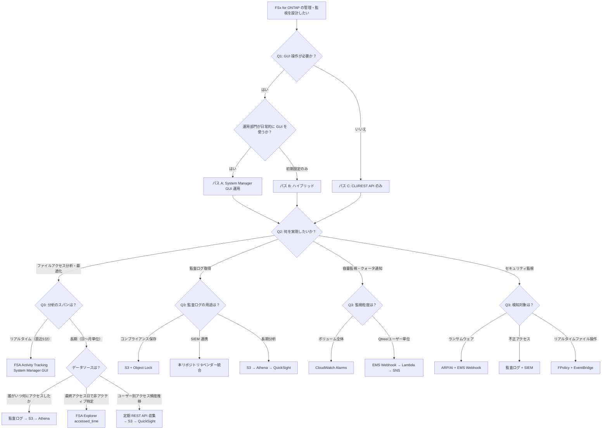

# FSx for ONTAP 管理・監視 Decision Tree

🌐 **日本語**（このページ） | [English](../en/decision-tree-management-monitoring.md)

## 概要

本ドキュメントは、FSx for ONTAP の管理・監視方法について、ユーザーの要件に基づいて最適なアーキテクチャパスを案内する Decision Tree です。

全ての記載内容は **2026年5月28日の実機検証** に基づいており、引用元リンクとスクリーンショットを付記しています。

> **検証環境**
>
> ONTAP 9.17.1P6 / SINGLE_AZ_1 / NetApp Console + Link (Lambda)

---

## 検証で確認された事実

### System Manager へのアクセス

| 事実 | スクリーンショット | 引用元 |
|------|-----------------|--------|
| 管理エンドポイントへの直接ブラウザアクセスでは System Manager UI は表示されない（404） | — | 実機検証 |
| NetApp Console > Systems > FSx for ONTAP カード選択 → 右パネル SERVICES > **System Manager: Open** で利用可能 | [48-systems-card-selected.png](../../integrations/netapp-console/system-manager/screenshots/48-systems-card-selected.png) | [AWS Docs](https://docs.aws.amazon.com/fsx/latest/ONTAPGuide/managing-resources-ontap-apps.html) |
| System Manager URL: `https://console.netapp.com/system-manager/<file-system-id>` | [49-system-manager-dashboard.png](../../integrations/netapp-console/system-manager/screenshots/49-system-manager-dashboard.png) | 実機検証 |
| Link（Lambda < $1/月）で十分。Console Agent（EC2 t3.xlarge ~$120/月）は不要 | — | [NetApp Docs - Quick Start](https://docs.netapp.com/us-en/storage-management-fsx-ontap/start/task-getting-started-fsx.html) |
| クレデンシャル管理: `console.workloads.netapp.com` > Menu > Administration > Credentials | [13-workload-factory-administration.png](../../integrations/netapp-console/system-manager/screenshots/13-workload-factory-administration.png) | [NetApp Docs - Add Credentials](https://docs.netapp.com/us-en/workload-setup-admin/add-credentials.html) |

### System Manager で GUI 操作可能な項目

| 操作 | System Manager パス | スクリーンショット | 引用元 |
|------|-------------------|-----------------|--------|
| ボリューム管理 | Storage > Volumes | [51-sm-volumes-list.png](../../integrations/netapp-console/system-manager/screenshots/51-sm-volumes-list.png) | 実機検証 |
| 監査ログ設定 | Storage VMs → Settings → Audit | [60-sm-audit-logs.png](../../integrations/netapp-console/system-manager/screenshots/60-sm-audit-logs.png) | [AWS Docs - Auditing](https://docs.aws.amazon.com/fsx/latest/ONTAPGuide/file-access-auditing.html) |
| Qtree 作成 | Storage → Qtrees | [58-sm-qtrees.png](../../integrations/netapp-console/system-manager/screenshots/58-sm-qtrees.png) | [NetApp Docs - Quotas](https://docs.netapp.com/us-en/ontap/task_quotas_to_limit_resources.html) |
| クォータ設定 | Storage → Quotas | [59-sm-quotas.png](../../integrations/netapp-console/system-manager/screenshots/59-sm-quotas.png) | 同上 |
| Quota Usage 確認 | Volumes → [vol] → Quota Usage タブ | [57-sm-quota-usage.png](../../integrations/netapp-console/system-manager/screenshots/57-sm-quota-usage.png) | 実機検証 |
| **FSA Activity Tracking** | Volumes → [vol] → File system → Activity | [54-sm-fsa-activity.png](../../integrations/netapp-console/system-manager/screenshots/54-sm-fsa-activity.png) | [NetApp Docs - Activity Tracking](https://docs.netapp.com/us-en/ontap/file-system-analytics/activity-tracking-task.html) |
| **FSA Explorer** | Volumes → [vol] → File system → Explorer | [55-sm-fsa-explorer.png](../../integrations/netapp-console/system-manager/screenshots/55-sm-fsa-explorer.png) | [NetApp Docs - View Activity](https://docs.netapp.com/us-en/ontap/task_nas_file_system_analytics_view.html) |
| **FSA Usage** | Volumes → [vol] → File system → Usage | [56-sm-fsa-usage.png](../../integrations/netapp-console/system-manager/screenshots/56-sm-fsa-usage.png) | 同上 |
| SMB 共有管理 | Storage → SMB shares | — | 実機検証 |
| パフォーマンス確認 | Dashboard (Latency, IOPS, Throughput) | [50-system-manager-loaded.png](../../integrations/netapp-console/system-manager/screenshots/50-system-manager-loaded.png) | 実機検証 |
| EMS Webhook 設定 | ❌ GUI 未対応 | — | CLI のみ |
| FPolicy 設定 | ❌ GUI 未対応 | — | CLI のみ |

### FSA (File System Analytics) のデータ特性

| 項目 | 値 | 引用元 |
|------|-----|--------|
| Activity Tracking 更新間隔 | 10-15秒ごと | [Activity Tracking](https://docs.netapp.com/us-en/ontap/file-system-analytics/activity-tracking-task.html): "refresh every 10 to 15 seconds" |
| データ粒度 | 直前5秒間のホットスポット | 同上: "pertaining to hot spots seen in the system over the previous five-second interval" |
| Timeline 保持期間 | **直近5分間のみ** | 同上: "retaining the previous five minutes of data" |
| CSV ダウンロード | **point-in-time スナップショット** | 同上: "display all the point-in-time data captured for the selected volume" |
| Timeline 制限 | ページ表示中のみ収集。離脱で停止 | 同上: "automatically be disabled when you navigate away from the Activity tab" |
| 監視カテゴリ | Directories, Files, Clients, Users | 同上 |
| メトリクス | Read/Write IOPS, Read/Write throughput | 同上 |
| Explorer の非アクティブ期間 | カスタマイズ可能（デフォルト1年） | [View Activity](https://docs.netapp.com/us-en/ontap/task_nas_file_system_analytics_view.html): "you can customize the range to be reported" |
| accessed_time 表示条件 | `-atime-update` が有効な場合のみ | 同上: "if the volume default has been altered...only last modified time is shown" |

### FSA 有効化時の注意事項

| 注意点 | 詳細 | 引用元 |
|--------|------|--------|
| **パフォーマンス影響** | FSA 初期スキャン時にレイテンシが上昇する可能性あり | [NetApp KB: High or fluctuating latency after turning on FSA](https://kb.netapp.com/Advice_and_Troubleshooting/Data_Storage_Software/ONTAP_OS/High_or_fluctuating_latency_after_turning_on_NetApp_ONTAP_File_System_Analytics) |
| **`-atime-update` 前提条件** | 無効の場合、Explorer の accessed_time が更新されず非アクティブファイル分析が機能しない | [View Activity](https://docs.netapp.com/us-en/ontap/task_nas_file_system_analytics_view.html) |
| **初期スキャン時間** | ボリューム内のファイル数に比例。大量ファイルがある場合は数時間かかる可能性 | [FSA Overview](https://docs.netapp.com/us-en/ontap/concept_nas_file_system_analytics_overview.html) |
| **推奨**: 本番有効化前にテストボリュームで影響を確認すること | — | — |

---

## Decision Tree フローチャート



---

## パス別実装ガイド

### NetApp Console 接続方式

| 方式 | コンポーネント | 月額コスト | 用途 |
|------|-------------|-----------|------|
| **Link（推奨）** | AWS Lambda + IAM ロール | **< $1** | System Manager アクセス、ONTAP REST API |
| Console Agent | EC2 t3.xlarge | ~$120-150 | CVO デプロイ等（FSx for ONTAP には不要） |

**Link 作成に必要な IAM 権限**:

```json
{
  "Action": [
    "lambda:CreateFunction", "lambda:InvokeFunction", "lambda:GetFunction",
    "iam:CreateRole", "iam:AttachRolePolicy", "iam:PassRole",
    "cloudformation:CreateStack", "cloudformation:DescribeStacks",
    "ec2:DescribeNetworkInterfaces", "ec2:DescribeVpcs",
    "ec2:DescribeSubnets", "ec2:DescribeSecurityGroups",
    "fsx:DescribeFileSystems", "fsx:DescribeStorageVirtualMachines"
  ]
}
```

引用元: [NetApp Docs - Add Credentials](https://docs.netapp.com/us-en/workload-setup-admin/add-credentials.html) + 実機検証

スクリーンショット: [26-cloudformation-quick-create.png](../../integrations/netapp-console/system-manager/screenshots/26-cloudformation-quick-create.png)

---

### パス A: System Manager GUI 運用

**アクセスパス**: NetApp Console > Systems > FSx for ONTAP カード > SERVICES > System Manager: Open

スクリーンショット: [48-systems-card-selected.png](../../integrations/netapp-console/system-manager/screenshots/48-systems-card-selected.png)

```
セットアップ所要時間: 1-2 営業日
月額コスト: Link < $1
```

| 操作 | GUI パス | CLI 必要か |
|------|---------|-----------|
| 監査ログ有効化 | Storage VMs → Audit | GUI で可能 |
| Qtree 作成 | Storage → Qtrees | GUI で可能 |
| クォータ設定・初期化 | Storage → Quotas | GUI で可能 |
| FSA Activity Tracking 有効化 | Volumes → File system → Activity トグル | GUI で可能 |
| FSA Explorer（非アクティブファイル特定） | Volumes → File system → Explorer | GUI で可能 |
| Quota Usage 確認 | Volumes → Quota Usage | GUI で可能 |
| EMS Webhook 設定 | — | **CLI のみ** |
| FPolicy 設定 | — | **CLI のみ** |

### パス B: ハイブリッド（推奨）

```
Phase 1 (即日): CLI/REST API で初期設定
  - 監査ログ有効化
  - Qtree + クォータ設定
  - EMS Webhook 設定
  - FSA + Activity Tracking 有効化

Phase 2 (1-2日後): NetApp Console セットアップ
  - System Manager で日常監視
  - FSA Explorer で非アクティブデータ確認
  - Quota Usage で容量確認
```

### パス C: CLI/REST API のみ

```
セットアップ所要時間: 即日
月額コスト: Lambda/SNS ~$5（通知のみ）
```

---

## テレメトリコスト見積もり

> ⚠️ 以下は **サイジング参考値** であり、サービス上限や保証価格ではありません。実際のコストは利用量・リージョン・データ転送量により変動します。

### 前提条件

- FSx for ONTAP: 1 ファイルシステム、4 SVM、12 ボリューム
- CIFS ユーザー: 50名、1日あたり平均 500 ファイルアクセス/ユーザー
- 監査ログ量: 約 25,000 イベント/日 → 約 50MB/日 → **約 1.5GB/月**
- EMS イベント: 約 10-50 件/月（クォータ超過、ARP 等）

### コスト比較表

| コンポーネント | 月額コスト | 内訳 |
|-------------|-----------|------|
| **Link (Lambda)** | < $1-2 | Lambda 呼び出し（30分ごとの定期実行あり: ~1,440回/月 + 操作時）|
| **EMS 通知 (Lambda + SNS)** | ~$5 | Lambda: ~$1、SNS: ~$0.50、API Gateway: ~$3 |
| **監査ログ保存 (S3)** | ~$0.04 | 1.5GB × $0.025/GB (S3 Standard) |
| **Athena クエリ (月10回)** | ~$0.08 | 1.5GB スキャン × 10回 × $0.005/GB |
| **CloudWatch Alarms (3個)** | ~$0.30 | $0.10/アラーム × 3 |
| **合計 (AWS ネイティブ)** | **~$6-7/月** | |

### Grafana Cloud を使う場合の追加コスト

| コンポーネント | 月額コスト | 内訳 |
|-------------|-----------|------|
| Loki (ログ) | ~$5-15 | 1.5GB/月 (プランによる) |
| Mimir (メトリクス) | ~$3-8 | FSA + CW メトリクス |
| Grafana (ダッシュボード) | $0 (Free tier) | 3ユーザーまで無料 |
| **合計 (Grafana Cloud 追加)** | **~$8-23/月** | |

### セルフホスト Grafana (Harvest + AMP + AMG) の場合

| コンポーネント | 月額コスト |
|-------------|-----------|
| Harvest (ECS Fargate) | ~$36 |
| NAT Gateway | ~$45 |
| AMP | ~$5 |
| AMG | ~$9 |
| **合計** | **~$95-250/月** |

参考: [management-console/README.md](../../management-console/README.md)

---

## ファイルアクセス分析の設計ガイド

### Q: 「利用していないユーザーの権限剥奪やファイル削除の最適化」をしたい

この要件には **複数のデータソースの組み合わせ** が必要です。

| 分析目的 | 最適なデータソース | データスパン | GUI 操作 | 引用元 |
|---------|-----------------|-----------|---------|--------|
| **今この瞬間のホットスポット** | FSA Activity Tracking | 直近5秒〜5分 | ✅ System Manager | [Activity Tracking](https://docs.netapp.com/us-en/ontap/file-system-analytics/activity-tracking-task.html) |
| **長期間アクセスされていないファイル** | FSA Explorer (accessed_time) | 最終アクセス日（カスタマイズ可能、デフォルト1年） | ✅ System Manager | [View Activity](https://docs.netapp.com/us-en/ontap/task_nas_file_system_analytics_view.html) |
| **誰がいつ何にアクセスしたか（履歴）** | 監査ログ (EVTX/JSON) | 無制限（S3 保存） | ❌ CLI + パイプライン | [AWS Docs - Auditing](https://docs.aws.amazon.com/fsx/latest/ONTAPGuide/file-access-auditing.html) |
| **ユーザー別アクセス頻度の推移** | 監査ログ集計 or 定期 REST API 収集 | 無制限（S3 保存） | ❌ Lambda + Athena | 本リポジトリ |
| **クォータ超過通知** | EMS Webhook | リアルタイム | ❌ CLI 設定 | 本リポジトリ `docs/ja/event-sources.md` |

### FSA Activity Tracking の CSV ダウンロードについて

> ⚠️ **重要**: CSV ダウンロードは **その時点のスナップショット（point-in-time）** です。長期間の時系列データの蓄積・エクスポートではありません。

引用元: [Activity Tracking](https://docs.netapp.com/us-en/ontap/file-system-analytics/activity-tracking-task.html)
> "Activity data can be downloaded in a CSV format that will display all the point-in-time data captured for the selected volume."

Timeline 機能（ONTAP 9.11.1+）を有効化しても保持されるのは **直近5分間のみ**:
> "retaining the previous five minutes of data"
> "Timeline data is only retained for fields that are visible area of the page."

### 推奨アーキテクチャ: 長期ファイルアクセス分析

```
┌─────────────────────────────────────────────────────────────────┐
│ リアルタイム分析（FSA — System Manager GUI）                       │
├─────────────────────────────────────────────────────────────────┤
│  Activity Tracking: Top files/users by IOPS/throughput (5秒更新) │
│  Explorer: ディレクトリ構造 + 最終アクセス日 + 非アクティブ比率    │
│  Usage: ユーザー別使用量                                         │
│  → CSV ダウンロード可能（point-in-time スナップショット）         │
└─────────────────────────────────────────────────────────────────┘

┌─────────────────────────────────────────────────────────────────┐
│ 長期分析（監査ログ + パイプライン）                                │
├─────────────────────────────────────────────────────────────────┤
│  監査ログ (EVTX/JSON)                                           │
│    → S3 バケット（無制限保存）                                    │
│    → Athena (SQL 分析)                                           │
│    → QuickSight ダッシュボード                                    │
│      - 非アクティブユーザー一覧（90日以上アクセスなし）            │
│      - ユーザー別アクセス頻度ランキング（月次推移）                │
│      - ディレクトリ別容量 + 最終アクセス日                         │
│                                                                  │
│  または: 本リポジトリの Observability パイプライン                 │
│    → Datadog / Splunk / Grafana 等（9ベンダー E2E 検証済み）      │
└─────────────────────────────────────────────────────────────────┘
```

---

## 容量監視・通知の設計ガイド

| 監視対象 | 方法 | リアルタイム性 | GUI 設定 | 引用元 |
|---------|------|-------------|---------|--------|
| ボリューム容量 80%/90% | CloudWatch Alarms | 5分間隔 | ✅ AWS コンソール | [AWS Docs - CloudWatch](https://docs.aws.amazon.com/fsx/latest/ONTAPGuide/monitoring-cloudwatch.html) |
| **Qtree クォータ超過** | EMS Webhook → Lambda → SNS | リアルタイム | ❌ CLI 設定 | 本リポジトリ `docs/ja/event-sources.md` |
| Quota Usage 確認 | System Manager GUI | 手動確認 | ✅ | [57-sm-quota-usage.png](../../integrations/netapp-console/system-manager/screenshots/57-sm-quota-usage.png) |

> **CloudWatch では Qtree 単位の監視は不可**。Qtree クォータ通知には EMS Webhook が必須。

---

## FAQ

### Q1: System Manager は無料で使えますか？

**A**: はい、無料です。NetApp Console > Systems > FSx for ONTAP > SERVICES > System Manager: Open でアクセスします。Link（Lambda < $1/月）が必要です。Console Agent（EC2 ~$120/月）は不要です。

**実測コスト**: 当環境では Lambda Link の呼び出し回数は平均 113回/日（約 $0.008/月）でした。アクティブに操作しても月額 $1 を大きく下回ります。

> ⚠️ **Link 作成時の注意**: 「自動作成」を選択すると、Lambda が VPC 外に作成される場合があります。System Manager の読み込みに失敗する場合は、「手動作成」で VPC・サブネット・セキュリティグループを明示的に指定して再作成してください。手動作成の手順は [classmethod 検証記事](https://dev.classmethod.jp/articles/amazon-fsx-for-netapp-ontap-netapp-console/) を参照。

スクリーンショット: [48-systems-card-selected.png](../../integrations/netapp-console/system-manager/screenshots/48-systems-card-selected.png)

### Q2: 監査ログ・クォータは GUI で設定できますか？

**A**: はい、System Manager 内で全て GUI 操作可能です。EMS Webhook と FPolicy のみ CLI が必要です。

### Q3: FSA で長期間の時系列データは取れますか？

**A**: いいえ。Activity Tracking の CSV は point-in-time スナップショットで、Timeline は直近5分間のみです。長期分析には**監査ログ（S3 → Athena）** を使用してください。

引用元: [Activity Tracking](https://docs.netapp.com/us-en/ontap/file-system-analytics/activity-tracking-task.html)

### Q4: 非アクティブファイルの特定は GUI でできますか？

**A**: はい。FSA Explorer（Volumes → File system → Explorer）で、最終アクセス日に基づく非アクティブデータの比率が表示されます。非アクティブ期間はカスタマイズ可能（デフォルト1年）。

**成功指標の例**:
- 90日以上未アクセスのファイル容量を 30% 削減（コールドティアへ移行）
- 180日以上未アクセスのユーザーアカウント数を特定し、権限レビュー実施率 100%
- Qtree 別の非アクティブデータ比率を月次レポート化

スクリーンショット: [55-sm-fsa-explorer.png](../../integrations/netapp-console/system-manager/screenshots/55-sm-fsa-explorer.png)

引用元: [View Activity](https://docs.netapp.com/us-en/ontap/task_nas_file_system_analytics_view.html)

### Q5: クォータ超過時にメール通知を受けたい

**A**: EMS Webhook + Lambda + SNS で実現します。CloudWatch ではボリュームレベルのみ。Qtree 単位は EMS が必須。

### Q6: 監査ログに含まれる PII（個人情報）の取り扱いは？

**A**: 監査ログには以下の PII が含まれます:

| フィールド | PII 分類 | 取り扱い方針 |
|-----------|---------|------------|
| ユーザー名 (user_name) | 個人識別情報 | ハッシュ化 or マスキング推奨（外部送信時） |
| ファイルパス (object_name) | 業務情報 | パスに個人名が含まれる場合はマスキング |
| クライアント IP | ネットワーク情報 | 内部分析のみ。外部送信時は除外 |
| SID / ドメイン名 | 組織情報 | 内部利用のみ |

**推奨対応**:
- S3 保存時: 暗号化 (SSE-S3 or SSE-KMS) + バケットポリシーでアクセス制限
- 外部 Observability ツール送信時: OTel Collector の `transform` processor で PII フィールドをマスキング
- Athena 分析時: IAM ポリシーで分析者を制限
- 保持期間: コンプライアンス要件に基づき設定（例: 金融 7年、一般 1年）

参考: [本リポジトリ — データ分類ガイド](data-classification.md) | [PII リダクション Cookbook](../../integrations/otel-collector/docs/en/pii-redaction-cookbook.md)

---

## FSA メトリクス → Grafana / Prometheus 収集パターン

FSA Activity Tracking はリアルタイムのホットスポットデータ（5秒間隔）を提供しますが、保持期間は5分間のみです。Grafana で長期ダッシュボードを構築するには、ONTAP REST API 経由で FSA メトリクスを定期収集します。

### アーキテクチャ

```
EventBridge Scheduler (60秒ごと)
  → Lambda (ONTAP REST API 呼び出し)
  → Prometheus Remote Write (AMP またはセルフホスト)
  → Grafana ダッシュボード

代替案:
  NetApp Harvest (ECS Fargate)
  → Prometheus (AMP)
  → Grafana Cloud / AMG
```

### オプション A: Lambda + ONTAP REST API → Prometheus Remote Write

FSA 固有メトリクスに特化した軽量サーバーレスアプローチ:

| メトリクス | ONTAP REST API エンドポイント | Grafana パネル |
|-----------|---------------------------|---------------|
| ボリューム IOPS | `/api/cluster/counter/tables/volume:node` | 時系列グラフ |
| トップクライアント | `/api/storage/volumes/{uuid}/top-metrics/clients` | テーブル / バー |
| トップファイル | `/api/storage/volumes/{uuid}/top-metrics/files` | テーブル |
| トップディレクトリ | `/api/storage/volumes/{uuid}/top-metrics/directories` | ツリーマップ |
| 使用容量 | `/api/storage/volumes/{uuid}` (fields: space) | ゲージ |

### オプション B: NetApp Harvest（300+ メトリクスの場合に推奨）

包括的な ONTAP メトリクス（パフォーマンス、容量、ネットワーク、プロトコル）には [NetApp Harvest](https://github.com/NetApp/harvest) を使用:

```
NetApp Harvest (ECS Fargate, linux/amd64)
  → Prometheus exporter (:12990)
  → Amazon Managed Prometheus (AMP)
  → Amazon Managed Grafana (AMG) or Grafana Cloud
```

| 観点 | Lambda + REST API | NetApp Harvest |
|------|------------------|----------------|
| メトリクス数 | 10-20（FSA 特化） | 300+（全 ONTAP） |
| 収集間隔 | 60秒（Scheduler） | 60秒（組み込み） |
| インフラ | サーバーレス（Lambda） | ECS Fargate（~$36/月） |
| ダッシュボード | カスタム構築 | プリビルト（Harvest に Grafana JSON 付属） |
| メンテナンス | 最小限 | Harvest バージョン更新 |

### オプション C: Grafana Alloy（OpenTelemetry ネイティブ）

既に Grafana Alloy をテレメトリコレクターとして使用しているチーム向け:

```
Grafana Alloy (ECS Fargate)
  → prometheus.scrape (Harvest exporter)
  → prometheus.remote_write (Grafana Cloud Mimir)
```

### Grafana Alerting ルール例

```yaml
groups:
  - name: fsxn-fsa-alerts
    rules:
      - alert: HighVolumeIOPS
        expr: ontap_volume_read_ops + ontap_volume_write_ops > 5000
        for: 5m
        labels:
          severity: warning
        annotations:
          summary: "ボリューム {{ $labels.volume }} で高 IOPS 検知"

      - alert: InactiveDataRatioHigh
        expr: ontap_volume_inactive_data_bytes / ontap_volume_used_bytes > 0.7
        for: 1h
        labels:
          severity: info
        annotations:
          summary: "{{ $labels.volume }} で 70%+ の非アクティブデータ — ティアリング検討"
```

### コスト比較

| アプローチ | 月額コスト | メトリクス範囲 |
|-----------|-----------|--------------|
| Lambda + REST API（FSA のみ） | ~$2-5 | 10-20 メトリクス |
| Harvest + AMP + AMG | ~$95-250 | 300+ メトリクス |
| Harvest + Grafana Cloud | ~$50-100 | 300+ メトリクス（マネージド） |
| CloudWatch のみ | ~$0.30 | FSx レベルのみ（5 メトリクス） |

> **推奨**
>
> まず CloudWatch でボリュームレベル監視。FSA 固有メトリクスが必要なら Lambda + REST API を追加。フル ONTAP Observability（プロトコルレベル、アグリゲートレベル、ノードレベル）が必要になったら Harvest に移行。

---

## 参考リンク

### AWS ドキュメント
- [FSx for ONTAP — NetApp アプリケーションでの管理](https://docs.aws.amazon.com/fsx/latest/ONTAPGuide/managing-resources-ontap-apps.html)
- [FSx for ONTAP — ファイルアクセス監査](https://docs.aws.amazon.com/fsx/latest/ONTAPGuide/file-access-auditing.html)
- [FSx for ONTAP — CloudWatch メトリクス](https://docs.aws.amazon.com/fsx/latest/ONTAPGuide/monitoring-cloudwatch.html)
- [FSx for ONTAP — EMS イベント監視](https://docs.aws.amazon.com/fsx/latest/ONTAPGuide/ems-events.html)

### NetApp ドキュメント
- [System Manager と NetApp Console の統合](https://docs.netapp.com/us-en/ontap/concepts/sysmgr-integration-console-concept.html)
- [FSx for ONTAP — NetApp Console クイックスタート](https://docs.netapp.com/us-en/storage-management-fsx-ontap/start/task-getting-started-fsx.html)
- [File System Analytics 概要](https://docs.netapp.com/us-en/ontap/concept_nas_file_system_analytics_overview.html)
- [Activity Tracking 有効化](https://docs.netapp.com/us-en/ontap/file-system-analytics/activity-tracking-task.html)
- [ファイルシステムアクティビティの表示](https://docs.netapp.com/us-en/ontap/task_nas_file_system_analytics_view.html)
- [クォータ設定（System Manager）](https://docs.netapp.com/us-en/ontap/task_quotas_to_limit_resources.html)
- [クレデンシャル追加（Workload Factory）](https://docs.netapp.com/us-en/workload-setup-admin/add-credentials.html)

### 本リポジトリ
- [イベントソースガイド](event-sources.md)
- [パイプライン SLO 定義](pipeline-slo.md)
- [ベンダー比較](vendor-comparison.md)
- [NetApp Console 統合](../../integrations/netapp-console/)
- [セルフホスト管理コンソール](../../management-console/README.md)
