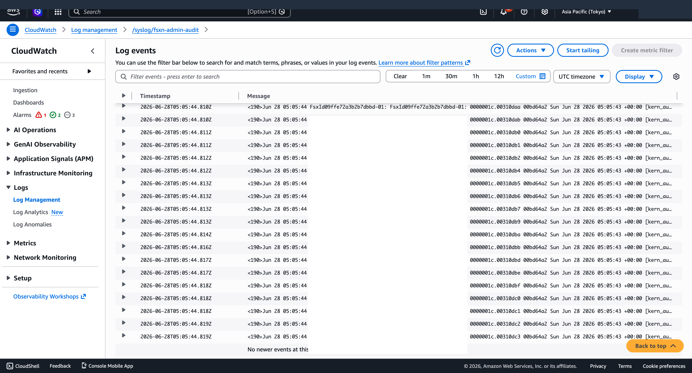

# Syslog VPC Endpoint セットアップガイド — FSx for ONTAP 管理監査ログ → CloudWatch Logs

🌐 **日本語**（このページ） | [English](../en/syslog-vpce-setup-guide.md)

> **所要時間**
>
> 約 15 分（CloudFormation デプロイ + ONTAP 設定）
> **前提**
>
> FSx for ONTAP ファイルシステムが稼働中であること
> **テンプレート**: `shared/templates/syslog-vpce-cloudwatch.yaml`

---

## 概要

FSx for ONTAP の管理アクティビティ監査ログ（ONTAP CLI/API 操作の記録）を、EC2 syslog サーバーなしで CloudWatch Logs に直接配信します。

```
FSx for ONTAP (ONTAP log-forwarding)
    │ Syslog (TCP port 1514 or 6514)
    ▼
VPC Endpoint (com.amazonaws.{region}.syslog-logs)
    │ AWS PrivateLink
    ▼
CloudWatch Logs (/syslog/fsxn-admin-audit)
```

---

## 事前準備

以下の情報を確認してください:

| パラメータ | 確認方法 | 例 |
|-----------|---------|-----|
| VPC ID | FSx コンソール → ファイルシステム → Network | `vpc-0ae01826f906191af` |
| Subnet ID | FSx と同じ AZ のサブネット | `subnet-0e36804c7fbc819a6` |
| VPC CIDR | VPC コンソール → 対象 VPC | `10.0.0.0/16` |
| FSx 管理 IP | FSx コンソール → Management endpoint | `10.0.3.72` |

> **ヒント**
>
> FSx の Subnet ID と同じサブネットを指定するのが最もシンプルです。異なる AZ のサブネットも追加指定可能です（HA 向上）。

---

## Step 1: CloudFormation スタックのデプロイ

```bash
aws cloudformation deploy \
  --template-file shared/templates/syslog-vpce-cloudwatch.yaml \
  --stack-name fsxn-syslog-vpce-admin-audit \
  --parameter-overrides \
    VpcId=<YOUR_VPC_ID> \
    SubnetIds=<YOUR_SUBNET_ID> \
    VpcCidr=<YOUR_VPC_CIDR> \
    LogGroupName=/syslog/fsxn-admin-audit \
    LogRetentionDays=90 \
  --region ap-northeast-1 \
  --no-fail-on-empty-changeset
```

**作成されるリソース**:

| リソース | 用途 |
|---------|------|
| VPC Endpoint | `com.amazonaws.{region}.syslog-logs` への PrivateLink |
| Security Group | VPC CIDR → Port 6514/1514 のイングレス許可 |
| Log Group | `/syslog/fsxn-admin-audit`（90 日保持） |
| Resource Policy | `syslog.logs.amazonaws.com` による書き込み許可 |

デプロイ後、VPC Endpoint の ENI プライベート IP を取得します:

```bash
# スタック出力から VPC Endpoint ID を取得
VPCE_ID=$(aws cloudformation describe-stacks \
  --stack-name fsxn-syslog-vpce-admin-audit \
  --query "Stacks[0].Outputs[?OutputKey=='VpcEndpointId'].OutputValue" \
  --output text --region ap-northeast-1)

# ENI の Private IP を取得（ONTAP の転送先に使用）
ENI_ID=$(aws ec2 describe-vpc-endpoints --vpc-endpoint-ids $VPCE_ID \
  --query 'VpcEndpoints[0].NetworkInterfaceIds[0]' \
  --output text --region ap-northeast-1)

VPCE_IP=$(aws ec2 describe-network-interfaces --network-interface-ids $ENI_ID \
  --query 'NetworkInterfaces[0].PrivateIpAddress' \
  --output text --region ap-northeast-1)

echo "VPC Endpoint IP: $VPCE_IP"
```

---

## Step 2: Syslog Configuration の作成

VPC Endpoint と Log Group を関連付けます。

```bash
python3 shared/scripts/create-syslog-configuration.py \
  --vpce-id $VPCE_ID \
  --log-group-arn "arn:aws:logs:ap-northeast-1:$(aws sts get-caller-identity --query Account --output text):log-group:/syslog/fsxn-admin-audit" \
  --region ap-northeast-1
```

> **注記**
>
> 2026 年 6 月時点で AWS CLI / boto3 に `put-syslog-configuration` コマンドがないため、本スクリプトは raw SigV4 署名で API を直接呼び出します。CLI がアップデートされ次第、`aws logs put-syslog-configuration` コマンドに移行可能です。
>
> **代替**
>
> AWS Console → CloudWatch → Logs → Syslog configurations → Create からも作成可能です。

---

## Step 3: ONTAP Log-Forwarding の設定

FSx for ONTAP の管理エンドポイントに SSH（または REST API）でアクセスし、syslog 転送先を設定します。

### Option A: REST API 経由（推奨 — 自動化向き）

```bash
# REST API で転送先を作成
curl -sk -u fsxadmin:<PASSWORD> \
  -X POST "https://<FSx-Management-IP>/api/security/audit/destinations?force=true" \
  -H "Content-Type: application/json" \
  -d '{
    "address": "'$VPCE_IP'",
    "port": 1514,
    "protocol": "tcp_unencrypted",
    "facility": "local7"
  }'
```

### Option B: SSH + ONTAP CLI

> **CLI コマンド名の注意**
>
> ONTAP 9.11.1 以降では `cluster log-forwarding` コマンドが `security audit log-forwarding` に変更されています。FSx for ONTAP（9.11.1+）では `security audit log-forwarding` を使用してください。古いドキュメントや記事で `cluster log-forwarding` と記載されている場合がありますが、同じ機能です。

```bash
ssh fsxadmin@<FSx-Management-IP>

# ONTAP CLI
FsxId*> security audit log-forwarding create \
  -destination <VPCE_IP> \
  -port 1514 \
  -protocol tcp-unencrypted \
  -facility local7

# 確認
FsxId*> security audit log-forwarding show
```

### プロトコル選択

| プロトコル | ポート | ONTAP パラメータ | 推奨用途 |
|-----------|--------|-----------------|---------|
| TCP + TLS | 6514 | `tcp-encrypted` | **本番環境（推奨）** — 暗号化あり |
| TCP Plaintext | 1514 | `tcp-unencrypted` | 初期検証用フォールバック |

> **検証での知見**
>
> TCP plaintext (1514) は追加の証明書設定なしで動作確認できます。TLS (6514) の場合、ONTAP がサーバー証明書（AWS 管理の Amazon Trust Services 証明書）を検証するため、ONTAP ノードが CA を信頼していることを確認してください。PrivateLink 経由のため通信経路自体は VPC 内に閉じています。

> **本番環境向けセキュリティ強化**
> - **Security Group を FSx サブネット CIDR に限定**: テンプレートデフォルトの VPC CIDR (`10.0.0.0/16`) を、FSx for ONTAP が配置されたサブネットの CIDR（例: `10.0.3.0/24`）に狭めてください。
> - **認証情報の取り扱い**: `curl -u fsxadmin:<PASSWORD>` のようにコマンドラインにパスワードを渡すのは検証用です。本番では Secrets Manager から取得し、環境変数経由で渡してください。
> - **TLS を使用**: 本番では `tcp-encrypted` (ポート 6514) を使用してください。PrivateLink 内であっても defense-in-depth として暗号化を推奨します。

---

## Step 4: 動作確認

### ログ生成（管理操作の実行）

```bash
# REST API で何らかの操作を行うと監査ログが生成される
curl -sk -u fsxadmin:<PASSWORD> \
  https://<FSx-Management-IP>/api/storage/volumes?fields=name \
  --max-time 10 > /dev/null
```

### CloudWatch Logs での確認



```bash
# ログストリームの確認（数秒〜1 分以内に出現）
aws logs describe-log-streams \
  --log-group-name /syslog/fsxn-admin-audit \
  --region ap-northeast-1

# 最新イベントの確認
aws logs get-log-events \
  --log-group-name /syslog/fsxn-admin-audit \
  --log-stream-name "<VPCE_ID>_Syslog_<region>" \
  --limit 5 \
  --region ap-northeast-1
```

**期待される出力**（実際の検証結果）:

```
<190>Jun 28 02:06:40 FsxId09ffe72a3b2b7dbbd-01: ... [kern_audit:info:6392]
  ... FsxId09ffe72a3b2b7dbbd:http ... POST /api/storage/volumes ... :: Success
```

---

## トラブルシューティング

### ログが到着しない

| 原因 | 確認方法 | 対処 |
|------|---------|------|
| SG でブロックされている | VPC Flow Logs で REJECT 確認 | SG に VPC CIDR → 1514/6514 を追加 |
| Syslog Configuration 未作成 | ログストリームが存在しない | Step 2 を実行 |
| ONTAP 転送先が未設定 | `security audit log-forwarding show` | Step 3 を実行 |
| fsxadmin ロック | REST API で "User is not authorized" | パスワードリセット（下記参照） |
| ONTAP → VPCE 疎通不可 | `force=true` なしでエラー | SG 確認 + `force=true` で再作成 |

### fsxadmin アカウントがロックされた場合

SSH パスワード認証で複数回失敗するとロックされます。AWS API でリセットできます:

```bash
aws fsx update-file-system \
  --file-system-id <FS_ID> \
  --ontap-configuration '{"FsxAdminPassword":"<NEW_PASSWORD>"}' \
  --region ap-northeast-1
```

> リセット後、30 秒ほど待ってからアクセスしてください。

### Security Group の重要な注意点

> **検証での知見**
>
> FSx for ONTAP のノード ENI は、ユーザーが FSx に割り当てた Security Group とは異なる内部 SG を使用しています。そのため、VPC Endpoint の SG で「FSx の SG からのインバウンド」をソースに指定しても**接続できません**。代わりに **VPC CIDR をソース** に指定してください。

---

## クリーンアップ

```bash
# 1. ONTAP 転送先を削除
curl -sk -u fsxadmin:<PASSWORD> \
  -X DELETE "https://<FSx-Management-IP>/api/security/audit/destinations/<VPCE_IP>/1514" \
  --max-time 10

# 2. CloudFormation スタック削除
aws cloudformation delete-stack \
  --stack-name fsxn-syslog-vpce-admin-audit \
  --region ap-northeast-1

# 注: Log Group は DeletionPolicy: Retain のため手動削除が必要
aws logs delete-log-group \
  --log-group-name /syslog/fsxn-admin-audit \
  --region ap-northeast-1
```

---

## 次のステップ

### 運用監視（推奨）

Syslog パイプライン自体の健全性を監視するため、以下の CloudWatch メトリクスとアラームを設定してください:

```bash
# SyslogMessagesDropped メトリクスを監視するアラーム
aws cloudwatch put-metric-alarm \
  --alarm-name "FSx-ONTAP-SyslogDropped" \
  --metric-name SyslogMessagesDropped \
  --namespace AWS/Logs \
  --statistic Sum \
  --period 300 \
  --threshold 1 \
  --comparison-operator GreaterThanOrEqualToThreshold \
  --evaluation-periods 1 \
  --dimensions Name=LogGroupName,Value=/syslog/fsxn-admin-audit \
  --alarm-actions <SNS_TOPIC_ARN> \
  --region ap-northeast-1
```

| メトリクス | 意味 | アラーム閾値案 |
|-----------|------|-------------|
| `SyslogMessagesDropped` | 配信失敗で破棄されたメッセージ数 | > 0 (5 分間) |
| `IncomingLogEvents` | 受信ログイベント数 | < 1 (1 時間) で「ログ到着停止」検知 |

> **ヒント**
>
> ONTAP の fsx-control-plane は定期的にアクセスチェックを実行するため、通常はログが常時到着します。1 時間以上ログがない場合、VPCE 接続や ONTAP 設定に問題がある可能性があります。

### その他の次のステップ

- **CloudWatch Alarms** — 特定操作（権限昇格、ユーザー作成等）をメトリクスフィルタで検知
- **Subscription Filter** — CloudWatch Logs → Lambda → Datadog/Splunk/SIEM へ二次配信
- **S3 Export** — 長期保存用に S3 へエクスポート（Glacier 移行可）
- **CloudWatch Logs Insights** — 管理操作の分析クエリ

### CloudWatch Logs Insights クエリ例

```sql
-- 権限昇格操作の検出
fields @timestamp, @message
| filter @message like /set -privilege/
| sort @timestamp desc
| limit 20

-- REST API 操作の成功/失敗一覧
fields @timestamp, @message
| filter @message like /POST|GET|PATCH|DELETE/
| parse @message "* :: *" as operation, result
| stats count() by result
```

---

## 関連ドキュメント

- [アーキテクチャ進化ドキュメント](architecture-evolution-syslog-vpce.md)
- [AWS Docs: Syslog ingestion](https://docs.aws.amazon.com/AmazonCloudWatch/latest/logs/CWL_Syslog.html)
- [AWS Docs: Setting up syslog ingestion](https://docs.aws.amazon.com/AmazonCloudWatch/latest/logs/CWL_Syslog_Setup.html)
- [NetApp: ONTAP audit destinations](https://docs.netapp.com/us-en/ontap/system-admin/forward-command-history-log-file-destination-task.html)
- [Classmethod: FSx for ONTAP 管理監査ログ → CW Logs](https://dev.classmethod.jp/articles/amazon-fsx-for-netapp-ontap-security-audit-log-syslog-to-cw-logs/)
