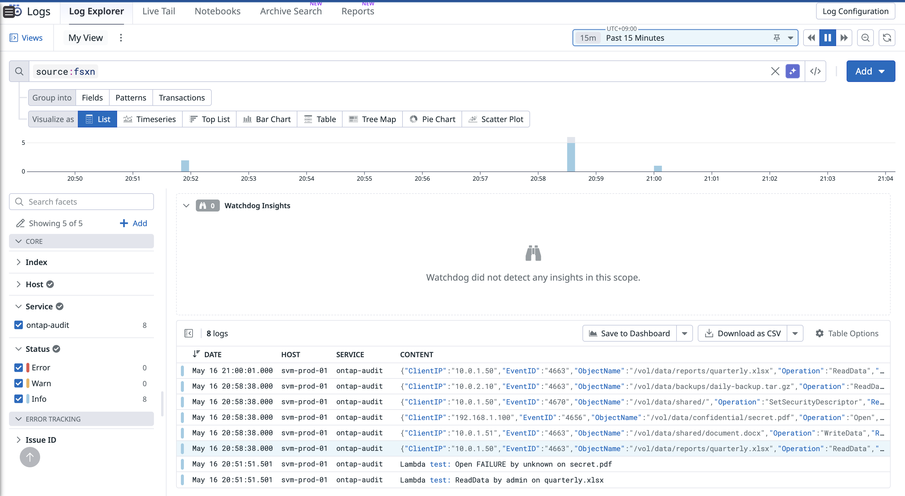
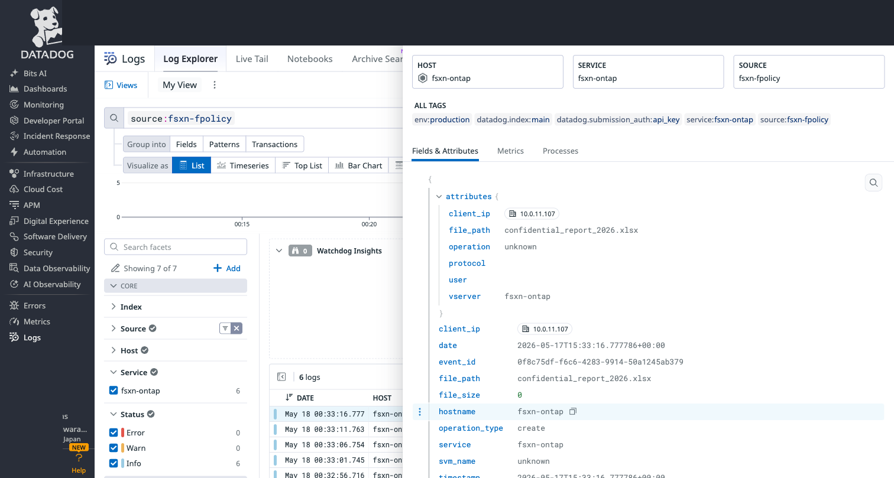
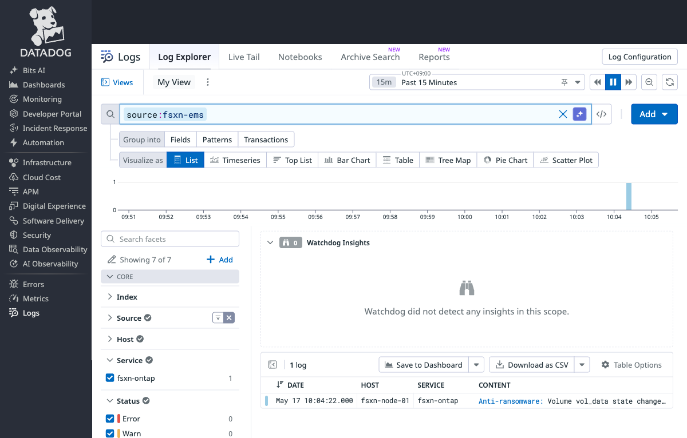
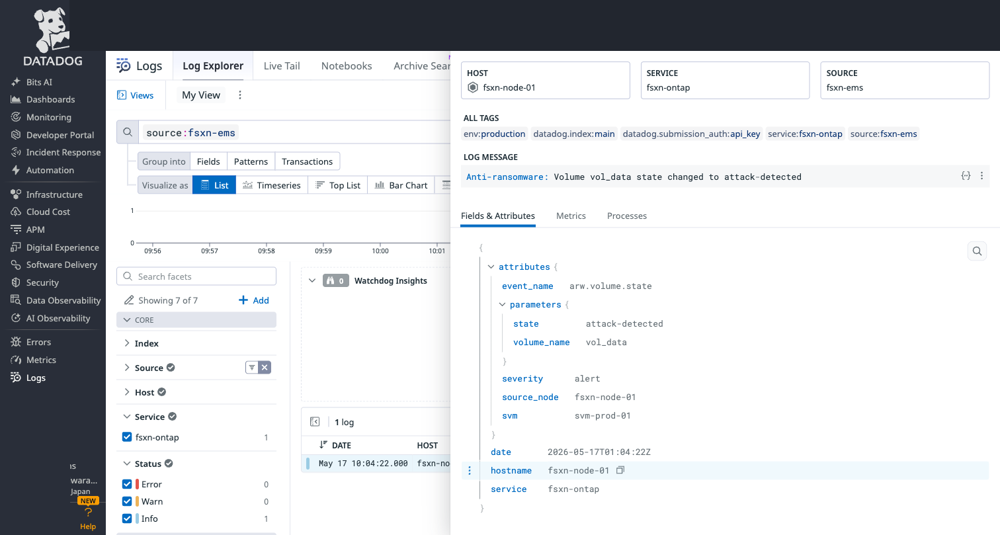
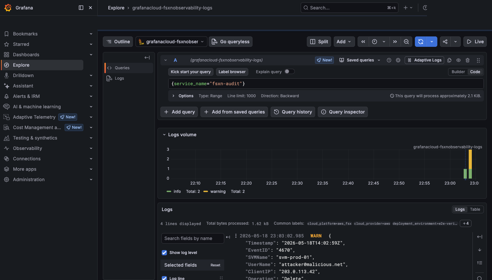
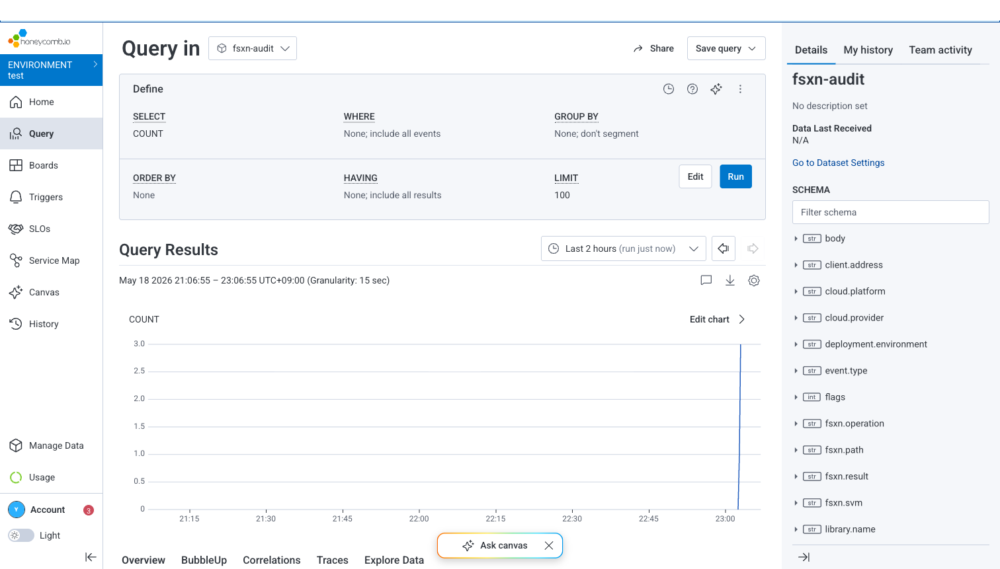
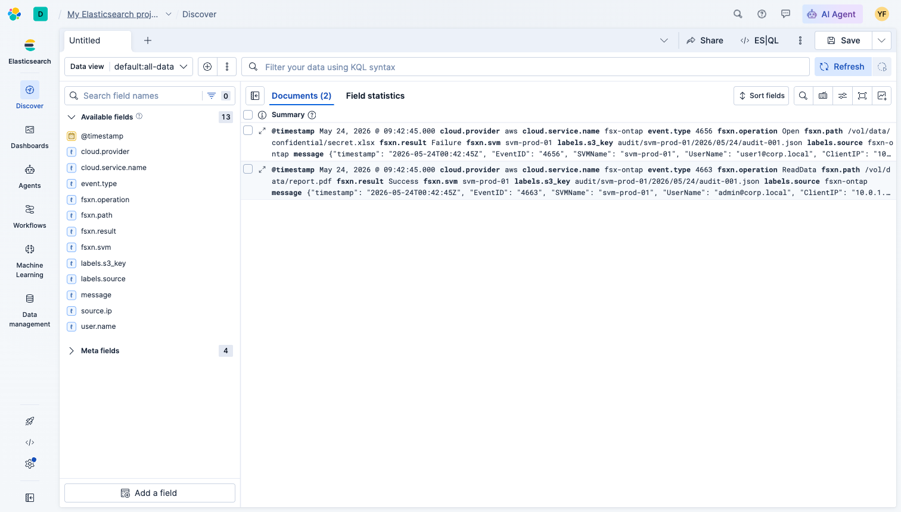

# ベンダー比較

🌐 **日本語**（このページ） | [English](../en/vendor-comparison.md)

## 対応ベンダー一覧

| ベンダー | 配信方式 | 認証方式 | バッチサイズ上限 | Firehose対応 |
|---------|---------|---------|---------------|-------------|
| Datadog | Logs API v2 | API Key (Header) | 5MB/リクエスト | ✅ |
| New Relic | Log API | License Key (Header) | 1MB/リクエスト | ✅ |
| Grafana Cloud | OTLP Gateway | Basic Auth | 制限なし (推奨4MB) | ❌ |
| Splunk | HEC | HEC Token (Header) | 制限なし | ✅ (組み込み) |
| Elastic | Bulk API | API Key / Basic Auth | 制限なし (推奨10MB) | ❌ |
| Dynatrace | Log Ingest API | API Token (Header) | 1MB/リクエスト | ✅ |
| Sumo Logic | HTTP Source | URL内蔵 | 1MB/リクエスト | ❌ |
| Honeycomb | Events API | API Key (Header) | 5MB/リクエスト | ❌ |
| OTel Collector | OTLP/HTTP | 設定依存 | 設定依存 | ❌ |

## コスト比較

**Observability プラットフォーム側の取り込みコスト**推定値（AWS インフラコスト ~$5-50/月は別途）:

| ベンダー | 無料枠 | 1 GB/月 | 10 GB/月 | 100 GB/月 | 課金モデル |
|---------|--------|---------|----------|-----------|-----------|
| New Relic | 100 GB/月 | $0 | $0 | $0 | 無料枠超過分 $0.35/GB |
| Grafana Cloud | 50 GB/月 | $0 | $0 | ~$40 | 無料枠超過分 $0.50/GB |
| Sumo Logic | 1.25 credits/日 (~20 credits/月) | $0 | $0 | ~$300 | クレジットベース (Flex) |
| Honeycomb | 2000万イベント/月 | $0 | $0 | ~$100 | イベント数ベース |
| Datadog | なし（トライアルのみ） | ~$10 | ~$100 | ~$1,000 | $0.10/GB 取り込み + 保持 |
| Splunk | なし（ライセンスベース） | ライセンス依存 | ライセンス依存 | ライセンス依存 | 日次インデックス量ライセンス |
| Dynatrace | なし（DDUベース） | ~1 DDU/日 | ~10 DDU/日 | ~100 DDU/日 | Davis Data Units |
| Elastic Cloud | 14日間トライアル | ~$30 (最小構成) | ~$95 | ~$300+ | ストレージ + コンピュート |
| OTel Collector | N/A (セルフホスト) | $0 (インフラのみ) | $0 (インフラのみ) | $0 (インフラのみ) | バックエンドコストのみ |

> **注意**
>
> 価格は概算であり、リージョン、契約形態、コミットメントにより変動します。最新の価格は各ベンダーの料金ページで確認してください。AWS インフラコスト（Lambda, EventBridge, S3, Secrets Manager）は通常 $5-50/月です。

### AWS インフラコスト推定

| コンポーネント | 1 GB/月 | 10 GB/月 | 100 GB/月 |
|--------------|---------|----------|-----------|
| Lambda (256MB, 5分間隔) | ~$1 | ~$5 | ~$30 |
| EventBridge Scheduler | ~$0.01 | ~$0.01 | ~$0.01 |
| Secrets Manager | ~$0.40 | ~$0.40 | ~$0.40 |
| CloudWatch Logs | ~$0.50 | ~$2 | ~$10 |
| SQS (DLQ) | ~$0 | ~$0 | ~$0 |
| **合計 AWS** | **~$2** | **~$8** | **~$41** |

## 選定ガイド

### コスト重視
- **New Relic** — 無料枠が最大（100 GB/月、永続）
- **Grafana Cloud** — 無料枠あり（50 GB/月）+ OSS エコシステム
- **Sumo Logic** — 無料枠あり（1.25 credits/日、7 日保持）
- **Elastic** — セルフホスト可能（取り込みコストなし）

### 既存環境との統合
- **Datadog** — 既に Datadog を APM/インフラ監視で使用している場合
- **Splunk** — 既存 Splunk 環境がある場合（EC2 UF からのサーバーレス移行）
- **Dynatrace** — AI 駆動の根本原因分析と APM 相関が必要な場合

### ベンダーロックイン回避
- **OTel Collector** — ベンダー中立、コード変更なしでバックエンド切り替え可能
- **Grafana Cloud** — OSS ベースのスタック（Loki, Grafana）
- **Honeycomb** — OTel Collector 経由で強力

### エンタープライズ / コンプライアンス
- **Splunk** — 確立された SIEM、コンプライアンスレポート
- **CrowdStrike Falcon LogScale** — 次世代 SIEM、Falcon XDR エコシステムと統合
- **Elastic** — セルフホストによるデータ主権確保
- **Datadog** — SOC 2, HIPAA, FedRAMP オプション

## アーキテクチャパターン比較

### パターン A: Lambda 直接配信
```
S3 AP → EventBridge → Lambda → Vendor API
```
- ✅ シンプル、低コスト（少量ログ向け）
- ❌ 大量ログ時にスロットリングリスク
- ❌ バックエンドごとにベンダー固有コードが必要

### パターン B: Firehose 経由
```
S3 AP → Lambda (変換) → Firehose → Vendor API
```
- ✅ 自動バッファリング、高スループット
- ✅ 組み込みリトライとバックプレッシャー
- ❌ Firehose 対応ベンダーのみ（Datadog, Splunk, New Relic, Dynatrace）
- ❌ 追加の Firehose コスト

### パターン C: OTel Collector 経由
```
S3 AP → Lambda (OTLP) → OTel Collector → 複数バックエンド
```
- ✅ ベンダー中立な Lambda コード（バックエンド間で変更不要）
- ✅ 単一パイプラインから複数バックエンドへのファンアウト
- ✅ Collector 設定でルーティング、フィルタリング、リダクション
- ❌ Collector インフラが必要（ECS Fargate 推奨）
- ❌ 運用の複雑さが増加

## 検証中・β版ベンダー

以下のベンダーは、上記の「対応ベンダー一覧」表には**まだ含まれていません** — 本リポジトリにコードや設定が既に存在する場合でも、実際のアカウントへの E2E 送信確認がまだできていません。プラットフォーム側に関連機能が最近追加され、少なくともドキュメントベースの技術検証が完了しているため、ここで進捗を追跡しています。

| ベンダー | 配信方式 | 認証方式 | ステータス |
|---------|---------|---------|-----------|
| [Mackerel](../../integrations/mackerel/) | OTLP/HTTP のみ (`https://otlp-vaxila.mackerelio.com`) | `Mackerel-Api-Key` ヘッダー（Write 権限） | ✅ E2E 検証済み（2026年7月18日、実際の Mackerel オーガニゼーションに対して確認）— ただし Mackerel のログ機能自体は依然として **オープンβ版**（2026年7月16日にβ公開、2026年秋にGA予定・インジェスト量課金の料金体系は既に公表済み）のため、本節（主要表とは別枠）に掲載しています。 |

**Mackerel が主要表に含まれていない理由**: 実際の Mackerel オーガニゼーション（Free プラン）に対する E2E 送信確認は完了しており、その条件はクリアしています。残る条件は、Mackerel 自身のログ機能が、データ保持 SLA を明示した正式版に到達することです。正式版に到達するまでは、Mackerel を上記9ベンダー（正式版で検証済み）の**代替ではなく、多層防御の一環として併用する**ものとして扱ってください。特にランサムウェア検知アラート等、Mackerel現状の「データ保持の保証なし」というβ版の制約が許容できない本番セキュリティ用途では注意が必要です。

β版の制約の全リストと実装ロードマップは [integrations/mackerel/README.md](../../integrations/mackerel/README.md) を参照してください。

## トライアル・検証に関する注意事項

### Splunk Cloud Platform

Splunk Cloud Platform の **無料トライアルでは HEC 用 DNS レコード** (`http-inputs-<stack>.splunkcloud.com`) **がプロビジョニングされません**。これは [Splunk Community で広く報告されている問題](https://community.splunk.com/t5/Getting-Data-In/HEC-with-Splunk-Cloud-trial/td-p/596680)です（2020〜2025年）。ポート 8088 もトライアルインスタンスではブロックされています。

**回避策**: Splunk Enterprise (Docker) をローカルで使用し、$0 で E2E 検証が可能です。`splunk/splunk:latest` イメージには完全に機能する HEC が含まれています。本プロジェクトの E2E 検証は Splunk Enterprise 10.4.0 (Docker, linux/amd64) で完了しました。

### CrowdStrike Falcon LogScale

CrowdStrike Falcon の **EDR トライアル**では、Next-Gen SIEM UI への読み取り専用アクセス（ログ検索、リポジトリ一覧）は含まれますが、**Data Connectors / HEC インジェスト機能は含まれません**。「Add data connector」ページはトライアルでは "Page not found" を返します。HEC 経由での外部データインジェストには有料の Falcon Next-Gen SIEM ライセンスが必要です。

**プロトコル検証**: Falcon LogScale は Splunk HEC 互換エンドポイント (`/api/v1/ingest/hec`) を使用するため、Splunk Enterprise での E2E テスト成功が、本統合で使用する HEC ペイロードフォーマットの互換性を検証しています。

### 検証方法サマリー

| ベンダー | E2E 検証方法 | コスト |
|---------|-------------|------|
| Datadog | Cloud トライアル (14日間) | $0 |
| New Relic | Free tier (100 GB/月) | $0 |
| Grafana Cloud | Free tier (50 GB/月) | $0 |
| Splunk | Docker ローカル (Enterprise trial) | $0 |
| Elastic | Cloud トライアル (14日間) | $0 |
| Dynatrace | Free tier (15日間トライアル) | $0 |
| Sumo Logic | Free tier (1.25 credits/日) | $0 |
| Honeycomb | Free tier (2000万イベント/月) | $0 |
| CrowdStrike | HEC プロトコル検証 (Splunk 経由) | $0 |
| OTel Collector | セルフホスト (Docker Compose) | $0 |

---

## ダッシュボード統合 — 各ベンダーでのイベント表示

イベントが Observability プラットフォームに到達した後、FSx for ONTAP の監査ログ、FPolicy ファイル操作、ARP アラートが各ベンダーのダッシュボードでどう表示されるかを説明します。

### Datadog

**監査ログ（S3 AP パス）**:



ログは `source:fsxn-ems` と構造化された属性で到着します。SVM、ボリューム、操作タイプでフィルタリングするためにファセットを使用してください。

**FPolicy ファイル操作**:



FPolicy イベントには完全なファイルパス、操作タイプ（create/write/rename/delete）、クライアント IP、ボリューム名が含まれます。疑わしいパターン（例: 単一クライアントからの高頻度ファイルリネーム）を検知するための Datadog Monitor を作成してください。

**ARP ランサムウェア検知**:



ARP の `arw.volume.state` イベントは `severity:alert` として表示されます。通知に `@sns-<trigger-topic>` を含む Monitor を設定して、自動封じ込めをトリガーしてください:

```
source:fsxn-ems @attributes.event_name:arw.volume.state @attributes.severity:alert
```



**ダッシュボード推奨構成**:
- 「FSx for ONTAP セキュリティ」ダッシュボードを作成:
  - 時系列: タイプ別ファイル操作/分
  - トップリスト: 最もアクティブなクライアント IP
  - イベントタイムライン: ARP アラートと自動応答アクション
  - テーブル: 最近の不正アクセス試行

---

### Grafana Cloud（OTel Collector 経由）



ログは OTLP ゲートウェイエンドポイント経由で構造化ラベル付きで到着します。Loki でクエリ:

```logql
{service_name="fsxn-observability"} | json | operation_type="create"
```

**ダッシュボード推奨構成**:
- Loki をデータソースとして Grafana ダッシュボードで使用
- パネル: イベントレート、トップボリューム、クライアント IP 分布
- アラートルール: Grafana Alerting → Contact point → AWS SNS（自動封じ込め用）

---

### Honeycomb（OTel Collector 経由）



イベントはデータセット `fsxn-fpolicy` または `fsxn-ems` で構造化トレース/ログとして到着します。Honeycomb のクエリビルダーで:
- `file_extension` でグループ化してランサムウェア様のパターンを検知
- `file_size` のヒートマップで異常な暗号化活動を検知
- ARP トリガー時に `client_ip` で BubbleUp

---

### Splunk（HEC）

イベントは `fsxn_audit` または `fsxn_fpolicy` インデックスに、sourcetype `fsxn:ontap:audit` / `fsxn:ontap:fpolicy` / `fsxn:ontap:ems` で到着します。

**検索クエリ**:
```spl
index=fsxn_ems sourcetype="fsxn:ontap:ems" message-name="arw.volume.state"
| table _time, parameters.vserver-name, parameters.volume-name, parameters.state

index=fsxn_fpolicy sourcetype="fsxn:ontap:fpolicy" operation_type="create"
| stats count by file_path, client_ip
| sort -count
```

**ダッシュボード推奨構成**:
- 「FSx for ONTAP セキュリティ運用」ダッシュボードを作成
- パネル: ARP イベントタイムライン（シングルバリュー + タイムチャート）
- パネル: FPolicy ファイル操作タイプ別（円グラフ）
- パネル: クライアント IP 別トップトーカー（テーブル）
- アラートアクション: 「AWS SNS notification」アクション（Splunk Add-on for AWS）で自動封じ込めをトリガー

> **補足**
>
> Splunk Cloud トライアルでは HEC DNS がプロビジョニングされません。ローカル検証には Splunk Enterprise（Docker）を使用してください。[トライアル・検証に関する注意事項](#トライアル検証に関する注意事項) を参照。

---

### Elastic（Bulk API）



イベントは `fsxn-audit-*` または `fsxn-fpolicy-*` インデックスパターンでインデックスされます。Kibana で:

```kql
event.dataset: "fsxn.fpolicy" AND operation_type: "create" AND NOT file_path: *~$*
```

**ダッシュボード推奨構成**:
- Kibana Lens: operation_type 別のファイル操作の時系列
- SIEM Detection Rule: 「ランサムウェア様のファイルリネームバースト」（60 秒以内に同一クライアントから 50 件超のリネーム）
- アラートアクション: SNS コネクターで自動封じ込めをトリガー

---

### 自動封じ込め連携パターン（全ベンダー共通）

使用するベンダーに関わらず、封じ込めのトリガーフローは共通です:

```
ベンダーダッシュボードのアラート
  → SNS Publish（automated-response スタックの TriggerTopicArn）
    → Lambda（fsxn-automated-response-handler）
      → ONTAP REST API（ユーザーブロック / IP ブロック / Snapshot）
        → SNS 通知（結果をセキュリティチームへ）
```

**ベンダーごとの設定**:

| ベンダー | アラート → SNS 接続方法 |
|---------|----------------------|
| Datadog | Monitor 通知で `@sns-<topic-name>` を使用 |
| Splunk | Alert action → AWS SNS（Splunk Add-on for AWS） |
| Grafana | Alert rule → Contact point → AWS SNS |
| Elastic | Kibana Alert → SNS コネクター |
| New Relic | Workflow → Destination → AWS SNS |
| Honeycomb | Trigger → Webhook → Lambda → SNS |
| Dynatrace | Problem notification → AWS SNS integration |
| PagerDuty | Event Orchestration → Custom Action → SNS |

---

## 関連ドキュメント

- [ONTAP REST API クイックリファレンス](ontap-rest-api-reference.md)
- [ARP インシデント対応ガイド](arp-incident-response-guide.md)
- [自動応答ガイド](automated-response-guide.md)
- [EMS 検知機能リファレンス](ems-detection-capabilities.md)
- [OTel Collector PII リダクションクックブック](../../integrations/otel-collector/docs/ja/pii-redaction-cookbook.md)
