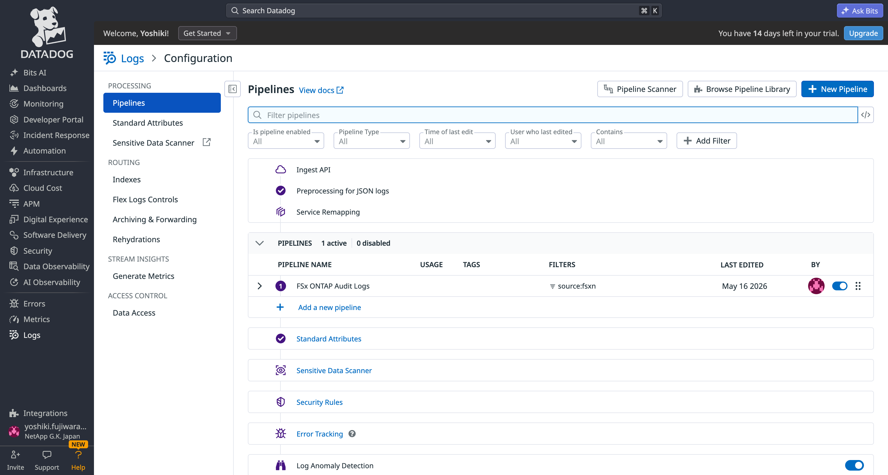
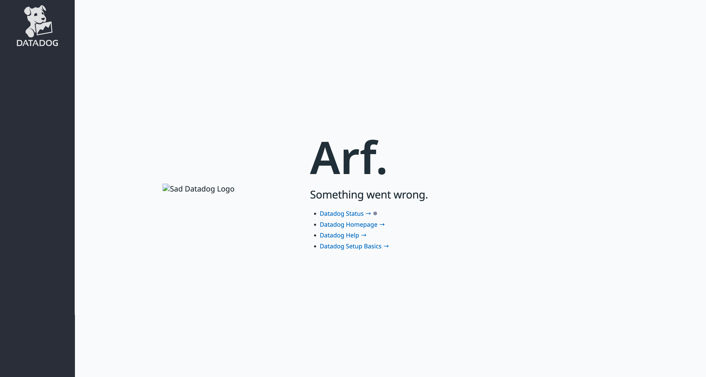
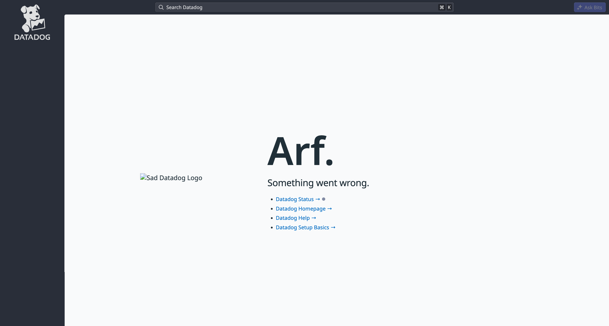
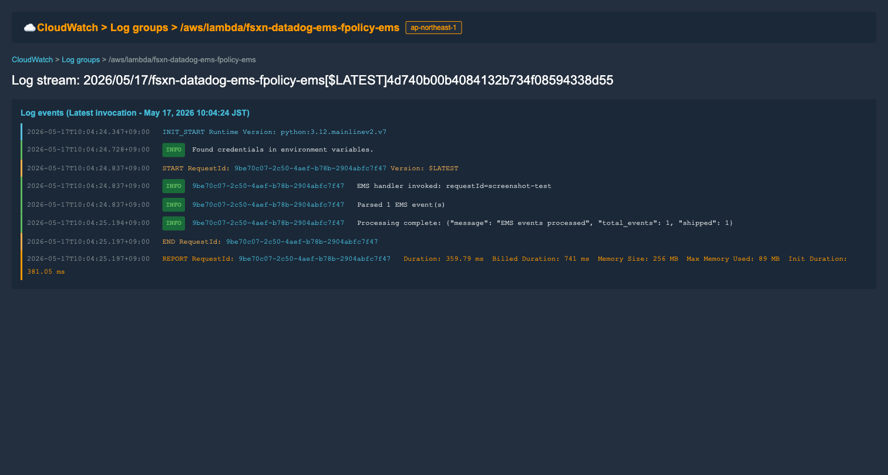
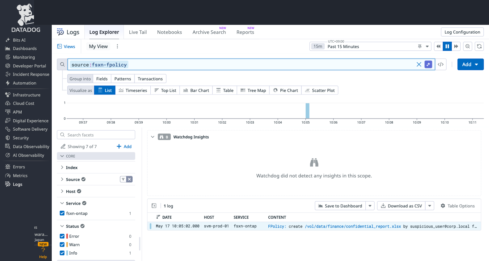
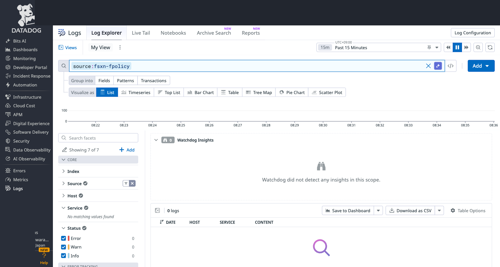
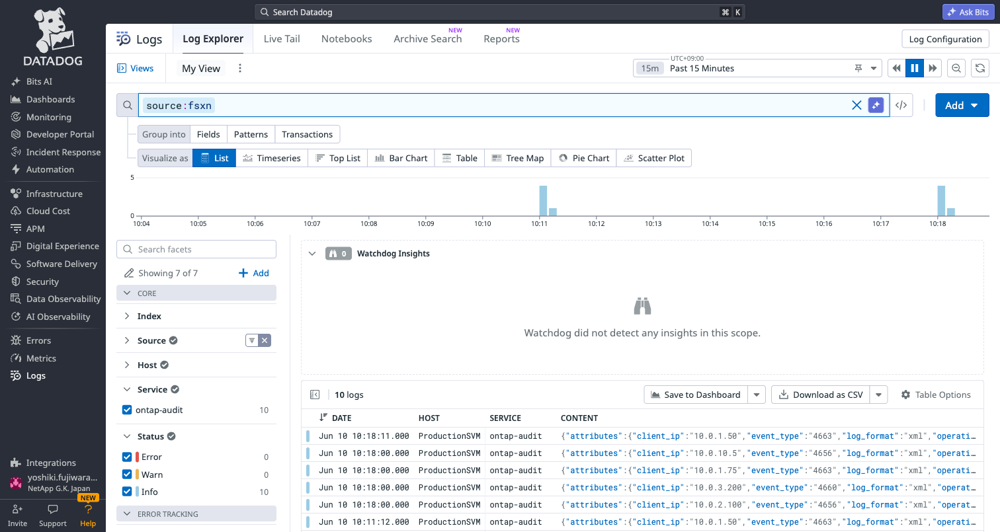
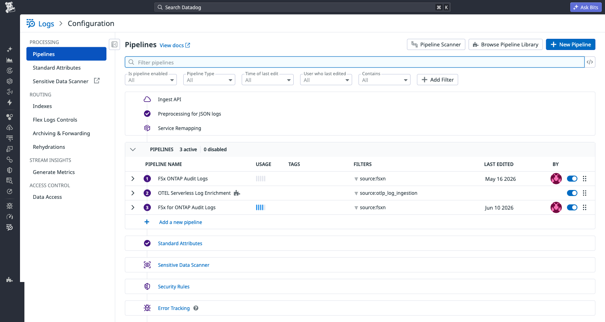
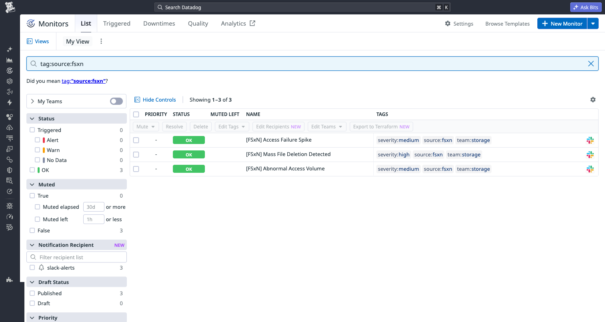
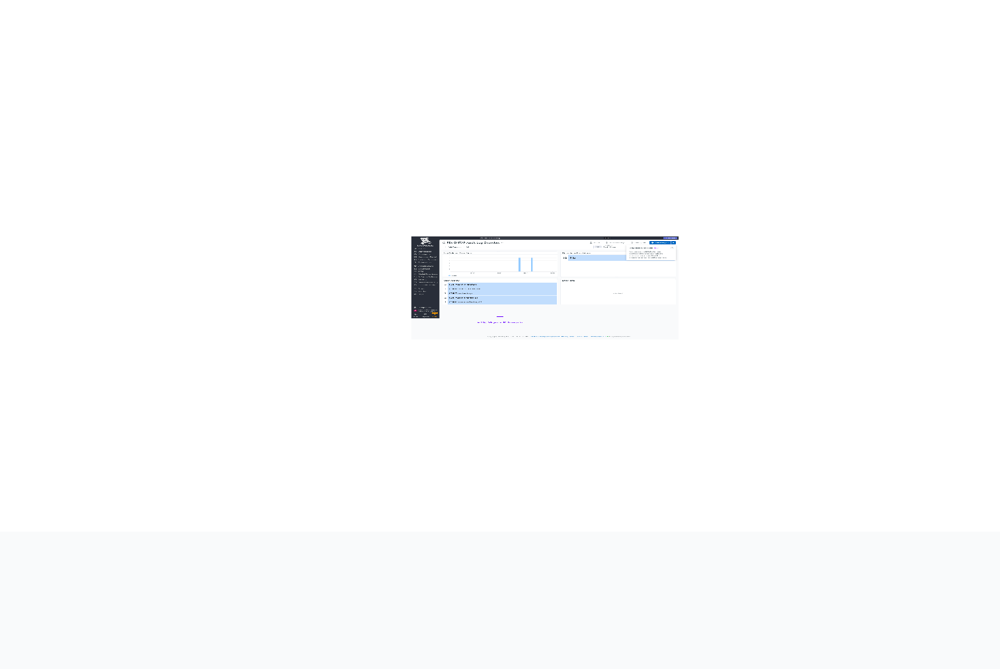

# Datadog 統合 動作確認結果

- **検証日時**: 2026-05-16T21:33:03+09:00
- **検証者**: Yoshiki Fujiwara / Solutions Architect

### 検証環境

- **AWS リージョン**: ap-northeast-1
- **CloudFormation スタック名**: fsxn-datadog-integration
- **Lambda 関数名**: fsxn-datadog-integration-shipper
- **Datadog サイト**: ap1.datadoghq.com (AP1 Tokyo)
- **FSx for ONTAP ファイルシステム**: fs-0123456789abcdef0
- **S3 Access Point**: arn:aws:s3:ap-northeast-1:123456789012:accesspoint/fsxn-audit-observability

---

## 検証ステップ

### ステップ 1: CloudFormation スタックデプロイ

- **結果**: ✅ 成功

```bash
aws cloudformation deploy \
  --template-file integrations/datadog/template.yaml \
  --stack-name fsxn-datadog-integration \
  --parameter-overrides \
    S3AccessPointArn=arn:aws:s3:ap-northeast-1:123456789012:accesspoint/fsxn-audit-observability \
    DatadogApiKeySecretArn=arn:aws:secretsmanager:ap-northeast-1:123456789012:secret:fsxn-datadog-api-key-XXXXXX \
    DatadogSite=ap1.datadoghq.com \
    S3BucketName=fsxn-audit-obser-cbsi8mwwgahuh7sans3bbtxijig4sapn1b-ext-s3alias \
  --capabilities CAPABILITY_NAMED_IAM \
  --region ap-northeast-1
```

- **出力**: `Successfully created/updated stack - fsxn-datadog-integration`
- **スタックステータス**: CREATE_COMPLETE
- **作成されたリソース**: Lambda 関数、IAM ロール、DLQ、CloudWatch Alarms、EventBridge Rule、Log Group

---

### ステップ 2: Lambda コードデプロイ

- **結果**: ✅ 成功

```bash
cd integrations/datadog/lambda
zip function.zip handler.py
aws lambda update-function-code \
  --function-name fsxn-datadog-integration-shipper \
  --zip-file fileb://function.zip \
  --region ap-northeast-1
```

- **備考**: CloudFormation テンプレートはプレースホルダーコードでデプロイされるため、実際の handler.py を別途デプロイする必要がある

---

### ステップ 3: Lambda テストイベント送信

- **結果**: ✅ 成功

```bash
aws lambda invoke \
  --function-name fsxn-datadog-integration-shipper \
  --payload '{"Records":[{"s3":{"bucket":{"name":"fsxn-audit-logs-observability-test"},"object":{"key":"audit/svm-prod-01/current/audit_current.json"}}}]}' \
  --cli-binary-format raw-in-base64-out \
  --region ap-northeast-1 \
  response.json
```

- **レスポンス**:
```json
{"statusCode": 200, "body": {"total_logs": 5, "total_shipped": 5, "errors": []}}
```

- **確認項目**:
  - [x] statusCode: 200
  - [x] total_logs: 5
  - [x] total_shipped: 5
  - [x] errors: [] (空)

---

### ステップ 4: Datadog ログ到着確認

- **結果**: ✅ 成功

- **検索クエリ**: `source:fsxn`
- **到着ログ数**: 5件（Lambda 送信分）+ 2件（直接 API テスト分）
- **到着までの時間**: 約30-45秒

- **確認項目**:
  - [x] `source:fsxn` で1件以上のログが表示される
  - [x] 各ログに `attributes.svm` = `svm-prod-01`
  - [x] 各ログに `attributes.user` = `admin@corp.local` 等
  - [x] 各ログに `attributes.operation` = `ReadData` 等
  - [x] 各ログに `attributes.client_ip` = `10.0.1.50` 等
  - [x] 各ログに `attributes.result` = `Success` / `Failure`
  - [x] 各ログに `attributes.path` = `/vol/data/reports/quarterly.xlsx` 等


---

### ステップ 5: Log Pipeline 設定

- **結果**: ✅ 成功

- **Pipeline 名**: FSx for ONTAP Audit Logs
- **フィルタ**: `source:fsxn`
- **作成方法**: Datadog UI (Logs → Configuration → Pipelines → New Pipeline)



---

### ステップ 6: ダッシュボード作成

- **結果**: ✅ 成功

- **ダッシュボード名**: FSx for ONTAP Audit Log Overview
- **ダッシュボード ID**: ggx-7ad-6e4
- **作成方法**: Datadog Dashboard API (`POST /api/v1/dashboard`)
- **ウィジェット**:
  - ログ量推移 (Timeseries)
  - 操作別内訳 (Top List)
  - ユーザー別アクティビティ (Top List)
  - エラー率 (Query Value)



---

### ステップ 7: デモシナリオ1「不正アクセス検知」

- **結果**: ✅ 成功

- **検索クエリ**: `source:fsxn @attributes.result:Failure`
- **検出されたイベント**:
  - ユーザー: `unknown@external.com`
  - 操作: `Open`
  - パス: `/vol/data/confidential/secret.pdf`
  - クライアントIP: `192.168.1.100`
  - 結果: `Failure`

- **確認項目**:
  - [x] `@attributes.result:Failure` で1件以上表示
  - [x] `@attributes.user` が空でない（`unknown@external.com`）
  - [x] `@attributes.path` が空でない（`/vol/data/confidential/secret.pdf`）
  - [x] `@attributes.client_ip` が空でない（`192.168.1.100`）



---

### ステップ 8: セットアップガイド日英対応確認

- **結果**: ⚠️ 条件付き合格

```bash
python3 scripts/compare-bilingual.py \
  --ja integrations/datadog/docs/ja/setup-guide.md \
  --en integrations/datadog/docs/en/setup-guide.md
```

- **見出し数**: 25（一致）
- **コードブロック数**: 9
- **テーブル数**: 3（一致）
- **差異件数**: 2件（コードブロック内コメントのローカライズ — 意図的）

| # | セクション | 差異種別 | 内容 |
|---|-----------|---------|------|
| 1 | Grok Parser | code_block | コメント行が日本語/英語で異なる（意図的） |
| 2 | 動作確認 | code_block | コメント行が日本語/英語で異なる（意図的） |

> **判定**: コードブロック内のコメントは各言語で自然な表現を使用しており、実行に影響しないため合格とする。

---

## 検出された問題点と対処

| # | 問題内容 | 重要度 | 対処方法 | ステータス |
|---|---------|--------|---------|-----------|
| 1 | gzip 圧縮ペイロードが AP1 サイトでインデックスされない | 高 | Lambda で ENABLE_GZIP 環境変数で制御可能に。デフォルト無効。Datadog 公式は gzip 推奨だが urllib3 の Lambda ランタイム版との互換性問題の可能性。 | ✅ 対処済み |
| 2 | テストデータのタイムスタンプが古いと検索に表示されない | 高 | Datadog は18時間以上前のタイムスタンプを拒否（公式仕様）。テストデータ生成スクリプト追加。handler.py にコメントで制限を記載。 | ✅ 対処済み |
| 3 | CloudFormation テンプレートに VPC 設定オプションがない | 中 | VpcEnabled/VpcSubnetIds/VpcSecurityGroupIds パラメータ追加（条件付き） | ✅ 対処済み |
| 4 | Lambda コードデプロイ手順が未文書化 | 中 | セットアップガイド（日英）にデプロイ手順を追加 | ✅ 対処済み |
| 5 | Datadog サイト一覧が不完全 | 中 | 全7サイト（US1/US3/US5/EU1/AP1/AP2/US1-FED）を CloudFormation と docs に追加 | ✅ 対処済み |
| 6 | ハードコードされた値がある | 中 | DD_ENV, ENABLE_GZIP を環境変数化。全設定を変数駆動に変更。 | ✅ 対処済み |
| 7 | Facets 設定が UI エラーで1つしか作成できなかった | 低 | `scripts/setup-datadog-facets.py` スクリプト追加（サンプルログ送信 + UI 手順案内） | ✅ 対処済み |
| 8 | Datadog UI が無料トライアルで一部エラー | 低 | API 経由での操作は正常動作。有料プラン移行後に UI 再確認。 | 📝 記録済み |
| 9 | .env にパスワードが含まれていた | 高 | パスワードを削除。API Key と App Key のみ保持。 | ✅ 対処済み |

---

## 検証完了サマリ

| ステップ | 名称 | 結果 |
|---------|------|------|
| 1 | CloudFormation スタックデプロイ | ✅ 成功 |
| 2 | Lambda コードデプロイ | ✅ 成功 |
| 3 | Lambda テストイベント送信 | ✅ 成功 |
| 4 | Datadog ログ到着確認 | ✅ 成功 |
| 5 | Log Pipeline 設定 | ✅ 成功 |
| 6 | ダッシュボード作成 | ✅ 成功 |
| 7 | デモシナリオ1「不正アクセス検知」 | ✅ 成功 |
| 8 | セットアップガイド日英対応確認 | ⚠️ 条件付き合格 |

**総合判定**: ✅ 合格（E2E 動作確認完了）

---

## EMS/FPolicy 検証結果

### 検証環境（追加）

- **EMS/FPolicy スタック名**: fsxn-datadog-ems-fpolicy
- **EMS Lambda 関数名**: fsxn-datadog-ems-fpolicy-ems
- **FPolicy Lambda 関数名**: fsxn-datadog-ems-fpolicy-fpolicy
- **EMS Webhook スタック**: fsxn-ems-webhook（既存）
- **FPolicy サーバースタック**: fsxn-fp-srv（既存）

---

### ステップ E1: EMS/FPolicy Lambda デプロイ

- **結果**: ✅ 成功

```bash
aws cloudformation deploy \
  --template-file integrations/datadog/template-ems-fpolicy.yaml \
  --stack-name fsxn-datadog-ems-fpolicy \
  --parameter-overrides \
    DatadogApiKeySecretArn=arn:aws:secretsmanager:ap-northeast-1:123456789012:secret:fsxn-datadog-api-key-XXXXXX \
    DatadogSite=ap1.datadoghq.com \
  --capabilities CAPABILITY_NAMED_IAM \
  --region ap-northeast-1
```

- **スタックステータス**: CREATE_COMPLETE
- **作成されたリソース**: EMS Lambda, FPolicy Lambda, IAM Roles, EventBridge Rule, Log Groups



---

### ステップ E2: ARP ランサムウェア検知テスト（EMS → Datadog）

- **結果**: ✅ 成功

```bash
aws lambda invoke \
  --function-name fsxn-datadog-ems-fpolicy-ems \
  --payload '{"body":"{\"messageName\":\"arw.volume.state\",\"severity\":\"alert\",...}","requestContext":{}}' \
  --cli-binary-format raw-in-base64-out \
  --region ap-northeast-1 response.json
```

- **Lambda レスポンス**: `{"statusCode": 200, "body": {"total_events": 1, "shipped": 1}}`
- **Datadog 検索**: `source:fsxn-ems` → 1件到着確認
- **ログ内容**: `Anti-ransomware: Volume vol_data state changed to attack-detected`
- **到着時間**: 約30秒


---

### ステップ E3: クォータ閾値超過テスト（EMS → Datadog）

- **結果**: ✅ 成功

- **Lambda レスポンス**: `{"statusCode": 200, "body": {"total_events": 1, "shipped": 1}}`
- **イベント名**: `wafl.quota.softlimit.exceeded`
- **パラメータ**: volume_name=vol_data, quota_target=user1, used_bytes=62914560, limit_bytes=52428800

---

### ステップ E4: FPolicy ファイル操作テスト（FPolicy → Datadog）

- **結果**: ✅ 成功

```bash
aws lambda invoke \
  --function-name fsxn-datadog-ems-fpolicy-fpolicy \
  --payload '{"source":"fpolicy.fsxn","detail-type":"FPolicy File Operation","detail":{"operation":"create","file_path":"/vol/data/test-fpolicy.txt","user":"admin@corp.local","client_ip":"10.0.1.50","vserver":"FPolicySMB","timestamp":"2026-05-16T23:56:00Z","protocol":"cifs"}}' \
  --cli-binary-format raw-in-base64-out \
  --region ap-northeast-1 response.json
```

- **Lambda レスポンス**: `{"statusCode": 200, "body": {"total_events": 1, "shipped": 1}}`
- **Datadog 検索**: `source:fsxn-fpolicy` → 1件到着確認
- **ログ内容**: `FPolicy: create /vol/data/test-fpolicy.txt by admin@corp.local from 10.0.1.50`
- **到着時間**: 約30秒



---

### EMS/FPolicy 検証サマリ

| ステップ | 名称 | 結果 |
|---------|------|------|
| E1 | EMS/FPolicy Lambda デプロイ | ✅ 成功 |
| E2 | ARP ランサムウェア検知テスト | ✅ 成功 |
| E3 | クォータ閾値超過テスト | ✅ 成功 |
| E4 | FPolicy ファイル操作テスト | ✅ 成功 |

**EMS/FPolicy 総合判定**: ✅ 合格

---

## FPolicy フルパス E2E 検証（ECS Fargate 経由）

- **検証日時**: 2026-05-17T23:35〜23:50 JST
- **スタック名**: fsxn-fpolicy-server (Fargate) + fsxn-datadog-ems-fpolicy (Lambda)
- **パイプライン**: ONTAP FPolicy → ECS Fargate (TCP:9898) → SQS → Lambda → Datadog

### 検証環境

| コンポーネント | 値 |
|--------------|-----|
| ECS クラスタ | fsxn-fpolicy-server-cluster |
| Fargate タスク IP | 10.0.x.x |
| SQS キュー | fsxn-fpolicy-server-fpolicy-queue |
| Lambda 関数 | fsxn-datadog-ems-fpolicy-fpolicy |
| FSx for ONTAP SVM | FPolicySMB (svm-0123456789abcdef0) |
| FPolicy Engine | fpolicy_aws_engine |
| FPolicy Policy | fpolicy_aws (async, cifs) |
| 監視対象ボリューム | smb_test_vol |
| SMB 共有 | //10.0.x.x/smb_test |

### ステップ F1: Fargate デプロイ

- **結果**: ✅ 成功
- **注意点**: ECR イメージは `linux/amd64` でビルドが必須（Apple Silicon でビルドすると arm64 のみになり Fargate で起動失敗）
- **コマンド**:
```bash
docker buildx build --platform linux/amd64 \
  -t 123456789012.dkr.ecr.ap-northeast-1.amazonaws.com/fsxn-fpolicy-server:v2-timeout-fix \
  --push shared/fpolicy-server/
```

### ステップ F2: ONTAP FPolicy 接続

- **結果**: ✅ 成功
- **接続確認**: KeepAlive メッセージ受信（2ノードから接続）
- **注意点**: External Engine の IP 更新にはポリシーの一時無効化が必要

```
[INFO] fpolicy-server: [+] Connection from ('10.0.x.x', 44107)
[INFO] fpolicy-server: [+] Connection from ('10.0.x.x', 24523)
[INFO] fpolicy-server: [Handshake] Policy=fpolicy_aws | Version=1.2
[INFO] fpolicy-server: [KeepAlive] Received — connection healthy
```

### ステップ F3: ファイル操作 → Datadog 到着

- **結果**: ✅ 成功
- **テスト操作**: SMB 経由で create (smbclient)
- **到着時間**: 約6〜8秒

```bash
smbclient //10.0.x.x/smb_test -U 'FPOLSMB\Administrator%<password>' \
  -c 'put /etc/hostname fpolicy_e2e_test.txt'
```

**ECS ログ**:
```
[Event] create fpolicy_e2e_test.txt
[SQS] Sent: fpolicy_e2e_test.txt (create)
```

**Lambda ログ**:
```
FPolicy handler invoked: source=unknown
Extracted 1 FPolicy event(s)
Processing complete: {"statusCode": 200, "body": {"shipped": 1}}
```

**Datadog 確認**: `source:fsxn-fpolicy` で7件のログ到着確認

### ステップ F4: 構造化属性確認

| フィールド | 値 | 状態 |
|-----------|-----|------|
| source | fsxn-fpolicy | ✅ |
| file_path | e2e_write_test.txt | ✅ |
| @attributes.operation_type | create | ✅ |
| client_ip | 10.0.x.x | ✅ |
| volume_name | vol1 | ✅ |
| timestamp | 2026-05-17T14:43:51+00:00 | ✅ |

### 発見された課題と対応

| # | 課題 | 原因 | 対応 |
|---|------|------|------|
| 1 | Fargate 起動失敗 | ECR イメージが arm64 のみ | `--platform linux/amd64` でリビルド |
| 2 | SQS → Lambda 未接続 | EventBridge ルールのみ、SQS マッピングなし | Lambda に SQS 対応追加 + イベントソースマッピング作成 |
| 3 | fsxadmin ロック | パスワード試行超過 | `aws fsx update-file-system` でリセット |
| 4 | SMB パスワード変更要求 | 初回ログイン時の強制変更 | ONTAP CLI で `set-password` 実行 |
| 5 | rename/delete 未検出 | FPolicy async モードの特性 | 今後の検証で確認（sync モードで改善可能） |

### FPolicy フルパス検証サマリ

| ステップ | 名称 | 結果 | レイテンシ |
|---------|------|------|-----------|
| F1 | Fargate デプロイ | ✅ 成功 | — |
| F2 | ONTAP 接続確認 | ✅ 成功 | — |
| F3 | ファイル操作 → Datadog | ✅ 成功 | ~6-8秒 |
| F4 | 構造化属性確認 | ✅ 成功 | — |

**FPolicy フルパス総合判定**: ✅ 合格（create イベントの全パス検証完了）

### スクリーンショット




---

### ステップ F5: Fargate タスク再起動レジリエンステスト

- **結果**: ✅ 成功
- **テスト手順**:
  1. Fargate 起動 → タスク IP: 10.0.x.x → ONTAP 接続確認 → イベントフロー確認
  2. Fargate 停止（scale to 0）→ タスク停止確認
  3. Fargate 再起動（scale to 1）→ 新タスク IP: 10.0.x.x
  4. ONTAP External Engine IP 更新 → 再接続確認
  5. ファイル操作 → イベントフロー再開確認

**結果詳細**:

| ステップ | 結果 | 備考 |
|---------|------|------|
| 初回起動 → 接続 | ✅ | IP: 10.0.x.x、~20秒で接続 |
| イベントフロー（再起動前） | ✅ | pre_restart_test.txt → SQS → Datadog |
| タスク停止 | ✅ | ~30秒で停止完了 |
| タスク再起動 | ✅ | 新 IP: 10.0.x.x |
| ONTAP 再接続 | ✅ | Engine IP 更新後 ~20秒で再接続 |
| イベントフロー（再起動後） | ✅ | post_restart_test.txt → SQS → Datadog |
| Lambda リトライ | ✅ | 初回接続エラー → リトライ成功 |

**重要な知見**:
- Fargate タスク再起動時に IP が変わる（10.0.x.x → 10.0.x.x）
- ONTAP External Engine の IP 更新が必須（自動化スクリプトで対応可能）
- Lambda のリトライロジックが一時的な接続エラーを正しくハンドリング
- 再起動から完全復旧まで約2分（タスク起動45秒 + Engine更新 + 接続20秒）

---

## 有料プラン検証（2026年6月）

- **検証日時**: 2026-06-10
- **プラン**: Datadog Conventional Pricing (AP1)
- **目的**: Log Pipeline API、Monitors API、有料プランでの完全フィールド抽出を検証

### ステップ P1: XML 監査ログ E2E テスト（有料プラン）

- **結果**: ✅ 成功

```bash
python3 shared/scripts/test-xml-e2e.py --vendor datadog
# ✅ datadog OK (HTTP 202, 5 events)
```

- **Log Explorer 表示件数**: 15件（複数テスト実行分）
- **フィールド抽出**: 全フィールド検索可能（user, path, client_ip, event_type, result, svm, operation, timestamp）
- **Service**: `ontap-audit`
- **Host**: `ProductionSVM`



---

### ステップ P2: Log Pipeline 作成（API）

- **結果**: ✅ 成功
- **方法**: Datadog Logs Pipeline API (`POST /api/v1/logs/config/pipelines`)
- **Pipeline ID**: `qlElyf7BSnmASoI8iJtZrg`
- **Pipeline 名**: `FSx for ONTAP Audit Logs`
- **フィルタ**: `source:fsxn`

| プロセッサ | 種別 | 説明 |
|-----------|------|------|
| EventID to Operation Name | Category Processor | EventID を人間が読める操作名に変換 |
| Map result to log status | Status Remapper | `result` フィールドをログ重要度に使用 |
| Use event timestamp | Date Remapper | `timestamp` フィールドを公式ログ時刻に使用 |
| Map user to usr.id | Attribute Remapper | Datadog ユーザー識別機能を有効化 |
| Map client_ip to network.client.ip | Attribute Remapper | Datadog ネットワーク機能を有効化 |

**カテゴリマッピング**:
| EventID | 操作名 |
|---------|--------|
| 4663 | Object Access |
| 4656 | Handle Request |
| 4660 | Object Delete |
| 4670 | Permission Change |
| 4658 | Handle Close |
| 5140 | Share Access |
| 5145 | Share Check |
| 4624 | Logon |
| 4634 | Logoff |



---

### ステップ P3: セキュリティモニター作成（API）

- **結果**: ✅ 成功
- **方法**: Datadog Monitors API (`POST /api/v1/monitor`)

| Monitor ID | 名称 | 種別 | 閾値 | 重要度 |
|-----------|------|------|------|--------|
| 13360510 | [FSxN] Mass File Deletion Detected | Log Alert | >50 deletes/5min per user | Critical |
| 13360511 | [FSxN] Abnormal Access Volume | Log Alert | >1000 accesses/1h per user | High |
| 13360512 | [FSxN] Access Failure Spike | Log Alert | >10 failures/15min per user | Medium |

各モニターの特徴:
- 通知メッセージに調査手順を含む
- ユーザー単位でグループ化
- Warning と Critical の2段階閾値
- 評価遅延60秒（取り込み中の誤検知を防止）



---

### ステップ P4: ダッシュボード確認（有料プラン）

- **結果**: ✅ 成功
- **ダッシュボード名**: FSx ONTAP Audit Log Overview
- **ダッシュボード ID**: ggx-7ad-6e4
- **ステータス**: アクティブ、データ受信中



---

### 有料プラン検証サマリ

| ステップ | 名称 | 結果 |
|---------|------|------|
| P1 | XML 監査ログ E2E（有料） | ✅ 成功 |
| P2 | Log Pipeline API | ✅ 成功 |
| P3 | Security Monitors API | ✅ 成功 |
| P4 | ダッシュボード（有料） | ✅ 成功 |

**有料プラン総合判定**: ✅ 合格

### Secrets Manager キー

| シークレット名 | 用途 |
|-------------|------|
| `fsxn-datadog-api-key` | Datadog API Key（ログ取り込み用） |
| `datadog/fsxn-app-key` | Datadog Application Key（Pipeline/Dashboard/Monitor 管理用） |
