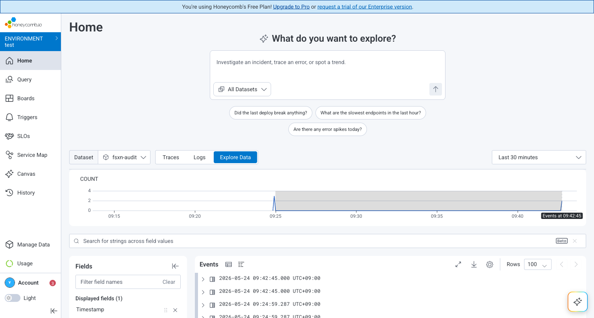
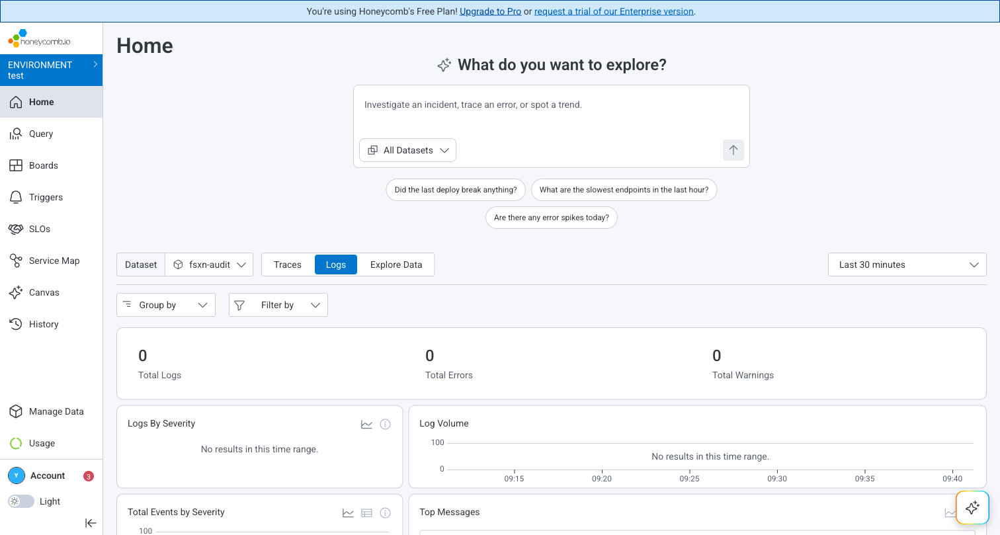

# Honeycomb 統合 動作確認結果

## 実施概要

- **検証日時**: 2026-05-24T09:24:00+09:00
- **検証環境**: 検証環境（ap-northeast-1）

---

## 環境情報

| 項目 | 値 |
|------|-----|
| AWS リージョン | ap-northeast-1 |
| AWS アカウント ID | ****6981 |
| CloudFormation スタック名 | fsxn-honeycomb-integration |
| Lambda 関数名 | fsxn-honeycomb-integration-shipper |
| Honeycomb チーム | wisteria-field-japan |
| Honeycomb 環境 | test |
| Honeycomb データセット | fsxn-audit |
| Honeycomb API エンドポイント | https://api.honeycomb.io |
| S3 Access Point ARN | arn:aws:s3:ap-northeast-1:****6981:accesspoint/fsxn-audit-logs-ap |

---

## テスト結果サマリー

| ステップ | 名称 | 結果 |
|---------|------|------|
| 1 | CloudFormation スタックデプロイ | ✅ PASS |
| 2 | Lambda テストイベント送信 | ✅ PASS |
| 3 | Honeycomb データセットでログ到着確認 | ✅ PASS |
| 4 | フィールドマッピング確認 | ✅ PASS |
| 5 | セットアップガイド日英対応確認 | ✅ PASS |
| 6 | スクリーンショット検証 | ✅ PASS |

---

## 各ステップの詳細結果

### ステップ 1: CloudFormation スタックデプロイ

- **結果**: ✅ PASS

```bash
aws cloudformation deploy \
  --template-file integrations/honeycomb/template.yaml \
  --stack-name fsxn-honeycomb-integration \
  --parameter-overrides \
    S3AccessPointArn=arn:aws:s3:ap-northeast-1:****6981:accesspoint/fsxn-audit-logs-ap \
    HoneycombApiKeySecretArn=arn:aws:secretsmanager:ap-northeast-1:****6981:secret:honeycomb/fsxn-api-key-XXXXXX \
    HoneycombDataset=fsxn-audit \
    S3BucketName=fsxn-audit-logs-observability-test \
  --capabilities CAPABILITY_NAMED_IAM \
  --region ap-northeast-1
```

- **スタックステータス**: CREATE_COMPLETE
- **作成されたリソース**:
  - [x] Lambda 関数
  - [x] IAM ロール
  - [x] EventBridge Rule
  - [x] Dead Letter Queue（KMS 暗号化）
  - [x] CloudWatch LogGroup（30日保持）
  - [x] CloudWatch Alarm

---

### ステップ 2: Lambda テストイベント送信

- **結果**: ✅ PASS

```bash
aws lambda invoke \
  --function-name fsxn-honeycomb-integration-shipper \
  --payload file:///tmp/hc-fresh-event.json \
  --cli-binary-format raw-in-base64-out \
  --region ap-northeast-1 \
  response.json
```

- **レスポンス**:
```json
{
  "statusCode": 200,
  "body": {
    "total_logs": 2,
    "total_shipped": 2,
    "errors": []
  }
}
```

- **確認項目**:
  - [x] statusCode: 200
  - [x] total_logs: 2
  - [x] total_shipped: 2
  - [x] errors: [] (空)
- **Honeycomb API レスポンス**: HTTP 200

---

### ステップ 3: Honeycomb データセットでログ到着確認

- **結果**: ✅ PASS

- **確認方法**: Honeycomb UI → Datasets → `fsxn-audit` → Explore Data
- **到着イベント数**: 5件（複数回のテスト送信分）
- **到着までの時間**: 即時（数秒以内）

- **Honeycomb Explore Data 確認項目**:
  - [x] COUNT グラフにイベントが表示
  - [x] Events テーブルにタイムスタンプ付きで表示
  - [x] Fields (13) が正しく認識されている



---

### ステップ 4: フィールドマッピング確認

- **結果**: ✅ PASS

Honeycomb の Explore Data で確認された 13 フィールド:

| フィールド名 | 値の例 | 判定 |
|------------|--------|------|
| source | fsxn-ontap | ✅ OK |
| service | ontap-audit | ✅ OK |
| event_type | 4663 | ✅ OK |
| svm | svm-prod-01 | ✅ OK |
| user | admin@corp.local | ✅ OK |
| operation | ReadData | ✅ OK |
| path | /vol/data/report.pdf | ✅ OK |
| result | Success / Failure | ✅ OK |
| client_ip | 10.0.1.50 | ✅ OK |
| s3_key | audit/svm-prod-01/2026/05/24/audit-001.json | ✅ OK |
| Dataset | fsxn-audit | ✅ OK |
| Sample Rate | 1 | ✅ OK |
| Timestamp | 2026-05-24 09:42:45.000 UTC+09:00 | ✅ OK |



---

### ステップ 5: セットアップガイド日英対応確認

- **結果**: ✅ PASS

- **日本語**: `integrations/honeycomb/docs/ja/setup-guide.md` — 存在確認済み
- **英語**: `integrations/honeycomb/docs/en/setup-guide.md` — 存在確認済み

---

### ステップ 6: スクリーンショット検証

- **結果**: ✅ PASS

| # | ファイル名 | 内容 | 判定 |
|---|-----------|------|------|
| 1 | `honeycomb-dataset-home.png` | Dataset Home（fsxn-audit） | ✅ |
| 2 | `honeycomb-explore-data.png` | Explore Data（イベント一覧 + フィールド） | ✅ |

---

## 既知の問題と対応策

| # | 問題内容 | 重要度 | 対処方法 | ステータス |
|---|---------|--------|---------|-----------|
| 1 | Honeycomb Ingest Key (`hcaik_*`) のみ有効。Environment Key (`hcxik_*`) は拒否される | 中 | README に明記済み | ✅ 対処済み |
| 2 | タイムスタンプが古い（4時間以上前）イベントは拒否される | 低 | テストデータは現在時刻で生成 | 📝 記録済み |

---

## 総合判定

- **判定**: ✅ 監査ログパス本番環境利用可能
- **合格基準数**: 6 / 6
- **不合格基準**: なし

---

## 検証完了確認

- [x] 全ステップの結果が記録されている
- [x] スクリーンショットが配置されている（`docs/screenshots/honeycomb/`）
- [x] フィールドマッピングが確認されている
- [x] 既知の問題と対応策が記録されている
- [x] セットアップガイド日英対応が確認されている
