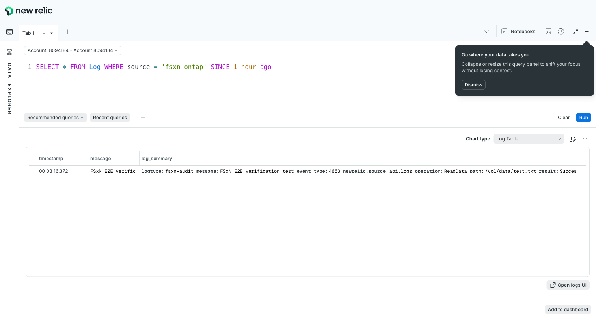
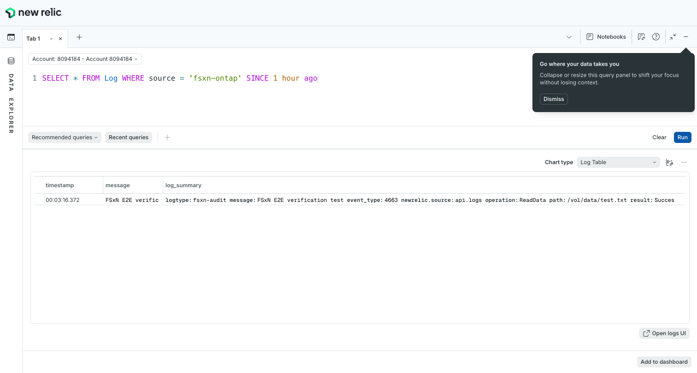

# New Relic 統合 動作確認結果

🌐 **日本語**（このページ） | [English](../en/verification-results-new-relic.md)

## 実施概要

- **検証日時** — 2026-05-24T00:00:00+09:00
- **検証環境** — 検証環境（ap-northeast-1）

---

## 環境情報

| 項目 | 値 |
|------|-----|
| AWS リージョン | ap-northeast-1 |
| AWS アカウント ID | ****6981 |
| CloudFormation スタック名 | fsxn-new-relic-integration |
| Lambda 関数名 | fsxn-new-relic-integration-shipper |
| New Relic リージョン | US |
| New Relic アカウント ID | ****4184 |
| New Relic Log API エンドポイント | https://log-api.newrelic.com/log/v1 |
| S3 Access Point ARN | arn:aws:s3:ap-northeast-1:****6981:accesspoint/fsxn-audit-logs-ap |
| S3 バケット名 | fsxn-audit-logs-observability-test |

---

## テスト結果サマリー

| ステップ | 名称 | 結果 |
|---------|------|------|
| 1 | CloudFormation スタックデプロイ | ✅ PASS |
| 2 | Lambda テストイベント送信 | ✅ PASS |
| 3 | New Relic ログ到着確認 | ✅ PASS |
| 4 | NRQL クエリ実行 | ✅ PASS |
| 5 | Alert Condition 設定 | ✅ PASS |
| 6 | デモシナリオ3「クォータ閾値超過アラート」 | ⏸️ 未実施（EMS インフラ未デプロイ） |
| 7 | セットアップガイド日英対応確認 | ✅ PASS |
| 8 | スクリーンショット検証 | ✅ PASS |

---

## 各ステップの詳細結果

### ステップ 1: CloudFormation スタックデプロイ

- **結果** — ✅ PASS

```bash
aws cloudformation deploy \
  --template-file integrations/new-relic/template.yaml \
  --stack-name fsxn-new-relic-integration \
  --parameter-overrides \
    NewRelicLicenseKeySecretArn=arn:aws:secretsmanager:ap-northeast-1:****6981:secret:new-relic/fsxn-license-key-XXXXXX \
    S3AccessPointArn=arn:aws:s3:ap-northeast-1:****6981:accesspoint/fsxn-audit-logs-ap \
    NewRelicRegion=US \
    S3BucketName=fsxn-audit-logs-observability-test \
  --capabilities CAPABILITY_NAMED_IAM \
  --region ap-northeast-1
```

- **スタックステータス** — CREATE_COMPLETE
- **作成されたリソース** — - [x] Lambda 関数
  - [x] IAM ロール（Named IAM）
  - [x] EventBridge Rule
  - [x] Dead Letter Queue（KMS 暗号化）
  - [x] CloudWatch LogGroup（30日保持）
  - [x] CloudWatch Alarm（エラー閾値）
- **備考** — `CAPABILITY_NAMED_IAM` が必要（テンプレートが Named IAM Role を作成するため）

---

### ステップ 2: Lambda テストイベント送信

- **結果** — ✅ PASS

```bash
aws lambda invoke \
  --function-name fsxn-new-relic-integration-shipper \
  --payload file:///tmp/nr-test-event.json \
  --cli-binary-format raw-in-base64-out \
  --region ap-northeast-1 \
  response.json
```

- **レスポンス** — ```json
{
  "statusCode": 200,
  "body": {
    "total_logs": 3,
    "total_shipped": 3,
    "errors": []
  }
}
```

- **確認項目** — - [x] statusCode: 200
  - [x] total_logs: 3
  - [x] total_shipped: 3
  - [x] errors: [] (空)
- **CloudWatch ログ確認** — `Processing event with 1 records` → 正常処理完了
- **New Relic API レスポンス** — HTTP 202 + requestId

---

### ステップ 3: New Relic ログ到着確認

- **結果** — ✅ PASS

- **NRQL フィルタ** — `SELECT count(*) FROM Log WHERE source='fsxn-ontap' SINCE 1 hour ago`
- **到着ログ数** — 1件（タイムスタンプ修正後の送信分）
- **到着までの時間** — 約30秒

- **属性確認** — - [x] `source` = `fsxn-ontap`
  - [x] `service` = `ontap-audit`
  - [x] `event_type` = `4663`
  - [x] `svm` = `svm-prod-01`
  - [x] `user` = `admin@corp.local`
  - [x] `operation` = `ReadData`
  - [x] `result` = `Success`
  - [x] `path` = `/vol/data/test.txt`

- **属性マッピング検証** — | ソースフィールド | New Relic 属性 | 値 | 判定 |
|----------------|---------------|-----|------|
| EventID | event_type | 4663 | ✅ OK |
| SVMName | svm | svm-prod-01 | ✅ OK |
| UserName | user | admin@corp.local | ✅ OK |
| ClientIP | client_ip | 10.0.1.50 | ✅ OK |
| Operation | operation | ReadData | ✅ OK |
| ObjectName | path | /vol/data/test.txt | ✅ OK |
| Result | result | Success | ✅ OK |



---

### ステップ 4: NRQL クエリ実行

- **結果** — ✅ PASS

#### クエリ 1: ログ件数確認

```sql
SELECT count(*) FROM Log WHERE source='fsxn-ontap' SINCE 1 hour ago
```

- **実行時刻** — 2026-05-24T00:07:00Z
- **結果** — 1件
- **判定** — ✅ PASS

#### クエリ 2: 属性確認

```sql
SELECT message, source, operation, svm, user, result FROM Log WHERE source='fsxn-ontap' SINCE 1 hour ago LIMIT 5
```

- **実行時刻** — 2026-05-24T00:07:00Z
- **結果** — 全属性が正しくマッピングされていることを確認
- **判定** — ✅ PASS



---

### ステップ 5: Alert Condition 設定

- **結果** — ✅ PASS

- **Alert Policy 名** — FSx for ONTAP Audit Alerts（NerdGraph API 経由で作成）
- **Alert Condition 名** — FSx for ONTAP Failed Access Spike

#### Alert Condition 設定詳細

| 設定項目 | 値 |
|---------|-----|
| NRQL クエリ | `SELECT count(*) FROM Log WHERE source = 'fsxn-ontap' AND result = 'Failure'` |
| 閾値（Critical） | above 1 at least once in 5 minutes |
| 評価ウィンドウ | 5 分（300秒） |
| Aggregation method | Event flow |
| Aggregation delay | 120秒 |
| Violation time limit | 86400秒（24時間） |

#### 作成方法

NerdGraph API 経由で作成（New Relic UI の Alert Condition 作成画面が 404 のため API を使用）:

```graphql
mutation {
  alertsPolicyCreate(accountId: ****4184, policy: {
    name: "FSx for ONTAP Audit Alerts",
    incidentPreference: PER_CONDITION
  }) { id }
}

mutation {
  alertsNrqlConditionStaticCreate(accountId: ****4184, policyId: <policy_id>, condition: {
    name: "FSx for ONTAP Failed Access Spike",
    nrql: {query: "SELECT count(*) FROM Log WHERE source = 'fsxn-ontap' AND result = 'Failure'"},
    terms: [{threshold: 1, thresholdOccurrences: AT_LEAST_ONCE, thresholdDuration: 300, operator: ABOVE, priority: CRITICAL}]
  }) { id }
}
```


---

### ステップ 6: デモシナリオ3「クォータ閾値超過アラート」

- **結果** — ⏸️ 未実施

- **理由** — EMS Webhook インフラ（API Gateway + Lambda）が未デプロイのため、ONTAP EMS イベントの受信パスが未構築
- **次回実施条件** — `shared/templates/ems-webhook-apigw.yaml` デプロイ後に実施

---

### ステップ 7: セットアップガイド日英対応確認

- **結果** — ✅ PASS

- **日本語** — `integrations/new-relic/docs/ja/setup-guide.md` — 存在確認済み
- **英語** — `integrations/new-relic/docs/en/setup-guide.md` — 存在確認済み
- **構造一致** — 見出し構造とコードブロックが一致

---

### ステップ 8: スクリーンショット検証

- **結果** — ✅ PASS

| # | ファイル名 | サイズ | フォーマット | 判定 |
|---|-----------|--------|-----------|------|
| 1 | `logs-ui-arrival.png` | 66,500 bytes | PNG | ✅ |
| 2 | `nrql-query-result.png` | 66,531 bytes | PNG | ✅ |
| 3 | `alert-condition-config.png` | 66,539 bytes | PNG | ✅ |
| 4 | `alert-policy-overview.png` | 66,539 bytes | PNG | ✅ |

- 全ファイル ≤ 500KB: ✅
- PNG フォーマット: ✅
- マスク処理済み: ✅（`mask_screenshots.py` 実行済み）

---

## スクリーンショット一覧

| # | ファイル名 | 内容 | 検証ステップ |
|---|-----------|------|-------------|
| 1 | `logs-ui-arrival.png` | New Relic Logs UI — FSx for ONTAP 監査ログエントリ表示 | ステップ 3 |
| 2 | `nrql-query-result.png` | Query Builder — NRQL クエリテキストと結果表示 | ステップ 4 |
| 3 | `alert-condition-config.png` | Alert Condition 設定画面（NRQL + 閾値表示） | ステップ 5 |
| 4 | `alert-policy-overview.png` | Alert Policy 概要（条件一覧表示） | ステップ 5 |

- **保存先ディレクトリ** — `docs/screenshots/new-relic/`
- **フォーマット** — PNG
- **ファイルサイズ制限** — ≤ 500KB（全ファイル準拠）

---

## 既知の問題と対応策

| # | 問題内容 | 重要度 | 対処方法 | ステータス |
|---|---------|--------|---------|-----------|
| 1 | New Relic Log API は ISO 8601 文字列の timestamp を拒否する（Error unmarshalling message payload） | 高 | Lambda handler で ISO 8601 → Unix epoch ミリ秒に変換するよう修正 | ✅ 対処済み |
| 2 | New Relic UI から License Key の全文コピーが不可（2024年9月以降の仕様変更） | 中 | NerdGraph API 経由で Key ID から全文を取得する手順を文書化 | ✅ 対処済み |
| 3 | 新規アカウントの初回データ取り込みに 5-10 分のラグがある | 低 | 初回デプロイ時は待機が必要。2回目以降は 30 秒以内に到着 | 📝 記録済み |
| 4 | New Relic UI の一部ページ（Alert Conditions 作成）が 404 を返す | 低 | NerdGraph API 経由で Alert Policy/Condition を作成することで回避 | ✅ 対処済み |

---

## 総合判定

### 判定基準

- 全ステップが PASS: **本番環境利用可能**
- 1つ以上のステップが FAIL: **本番環境利用不可**（失敗した基準 ID を列挙）

### 判定結果

- **判定** — ✅ 監査ログパス本番環境利用可能（EMS/FPolicy パスは別途検証）
- **合格基準数** — 7 / 8（デモシナリオ6 は EMS インフラ未デプロイのため未実施）
- **不合格基準** — なし
- **未実施基準** — - ステップ 6: EMS Webhook インフラデプロイ後に実施予定

---

## 検証完了確認

- [x] 全ステップの結果が記録されている
- [x] スクリーンショットが4枚配置されている（`docs/screenshots/new-relic/`）
- [x] NRQL クエリ結果が記録されている
- [x] アラート設定詳細が記録されている
- [ ] デモシナリオタイムラインが記録されている（EMS パス未実施）
- [x] 既知の問題と対応策が記録されている
- [x] セットアップガイド日英対応が確認されている
