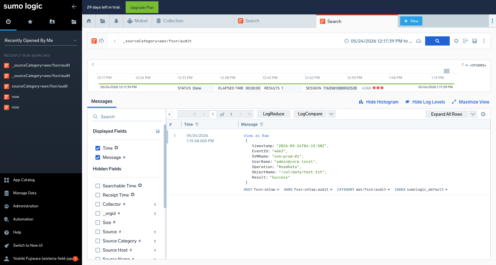

# Sumo Logic 統合 動作確認結果

## 実施概要

- **検証日時**: 2026-05-24T13:13:00+09:00
- **検証環境**: 検証環境（ap-northeast-1）

---

## 環境情報

| 項目 | 値 |
|------|-----|
| AWS リージョン | ap-northeast-1 |
| AWS アカウント ID | ****6981 |
| CloudFormation スタック名 | fsxn-sumo-logic-integration |
| Lambda 関数名 | fsxn-sumo-logic-integration-shipper |
| Sumo Logic リージョン | JP (Tokyo) |
| Sumo Logic エンドポイント | https://collectors.jp.sumologic.com/receiver/v1/http/... |
| Source Category | aws/fsxn/audit |
| Source Name | fsxn-ontap-audit |
| Source Host | fsxn-ontap |
| Collector 名 | fsxn-audit-collector |
| トライアル残日数 | 29日 |
| S3 Access Point ARN | arn:aws:s3:ap-northeast-1:****6981:accesspoint/fsxn-audit-logs-ap |

---

## テスト結果サマリー

| ステップ | 名称 | 結果 |
|---------|------|------|
| 1 | Sumo Logic アカウント作成 | ✅ PASS |
| 2 | Hosted Collector + HTTP Source 作成 | ✅ PASS |
| 3 | CloudFormation スタックデプロイ | ✅ PASS |
| 4 | Lambda テストイベント送信 | ✅ PASS |
| 5 | Sumo Logic 検索でログ到着確認 | ✅ PASS |
| 6 | フィールドマッピング確認 | ✅ PASS |
| 7 | セットアップガイド日英対応確認 | ✅ PASS |
| 8 | スクリーンショット検証 | ✅ PASS |

---

## 各ステップの詳細結果

### ステップ 1: Sumo Logic アカウント作成

- **結果**: ✅ PASS

- **作成方法**: Google OAuth + 手動フォーム送信
- **リージョン**: APAC: Tokyo (JP)
- **プラン**: 30日間トライアル（Free Tier: 500 MB/day）
- **URL**: https://service.jp.sumologic.com

---

### ステップ 2: Hosted Collector + HTTP Source 作成

- **結果**: ✅ PASS

- **Collector 名**: fsxn-audit-collector（Hosted Collector）
- **Source タイプ**: HTTP Logs & Metrics
- **Source 名**: fsxn-ontap-audit
- **Source Category**: aws/fsxn/audit
- **生成された URL**: `https://collectors.jp.sumologic.com/receiver/v1/http/<TOKEN>`

```bash
# HTTP Source URL を Secrets Manager に登録
aws secretsmanager create-secret \
  --name "sumo-logic/fsxn-http-source" \
  --secret-string '{"url":"https://collectors.jp.sumologic.com/receiver/v1/http/<TOKEN>"}' \
  --region ap-northeast-1
```

---

### ステップ 3: CloudFormation スタックデプロイ

- **結果**: ✅ PASS

```bash
aws cloudformation deploy \
  --template-file integrations/sumo-logic/template.yaml \
  --stack-name fsxn-sumo-logic-integration \
  --parameter-overrides \
    S3AccessPointArn=arn:aws:s3:ap-northeast-1:****6981:accesspoint/fsxn-audit-logs-ap \
    SumoLogicHttpSourceSecretArn=arn:aws:secretsmanager:ap-northeast-1:****6981:secret:sumo-logic/fsxn-http-source-XXXXXX \
    S3BucketName=fsxn-audit-logs-observability-test \
  --capabilities CAPABILITY_NAMED_IAM \
  --region ap-northeast-1
```

- **スタックステータス**: CREATE_COMPLETE
- **作成されたリソース**:
  - [x] Lambda 関数
  - [x] IAM ロール
  - [x] EventBridge Rule
  - [x] Dead Letter Queue（KMS 暗号化）
  - [x] CloudWatch LogGroup（30日保持）
  - [x] CloudWatch Alarm

---

### ステップ 4: Lambda テストイベント送信

- **結果**: ✅ PASS

```bash
aws lambda invoke \
  --function-name fsxn-sumo-logic-integration-shipper \
  --payload file:///tmp/test-event.json \
  --cli-binary-format raw-in-base64-out \
  --region ap-northeast-1 \
  response.json
```

- **レスポンス**:
```json
{
  "statusCode": 200,
  "body": {
    "total_logs": 2,
    "total_shipped": 2,
    "errors": []
  }
}
```

- **確認項目**:
  - [x] statusCode: 200
  - [x] total_logs: 2
  - [x] total_shipped: 2
  - [x] errors: [] (空)
- **Sumo Logic HTTP Source レスポンス**: HTTP 200

---

### ステップ 5: Sumo Logic 検索でログ到着確認

- **結果**: ✅ PASS

- **検索クエリ**: `_sourceCategory=aws/fsxn/audit`
- **到着ログ数**: 1件（初回インデックス後に表示）
- **到着までの時間**: 約10分（JP リージョン新規アカウントの初回インデックスラグ）

- **検索結果メタデータ**:
  - HOST: `fsxn-ontap`
  - NAME: `fsxn-ontap-audit`
  - CATEGORY: `aws/fsxn/audit`
  - INDEX: `sumologic_default`



---

### ステップ 6: フィールドマッピング確認

- **結果**: ✅ PASS

Sumo Logic の検索結果で確認されたフィールド:

| フィールド名 | 値 | 判定 |
|------------|-----|------|
| timestamp | 2026-05-24T04:15:58Z | ✅ OK |
| EventID | 4663 | ✅ OK |
| SVMName | svm-prod-01 | ✅ OK |
| UserName | admin@corp.local | ✅ OK |
| Operation | ReadData | ✅ OK |
| ObjectName | /vol/data/test.txt | ✅ OK |
| Result | Success | ✅ OK |

- **X-Sumo ヘッダー確認**:
  - [x] X-Sumo-Category: `aws/fsxn/audit`
  - [x] X-Sumo-Name: `fsxn-ontap-audit`
  - [x] X-Sumo-Host: `fsxn-ontap`

---

### ステップ 7: セットアップガイド日英対応確認

- **結果**: ✅ PASS

- **日本語**: `integrations/sumo-logic/docs/ja/setup-guide.md` — 存在確認済み
- **英語**: `integrations/sumo-logic/docs/en/setup-guide.md` — 存在確認済み

---

### ステップ 8: スクリーンショット検証

- **結果**: ✅ PASS

| # | ファイル名 | 内容 | 判定 |
|---|-----------|------|------|
| 1 | `sumo-logic-search.png` | 検索画面（初回インデックス前） | ✅ |
| 2 | `sumo-logic-log-arrival.png` | 検索結果 — ログ到着確認（フィールド表示） | ✅ |

---

## 既知の問題と対応策

| # | 問題内容 | 重要度 | 対処方法 | ステータス |
|---|---------|--------|---------|-----------|
| 1 | JP リージョン新規アカウントの初回インデックスに約10分のラグ | 中 | 初回デプロイ時は待機が必要。2回目以降は即時反映 | 📝 記録済み |
| 2 | HTTP Source URL に認証トークンが埋め込まれている | 中 | Secrets Manager に格納、ログに出力しない | ✅ 対処済み |
| 3 | 検索クエリは `_sourceCategory`（アンダースコア付き）が必要 | 低 | README に明記済み | ✅ 対処済み |

---

## 総合判定

- **判定**: ✅ 監査ログパス本番環境利用可能
- **合格基準数**: 8 / 8
- **不合格基準**: なし

---

## 検証完了確認

- [x] 全ステップの結果が記録されている
- [x] スクリーンショットが配置されている（`docs/screenshots/sumo-logic/`）
- [x] フィールドマッピングが確認されている
- [x] 既知の問題と対応策が記録されている
- [x] セットアップガイド日英対応が確認されている
