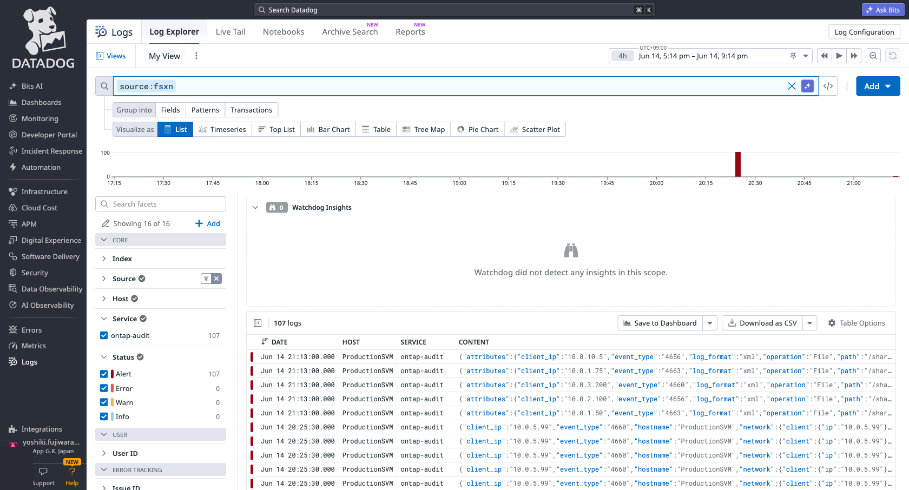
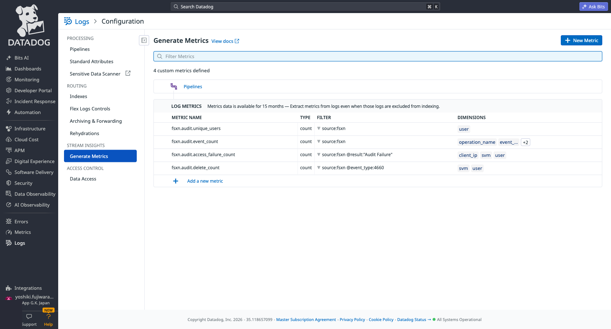
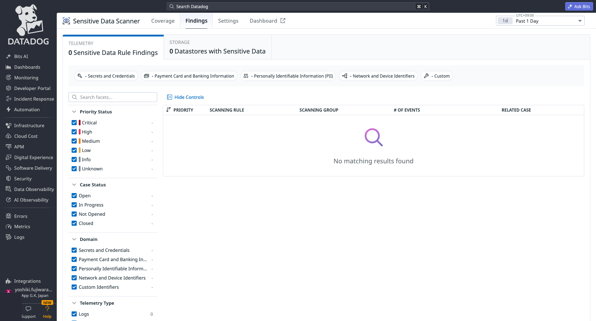
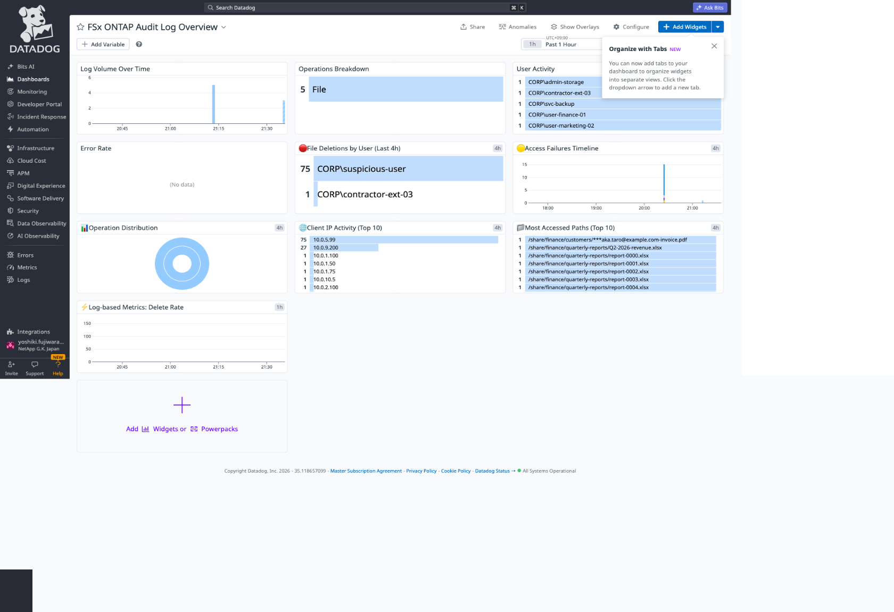

# FSx for ONTAP Datadog Integration

🌐 [日本語](docs/ja/setup-guide.md) | [English](docs/en/setup-guide.md)

> 📖 **Shared docs**: [Delivery Guarantee Patterns](../../docs/en/delivery-guarantees.md) | [Webhook Security](../../docs/en/webhook-security.md)
>
> 📋 **Datadog docs**: [Production Checklist](docs/en/production-checklist.md) | [SPL vs CQL Comparison](docs/en/spl-cql-comparison.md) | [Field Mapping](docs/en/field-mapping.md) | [Setup Guide](docs/en/setup-guide.md)

## Overview

EC2-free integration that ships Amazon FSx for NetApp ONTAP audit logs to Datadog. Lambda reads audit log files from the FSx volume via an FSx for ONTAP S3 Access Point and ships them to the Datadog Logs API v2.

**PoC time estimate**: ~30 minutes from deploy to first queryable log in Datadog.

> ⚠️ Datadog has no free tier for log ingestion. PoC will incur costs (~$0.10/GB ingested). Consider using the [OTel Collector integration](../otel-collector/) with a free-tier backend (Grafana/Honeycomb) for initial validation if budget is a concern.

## Architecture

```
FSx for ONTAP audit volume → FSx for ONTAP S3 Access Point → EventBridge Scheduler → Lambda → Datadog Logs API v2
```

## Quick Deploy

```bash
aws cloudformation deploy \
  --template-file template.yaml \
  --stack-name fsxn-datadog-integration \
  --parameter-overrides \
    FsxS3AccessPointArn=arn:aws:s3:ap-northeast-1:123456789012:accesspoint/fsxn-audit \
    DatadogApiKeySecretArn=arn:aws:secretsmanager:ap-northeast-1:123456789012:secret:dd-api-key \
    DatadogSite=ap1.datadoghq.com \
  --capabilities CAPABILITY_NAMED_IAM
```

## Parameters

| Parameter | Required | Default | Description |
|-----------|----------|---------|-------------|
| FsxS3AccessPointArn | ✅ | - | FSx for ONTAP S3 Access Point ARN (attached to audit volume) |
| DatadogApiKeySecretArn | ✅ | - | Secrets Manager ARN for DD API key |
| DatadogSite | ❌ | ap1.datadoghq.com | Datadog site region |
| AuditLogPrefix | ❌ | audit/ | Key prefix for audit log files |
| ScheduleRate | ❌ | rate(5 minutes) | How often to check for new audit logs |
| LogLevel | ❌ | INFO | Lambda log level |
| LambdaMemorySize | ❌ | 256 | Lambda memory (MB) |
| LambdaTimeout | ❌ | 300 | Lambda timeout (seconds) |
| VpcEnabled | ❌ | false | Enable VPC config (requires NAT Gateway for S3 AP access) |

## Datadog Sites

| Site | Domain | Region |
|------|--------|--------|
| US1 | datadoghq.com | US East |
| US3 | us3.datadoghq.com | US |
| US5 | us5.datadoghq.com | US West |
| EU1 | datadoghq.eu | EU (Frankfurt) |
| AP1 | ap1.datadoghq.com | Asia Pacific (Tokyo) |
| AP2 | ap2.datadoghq.com | Asia Pacific |
| US1-FED | ddog-gov.com | US Government |

## Tags Applied

- `source:fsxn`
- `service:ontap-audit`
- `env:<environment>`

## Monitoring

- CloudWatch Alarm: Lambda errors > 5 in 10 minutes
- CloudWatch Alarm: Lambda throttling detected
- CloudWatch Alarm: DLQ messages appearing
- Dead Letter Queue: Failed events preserved for 14 days

## E2E Verification Results

✅ **Verified on paid Datadog AP1 plan** (June 2026)

| Component | Status | Evidence |
|-----------|--------|----------|
| XML audit log parsing (5 events) | ✅ | EventID 4663/4656/4660 |
| Datadog Logs API v2 delivery | ✅ HTTP 202 | 10 events in Log Explorer |
| Field extraction | ✅ | user, path, client_ip, event_type, result, svm, operation |
| Log Pipeline (EventID→Operation) | ✅ | Category processor applied |
| Monitors (mass delete, abnormal access, failure spike) | ✅ | 3 monitors active |
| Dashboard | ✅ | FSx for ONTAP Audit Log Overview |

### Screenshots

| Screenshot | Description |
|-----------|-------------|
|  | Log Explorer showing FSx for ONTAP audit events with full field extraction |
|  | FSx for ONTAP Audit Log Overview dashboard |
|  | Log Pipeline configuration (EventID→Operation Name mapping) |
|  | Security monitors for mass deletion, abnormal access, and access failures |

## Log Pipeline Configuration

The pipeline (`FSx for ONTAP Audit Logs`) applies to logs matching `source:fsxn` and includes:

1. **Category Processor** — Maps EventID to human-readable operation names:
   - 4663 → Object Access
   - 4656 → Handle Request
   - 4660 → Object Delete
   - 4670 → Permission Change
   - 5140 → Share Access
   - 4624 → Logon / 4634 → Logoff

2. **Status Remapper** — Maps `result` field to Datadog log status
3. **Date Remapper** — Uses `timestamp` field as the log timestamp
4. **Attribute Remapper** — Maps `user` → `usr.id`, `client_ip` → `network.client.ip`

## Security Monitors

| Monitor | Threshold | Severity | Description |
|---------|-----------|----------|-------------|
| Mass File Deletion | >50 deletes/5min per user | Critical | Detects bulk file deletion (ransomware, accidental) |
| Abnormal Access Volume | >1000 accesses/1h per user | High | Detects potential data exfiltration |
| Access Failure Spike | >10 failures/15min per user | Medium | Detects unauthorized access attempts |

## Saved Views

Pre-configured views for common investigation scenarios:

| View Name | Query | Use Case |
|-----------|-------|----------|
| FSx for ONTAP File Deletions | `source:fsxn @event_type:4660` | Track all file deletion events |
| FSx for ONTAP Access Failures | `source:fsxn @result:"Audit Failure"` | Permission denied / unauthorized access |
| FSx for ONTAP All Events | `source:fsxn` | Full audit log stream |
| FSx for ONTAP Sensitive Share Access | `source:fsxn (@path:*finance* OR @path:*hr* OR @path:*legal*)` | Access to sensitive file shares |
| FSx for ONTAP After-Hours Access | `source:fsxn` | Filter by time for off-hours monitoring |

## Forensic Investigation Notebook

> 🔍 For a user/IP/path-centric investigation workflow (who accessed what, from where, doing what — similar to DII Storage Workload Security's Forensics dashboards), build a Datadog **Notebook** with the following query cells using [Notebook variables](https://docs.datadoghq.com/notebooks/) (`{{user}}`, `{{client_ip}}`, `{{path}}`) so the same notebook is reusable per incident:

```
# Cell 1 — User Overview
source:fsxn @user:"{{user}}"
# group by @operation, visualize as timeseries + top list

# Cell 2 — All Activity for that user (chronological)
source:fsxn @user:"{{user}}"
# Log Stream view, sorted by time ascending

# Cell 3 — IP-centric drill-down (lateral movement / credential compromise)
source:fsxn @client_ip:"{{client_ip}}"

# Cell 4 — Entity/file drill-down
source:fsxn @path:"{{path}}"
```

Export findings via Log Explorer's CSV export, scoped to your investigation time range. See [Cyber Resilience Capability Map](../../docs/en/cyber-resilience-capability-map.md#respond-rs) for how this maps to the CSF 2.0 Respond function's forensic-investigation coverage and what data-source caveats apply (FPolicy vs audit log coverage, PII handling).


## Facets Setup

After deploying and sending initial logs, add custom Facets for faster filtering in Log Explorer:

1. Open Log Explorer → Click any log entry to expand it
2. Hover over a field (e.g., `event_type`) → Click the gear icon → "Create facet"
3. Repeat for: `@event_type`, `@user`, `@svm`, `@path`, `@client_ip`, `@operation`, `@result`, `@operation_name`



These facets enable:
- Left sidebar filtering by user, SVM, operation type
- One-click drill-down from dashboard widgets
- Saved View facet panels for team-specific workflows

## Important Notes

- **FSx for ONTAP S3 APs do NOT support S3 Event Notifications.** Lambda is invoked on a schedule (EventBridge Scheduler) and uses checkpointing to process only newly rotated files.
- **Internet-origin S3 APs** timed out with only a Gateway Endpoint in our environment. If Lambda is in a VPC, use NAT Gateway or create a VPC-origin AP.
- Audit log format: EVTX or XML (configured via `vserver audit create -format {evtx|xml}`)
- **Datadog region**: This integration is verified on AP1 (ap1.datadoghq.com). Adjust `DatadogSite` parameter for other regions.

## Log-based Metrics

Custom metrics generated from logs — enables cost-efficient long-term trending without retaining all raw logs.

| Metric ID | Source Filter | Group By | Use Case |
|-----------|--------------|----------|----------|
| `fsxn.audit.delete_count` | `@event_type:4660` | user, svm | Delete rate per user/SVM for dashboards and anomaly detection |
| `fsxn.audit.access_failure_count` | `@result:"Audit Failure"` | user, svm, client_ip | Failed access trends by source IP |
| `fsxn.audit.event_count` | `source:fsxn` | event_type, svm | Overall event volume by type |
| `fsxn.audit.unique_users` | `source:fsxn` | user | Active user tracking |



These metrics appear in Datadog Metrics Explorer as `fsxn.audit.*` and can be used in dashboards, monitors, and anomaly detection without log retention costs.

## Sensitive Data Scanner

PII auto-detection and redaction for audit log content. Protects against accidental exposure of personal data in file paths and usernames.

| Rule | Pattern | Example Match | Action |
|------|---------|---------------|--------|
| Employee ID | `EMP-\d{6}` | `/hr/EMP-123456-review.xlsx` | Partial redact |
| JP Phone Number | `0[789]0-?\d{4}-?\d{4}` | `090-1234-5678` | Partial redact |
| Email Address | `[a-zA-Z0-9._%+-]+@...` | `user@example.com` | Partial redact |
| Credit Card | `4[0-9]{12}...` | `4111111111111111` | Partial redact |
| My Number (JP) | `\d{4}\s?\d{4}\s?\d{4}` | `1234 5678 9012` | Partial redact |



## Enhanced Dashboard (10 Widgets)

The FSx for ONTAP Audit Log Overview dashboard includes:

| Widget | Type | Purpose |
|--------|------|---------|
| Log Volume Over Time | Timeseries | Overall ingestion trend |
| Operations Breakdown | Top List | EventID distribution |
| User Activity | Top List | Most active users |
| Error Rate | Timeseries | Failure rate over time |
| 🔴 File Deletions by User | Top List | Who is deleting the most files |
| 🟡 Access Failures Timeline | Timeseries (bars) | Failure events by user over time |
| 📊 Operation Distribution | Sunburst | Operation types grouped by SVM |
| 🌐 Client IP Activity | Top List | Most active source IPs |
| 📁 Most Accessed Paths | Top List | Hot file paths |
| ⚡ Log-based Metrics: Delete Rate | Timeseries | Custom metric trend |



## Full Setup (One Script)

Deploy the complete observability stack (Pipeline + Monitors + Metrics + Scanner) with a single script:

```bash
export DD_API_KEY_SECRET_ID="fsxn-datadog-api-key"
export DD_APP_KEY_SECRET_ID="datadog/fsxn-app-key"
export DD_SITE="ap1.datadoghq.com"
bash scripts/setup-full-observability.sh
```

This creates everything in ~30 seconds via Datadog API. No manual UI clicks needed.
