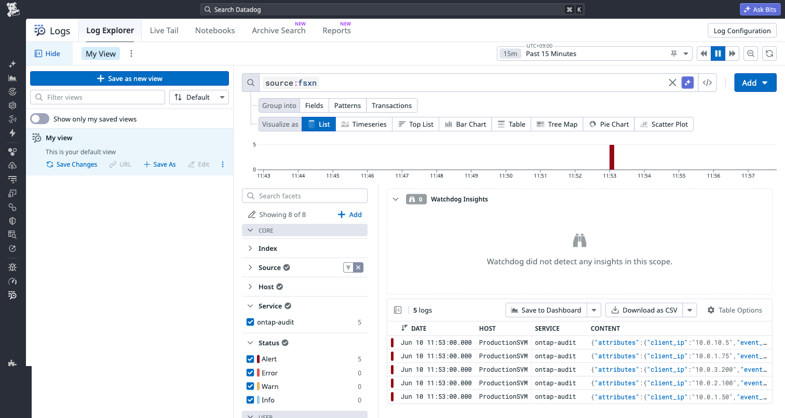

# FSx for ONTAP Datadog Integration

🌐 [日本語](docs/ja/setup-guide.md) | [English](docs/en/setup-guide.md)

> 📖 **Shared docs**: [Delivery Guarantee Patterns](../../docs/en/delivery-guarantees.md) | [Webhook Security](../../docs/en/webhook-security.md)

## Overview

EC2-free integration that ships Amazon FSx for NetApp ONTAP audit logs to Datadog. Lambda reads audit log files from the FSx volume via an FSx for ONTAP S3 Access Point and ships them to the Datadog Logs API v2.

**PoC time estimate**: ~30 minutes from deploy to first queryable log in Datadog.

> ⚠️ Datadog has no free tier for log ingestion. PoC will incur costs (~$0.10/GB ingested). Consider using the [OTel Collector integration](../otel-collector/) with a free-tier backend (Grafana/Honeycomb) for initial validation if budget is a concern.

## Architecture

```
FSx for ONTAP audit volume → FSx for ONTAP S3 Access Point → EventBridge Scheduler → Lambda → Datadog Logs API v2
```

## Quick Deploy

```bash
aws cloudformation deploy \
  --template-file template.yaml \
  --stack-name fsxn-datadog-integration \
  --parameter-overrides \
    FsxS3AccessPointArn=arn:aws:s3:ap-northeast-1:123456789012:accesspoint/fsxn-audit \
    DatadogApiKeySecretArn=arn:aws:secretsmanager:ap-northeast-1:123456789012:secret:dd-api-key \
    DatadogSite=ap1.datadoghq.com \
  --capabilities CAPABILITY_NAMED_IAM
```

## Parameters

| Parameter | Required | Default | Description |
|-----------|----------|---------|-------------|
| FsxS3AccessPointArn | ✅ | - | FSx for ONTAP S3 Access Point ARN (attached to audit volume) |
| DatadogApiKeySecretArn | ✅ | - | Secrets Manager ARN for DD API key |
| DatadogSite | ❌ | ap1.datadoghq.com | Datadog site region |
| AuditLogPrefix | ❌ | audit/ | Key prefix for audit log files |
| ScheduleRate | ❌ | rate(5 minutes) | How often to check for new audit logs |
| LogLevel | ❌ | INFO | Lambda log level |
| LambdaMemorySize | ❌ | 256 | Lambda memory (MB) |
| LambdaTimeout | ❌ | 300 | Lambda timeout (seconds) |
| VpcEnabled | ❌ | false | Enable VPC config (requires NAT Gateway for S3 AP access) |

## Datadog Sites

| Site | Domain | Region |
|------|--------|--------|
| US1 | datadoghq.com | US East |
| US3 | us3.datadoghq.com | US |
| US5 | us5.datadoghq.com | US West |
| EU1 | datadoghq.eu | EU (Frankfurt) |
| AP1 | ap1.datadoghq.com | Asia Pacific (Tokyo) |
| AP2 | ap2.datadoghq.com | Asia Pacific |
| US1-FED | ddog-gov.com | US Government |

## Tags Applied

- `source:fsxn`
- `service:ontap-audit`
- `env:<environment>`

## Monitoring

- CloudWatch Alarm: Lambda errors > 5 in 10 minutes
- CloudWatch Alarm: Lambda throttling detected
- CloudWatch Alarm: DLQ messages appearing
- Dead Letter Queue: Failed events preserved for 14 days

## E2E Verification Results

✅ **Verified on paid Datadog AP1 plan** (June 2026)

| Component | Status | Evidence |
|-----------|--------|----------|
| XML audit log parsing (5 events) | ✅ | EventID 4663/4656/4660 |
| Datadog Logs API v2 delivery | ✅ HTTP 202 | 10 events in Log Explorer |
| Field extraction | ✅ | user, path, client_ip, event_type, result, svm, operation |
| Log Pipeline (EventID→Operation) | ✅ | Category processor applied |
| Monitors (mass delete, abnormal access, failure spike) | ✅ | 3 monitors active |
| Dashboard | ✅ | FSx ONTAP Audit Log Overview |

### Screenshots

| Screenshot | Description |
|-----------|-------------|
|  | Log Explorer showing FSxN audit events with full field extraction |
|  | FSx ONTAP Audit Log Overview dashboard |
|  | Log Pipeline configuration (EventID→Operation Name mapping) |
|  | Security monitors for mass deletion, abnormal access, and access failures |

## Log Pipeline Configuration

The pipeline (`FSx for ONTAP Audit Logs`) applies to logs matching `source:fsxn` and includes:

1. **Category Processor** — Maps EventID to human-readable operation names:
   - 4663 → Object Access
   - 4656 → Handle Request
   - 4660 → Object Delete
   - 4670 → Permission Change
   - 5140 → Share Access
   - 4624 → Logon / 4634 → Logoff

2. **Status Remapper** — Maps `result` field to Datadog log status
3. **Date Remapper** — Uses `timestamp` field as the log timestamp
4. **Attribute Remapper** — Maps `user` → `usr.id`, `client_ip` → `network.client.ip`

## Security Monitors

| Monitor | Threshold | Severity | Description |
|---------|-----------|----------|-------------|
| Mass File Deletion | >50 deletes/5min per user | Critical | Detects bulk file deletion (ransomware, accidental) |
| Abnormal Access Volume | >1000 accesses/1h per user | High | Detects potential data exfiltration |
| Access Failure Spike | >10 failures/15min per user | Medium | Detects unauthorized access attempts |

## Saved Views

Pre-configured views for common investigation scenarios:

| View Name | Query | Use Case |
|-----------|-------|----------|
| FSxN File Deletions | `source:fsxn @event_type:4660` | Track all file deletion events |
| FSxN Access Failures | `source:fsxn @result:"Audit Failure"` | Permission denied / unauthorized access |
| FSxN All Events | `source:fsxn` | Full audit log stream |
| FSxN Sensitive Share Access | `source:fsxn (@path:*finance* OR @path:*hr* OR @path:*legal*)` | Access to sensitive file shares |
| FSxN After-Hours Access | `source:fsxn` | Filter by time for off-hours monitoring |



## Facets Setup

After deploying and sending initial logs, add custom Facets for faster filtering in Log Explorer:

1. Open Log Explorer → Click any log entry to expand it
2. Hover over a field (e.g., `event_type`) → Click the gear icon → "Create facet"
3. Repeat for: `@event_type`, `@user`, `@svm`, `@path`, `@client_ip`, `@operation`, `@result`, `@operation_name`

These facets enable:
- Left sidebar filtering by user, SVM, operation type
- One-click drill-down from dashboard widgets
- Saved View facet panels for team-specific workflows

## Important Notes

- **FSx for ONTAP S3 APs do NOT support S3 Event Notifications.** Lambda is invoked on a schedule (EventBridge Scheduler) and uses checkpointing to process only newly rotated files.
- **Internet-origin S3 APs** timed out with only a Gateway Endpoint in our environment. If Lambda is in a VPC, use NAT Gateway or create a VPC-origin AP.
- Audit log format: EVTX or XML (configured via `vserver audit create -format {evtx|xml}`)
- **Datadog region**: This integration is verified on AP1 (ap1.datadoghq.com). Adjust `DatadogSite` parameter for other regions.
