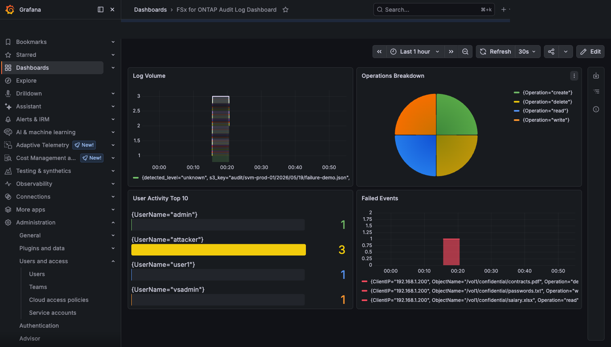

# Grafana Cloud Loki Setup Guide

🌐 [日本語](../ja/setup-guide.md)

## Overview

Setup instructions for the serverless integration that ships Amazon FSx for NetApp ONTAP audit logs to Grafana Cloud Loki.

This guide walks you through the following workflow:

1. Preparing Grafana Cloud credentials
2. Deploying Lambda via CloudFormation
3. Sending a test event and verifying operation
4. Confirming log arrival in Grafana Explore
5. LogQL query examples
6. Creating a dashboard

## Prerequisites

- AWS account (FSx for ONTAP running)
- Grafana Cloud account (Free tier available: 50GB/month log ingestion)
- AWS CLI v2 configured
- FSx for ONTAP audit logs outputting to an S3 bucket
- S3 Access Point created (see [Prerequisites](../../../../docs/en/prerequisites.md))

## Step 1: Prepare Grafana Cloud Credentials

### 1.1 Obtaining Instance ID and API Key

Retrieve Loki credentials from the Grafana Cloud console.

1. Log in to [Grafana Cloud](https://grafana.com/)
2. Navigate to the **My Account** page
3. Select the target stack from the **Grafana Cloud** section in the left menu
4. Click **Details** on the **Loki** card
5. Note the following information:
   - **Instance ID**: A numeric ID (e.g., `123456`)
   - **URL**: Loki endpoint URL
6. Click **Generate now** under **Security** → **API Keys**
7. Create an API Key:
   - **Key name**: `fsxn-audit-log-shipper`
   - **Role**: `MetricsPublisher` (includes `logs:write` scope)
8. Copy the generated API Key (it cannot be displayed again after closing this screen)

> **Important**: The API Key requires the `logs:write` scope. The `MetricsPublisher` role includes this scope.

### 1.2 Storing in AWS Secrets Manager

Store the obtained Instance ID and API Key in AWS Secrets Manager.

```bash
aws secretsmanager create-secret \
  --name "grafana/fsxn-loki-credentials" \
  --description "Grafana Cloud Loki credentials for FSxN audit log integration" \
  --secret-string '{"instance_id":"YOUR_INSTANCE_ID","api_key":"YOUR_API_KEY"}' \
  --region ap-northeast-1
```

> **Secret name**: `grafana/fsxn-loki-credentials`
>
> **JSON format**: `{"instance_id":"<id>","api_key":"<key>"}`

After creation, note the secret's ARN (used in the Step 2 deployment):

```bash
aws secretsmanager describe-secret \
  --secret-id "grafana/fsxn-loki-credentials" \
  --region ap-northeast-1 \
  --query 'ARN' --output text
```

### 1.3 Verifying IAM Permissions

The Lambda execution role requires permission to read the secret from Secrets Manager. The CloudFormation template configures this automatically, but if verifying manually, the following permission is required:

```json
{
  "Version": "2012-10-17",
  "Statement": [
    {
      "Effect": "Allow",
      "Action": "secretsmanager:GetSecretValue",
      "Resource": "arn:aws:secretsmanager:ap-northeast-1:<ACCOUNT_ID>:secret:grafana/fsxn-loki-credentials-*"
    }
  ]
}
```

> **Principle of least privilege**: Scope the `Resource` to the secret's ARN. The wildcard `*` suffix accommodates the random string automatically appended by Secrets Manager.

### 1.4 Loki Push Endpoint

Lambda sends logs to a URL in the following format:

```
https://<instance_id>.grafana.net/loki/api/v1/push
```

For example, if the Instance ID is `123456`:

```
https://123456.grafana.net/loki/api/v1/push
```

Authentication uses Basic Auth:
- **Username**: Instance ID
- **Password**: API Key

> **Note**: The URL host may differ depending on the Grafana Cloud region (e.g., `logs-prod-us-central1.grafana.net`). Use the URL confirmed in Step 1.1. You will specify it as the `LokiEndpoint` parameter during CloudFormation deployment.

## Step 2: CloudFormation Deploy

Deploy the Lambda function and related resources using a CloudFormation template.

```bash
aws cloudformation deploy \
  --template-file integrations/grafana/template.yaml \
  --stack-name fsxn-grafana-integration \
  --capabilities CAPABILITY_IAM \
  --parameter-overrides \
    S3AccessPointArn="arn:aws:s3:ap-northeast-1:123456789012:accesspoint/fsxn-audit-ap" \
    GrafanaCredentialsSecretArn="arn:aws:secretsmanager:ap-northeast-1:123456789012:secret:grafana/fsxn-loki-credentials-AbCdEf" \
    LokiEndpoint="https://logs-prod-us-central1.grafana.net" \
    S3BucketName="your-fsxn-audit-log-bucket"
```

> **Note**: Replace each parameter value with the appropriate value for your environment.

### Parameter Reference

| Parameter | Required | Description | Example |
|-----------|----------|-------------|---------|
| `S3AccessPointArn` | ✅ | ARN of the S3 Access Point for FSx for ONTAP audit logs | `arn:aws:s3:ap-northeast-1:123456789012:accesspoint/fsxn-audit-ap` |
| `GrafanaCredentialsSecretArn` | ✅ | ARN of the Secrets Manager secret containing Grafana Cloud credentials | `arn:aws:secretsmanager:ap-northeast-1:123456789012:secret:grafana/fsxn-loki-credentials-AbCdEf` |
| `LokiEndpoint` | ✅ | Grafana Cloud Loki endpoint URL | `https://logs-prod-us-central1.grafana.net` |
| `S3BucketName` | ✅ | S3 bucket name where audit logs are stored | `your-fsxn-audit-log-bucket` |
| `LokiTenantId` | ❌ | X-Scope-OrgID header (for multi-tenant Loki, usually empty) | `""` |
| `S3KeyPrefix` | ❌ | Audit log key prefix (for filtering) | `audit/svm-prod-01/` |
| `LogLevel` | ❌ | Lambda のログレベル（デフォルト: `INFO`） | `INFO` |
| `LambdaMemorySize` | ❌ | Lambda memory size in MB (default: 256) | `256` |
| `LambdaTimeout` | ❌ | Lambda timeout in seconds (default: 300) | `300` |

After deployment completes, verify the stack status:

```bash
aws cloudformation describe-stacks \
  --stack-name fsxn-grafana-integration \
  --query 'Stacks[0].StackStatus' --output text
```

If `CREATE_COMPLETE` is displayed, the deployment was successful.

## Step 3: Sending a Test Event

Send a test event to verify that the Lambda function operates correctly.

### 3.1 Creating the Test Event

Save the following JSON as `test-event.json`. It uses the S3 object creation notification format:

```json
{
  "Records": [
    {
      "eventSource": "aws:s3",
      "eventName": "ObjectCreated:Put",
      "s3": {
        "bucket": {
          "name": "your-fsxn-audit-log-bucket"
        },
        "object": {
          "key": "audit/svm-prod-01/2026/01/15/20260115120000_audit.evtx"
        }
      }
    }
  ]
}
```

> **Note**: Replace `bucket.name` and `object.key` with the actual audit log path. The `object.key` is the path to the audit log file output by FSx for ONTAP.

### 3.2 Invoking the Lambda Function

```bash
aws lambda invoke \
  --function-name fsxn-grafana-integration-shipper \
  --payload fileb://test-event.json \
  --cli-binary-format raw-in-base64-out \
  output.json
```

### 3.3 Expected Response

Check the contents of `output.json`:

```bash
cat output.json
```

**Success (all entries shipped)**:

```json
{
  "statusCode": 200,
  "body": {
    "total_logs": 15,
    "total_shipped": 15,
    "errors": []
  }
}
```

**Partial success**:

```json
{
  "statusCode": 207,
  "body": {
    "total_logs": 15,
    "total_shipped": 12,
    "errors": [
      "Failed to ship batch 2: HTTP 429 Too Many Requests"
    ]
  }
}
```

| Field | Description |
|-------|-------------|
| `statusCode` | `200`: 全件成功、`207`: 部分成功（一部エラーあり） |
| `body.total_logs` | Total number of parsed log entries |
| `body.total_shipped` | Number of logs successfully sent to Loki |
| `body.errors` | Array of error messages (empty array means full success) |

### 3.4 Troubleshooting

#### statusCode is not 200, or errors contains entries

**Check errors in CloudWatch Logs**:

```bash
aws logs filter-log-events \
  --log-group-name "/aws/lambda/fsxn-grafana-integration-shipper" \
  --filter-pattern "ERROR" \
  --start-time $(date -d '10 minutes ago' +%s000) \
  --query 'events[].message' --output text
```

> **macOS**: Replace `$(date -d '10 minutes ago' +%s000)` with `$(date -v-10M +%s000)`.

**Check DLQ message count**:

```bash
aws sqs get-queue-attributes \
  --queue-url "https://sqs.ap-northeast-1.amazonaws.com/123456789012/fsxn-grafana-integration-dlq" \
  --attribute-names ApproximateNumberOfMessages \
  --query 'Attributes.ApproximateNumberOfMessages' --output text
```

If there are messages in the DLQ, events that Lambda failed to process exist. Investigate the cause together with CloudWatch Logs.

#### Lambda returns FunctionError or times out

Verify the IAM permissions of the Lambda execution role:

**Verify S3 Access Point read permissions**:

```bash
aws iam list-attached-role-policies \
  --role-name fsxn-grafana-integration-lambda-role

aws iam get-role-policy \
  --role-name fsxn-grafana-integration-lambda-role \
  --policy-name S3Read
```

The following permission is required:
- `s3:GetObject` — Resource: `arn:aws:s3:ap-northeast-1:<ACCOUNT_ID>:accesspoint/fsxn-audit-ap/object/*`

**Verify Secrets Manager access permissions**:

```bash
aws iam get-role-policy \
  --role-name fsxn-grafana-integration-lambda-role \
  --policy-name Secrets
```

The following permission is required:
- `secretsmanager:GetSecretValue` — Resource: ARN of the Grafana credentials secret

> **For timeouts**: The default Lambda timeout is 300 seconds. If processing large log files, increase the `LambdaTimeout` parameter or split the log files for testing.


## Step 4: Verifying Logs in Grafana Explore

Once the test event has been sent successfully from Lambda, confirm that logs have arrived in Grafana Cloud.

### 4.1 Navigating to Explore

1. Log in to [Grafana Cloud](https://grafana.com/) and open the target stack
2. Click the compass icon **Explore** in the left sidebar (or use keyboard shortcut `Cmd+Shift+E` / `Ctrl+Shift+E`)
3. Select **grafanacloud-\<stack\>-logs** (Loki data source) from the data source dropdown at the top of the screen
4. Select **Last 15 minutes** in the time range picker

### 4.2 Verification with a Basic Query

Enter the following LogQL query and click **Run query**:

```logql
{job="fsxn-audit"}
```

If logs are being delivered successfully, one or more log entries will appear in the timeline and log list.


> **Hint**: If no logs appear, expand the time range to **Last 1 hour** and run the query again. The timestamp of the Lambda test event may differ from the current time.

### 4.3 Expected Log Fields

Expanding a log entry in the query results reveals the following fields:

| Field Name | Description | Example |
|------------|-------------|---------|
| `timestamp` | Event occurrence time (ISO 8601 format) | `2026-01-15T10:30:00.000Z` |
| `UserName` | User who performed the operation | `admin`, `vsadmin` |
| `Operation` | Type of operation performed | `create`, `read`, `write`, `delete`, `rename` |
| `ObjectName` | File/directory path of the operation target | `/vol1/data/report.xlsx` |

If these fields are displayed, the log pipeline is operating correctly.

### 4.4 Troubleshooting: Logs Not Appearing Within 5 Minutes

If logs do not appear in Grafana Explore after 5 minutes, check the following items in order.

#### Checking Lambda Invocation Errors (CloudWatch Logs)

Check the Lambda function execution logs for errors:

```bash
aws logs filter-log-events \
  --log-group-name "/aws/lambda/fsxn-grafana-log-shipper" \
  --filter-pattern "ERROR" \
  --start-time $(date -d '10 minutes ago' +%s000) \
  --region ap-northeast-1
```

- If `ERROR` or `Exception` is output, log delivery failed within the Lambda function
- If `Loki push failed` or `HTTP 4xx/5xx` messages appear, there is an authentication or endpoint issue

#### Verifying Network Connectivity (VPC Endpoint / Security Group)

If Lambda is deployed within a VPC, verify that HTTPS communication to the Loki endpoint is allowed:

- **NAT Gateway**: A NAT Gateway is required for Lambda within a VPC to communicate with external APIs (Grafana Cloud)
- **Security Group**: Verify that the Lambda security group allows HTTPS (port 443) outbound
- **VPC Endpoint**: Internet-origin S3 APs cannot be accessed via Gateway Endpoint alone (see [Constraints](../../../../docs/en/prerequisites.md))

```bash
# セキュリティグループのアウトバウンドルール確認
aws ec2 describe-security-groups \
  --group-ids <lambda-sg-id> \
  --query 'SecurityGroups[].IpPermissionsEgress' \
  --region ap-northeast-1
```

#### Verifying Credentials (Instance ID / API Key Validity)

Verify that the credentials stored in Secrets Manager are correct:

```bash
# シークレットの値を確認（Instance ID と API Key）
aws secretsmanager get-secret-value \
  --secret-id "grafana/fsxn-loki-credentials" \
  --region ap-northeast-1 \
  --query 'SecretString' --output text | python3 -c "
import sys, json
secret = json.loads(sys.stdin.read())
print(f'Instance ID: {secret[\"instance_id\"]}')
print(f'API Key: {secret[\"api_key\"][:8]}...(masked)')
"
```

Verification points:
- Does the **Instance ID** match the number displayed in Grafana Cloud console → Loki Details?
- Has the **API Key** expired? (Check in Grafana Cloud → Security → API Keys)
- Does the **API Key scope** include `logs:write`? (`MetricsPublisher` role)

> **If unresolved**: If the issue persists after checking all of the above, verify whether a service outage is occurring on the Grafana Cloud status page (https://status.grafana.com/).


## Step 5: LogQL Query Examples

Once logs are confirmed in Grafana Explore, you can use LogQL to efficiently search and analyze audit logs. Below are representative query patterns.

### 5.1 Filter by Operation

Filter logs by a specific operation type (create, read, write, delete, rename). Use this to view only file creation events.

```logql
{job="fsxn-audit"} | json | Operation="create"
```

> **Use case**: Auditing new file creation, detecting unauthorized file creation. Change the `Operation` value to `delete` or `rename` to filter other operation types.

### 5.2 Filter by User

Display only operations performed by a specific user. Use for user activity investigation or access auditing.

```logql
{job="fsxn-audit"} | json | UserName="admin"
```

> **Use case**: Reviewing administrator account operation history, investigating suspicious activity by a specific user. Change the `UserName` value to the target username.

### 5.3 Filter Failed Operations

Extract only logs where the operation result is Failure. Effective for detecting access denials and permission errors.

```logql
{job="fsxn-audit"} | json | Result="Failure"
```

> **Use case**: Detecting access denials due to insufficient permissions, identifying signs of brute-force attacks. A concentration of failure events in a short period may indicate a security incident.

### 5.4 Filter by SVM

Display only logs from a specific SVM (Storage Virtual Machine). Use in multi-tenant environments to view logs separated by SVM.

```logql
{job="fsxn-audit", svm="svm-prod-01"}
```

> **Use case**: Reviewing audit logs for the production SVM only, comparing activity between SVMs. The `svm` label is a stream label attached by Lambda during log delivery.

### 5.5 Output Formatting with line_format

Use `line_format` to format log output for readability. By extracting and displaying only the necessary fields, you can efficiently review large volumes of logs.

```logql
{job="fsxn-audit"} | json | line_format "{{.UserName}} {{.Operation}} {{.ObjectName}}"
```

> **Use case**: Display the log list in a concise "who · what · which file" format. Improves visibility in the Grafana Explore log view.

### 5.6 Aggregation with count_over_time

Aggregate log counts within a specified time window. Use to understand event frequency over time.

```logql
count_over_time({job="fsxn-audit"} | json [5m])
```

> **Use case**: View event count trends at 5-minute intervals. Useful for detecting abnormal spikes and establishing normal baselines. Effective when used in time-series dashboard panels.

### 5.7 Rate Calculation with rate

Calculate the log inflow rate (log entries per second). Use to monitor overall system log throughput.

```logql
rate({job="fsxn-audit"}[5m])
```

> **Use case**: Monitoring log delivery pipeline throughput, understanding log volume for capacity planning. A sudden rate increase suggests heavy access to the file system.

## Step 6: Dashboard Creation

Leverage LogQL queries to create a visualization dashboard for FSx for ONTAP audit logs. A dashboard composed of the following 4 panels provides an at-a-glance view of log volume trends, operation breakdown, user activity, and failure events.

### Dashboard Creation Steps

1. Log in to Grafana Cloud and click **Dashboards** → **New** → **New Dashboard** in the left sidebar
2. Click **Add visualization** to add a panel
3. Select **grafanacloud-\<stack\>-logs** (Loki) as the data source
4. Configure the query and visualization according to each panel configuration below

### 6.1 Log Volume Panel

Displays audit log volume over time. Provides visual insight into abnormal spikes and normal baselines.

| Setting | Value |
|---------|-------|
| **Panel title** | Log Volume Over Time |
| **Visualization** | Time series |
| **LogQL query** | See below |

```logql
count_over_time({job="fsxn-audit"}[5m])
```

**Panel configuration notes**:
- **Query type**: Select Range
- **Legend**: Set to `{{job}}`
- **Graph style**: Lines (default)
- **Unit**: short (event count)
- The time window `[5m]` can be adjusted to `[1m]` or `[15m]` depending on your environment

### 6.2 Operations Breakdown Panel

Displays event counts by operation type (create, read, write, delete, rename) as a pie chart or bar gauge. Provides intuitive understanding of which operations are most frequent.

| Setting | Value |
|---------|-------|
| **Panel title** | Operations Breakdown |
| **Visualization** | Pie chart or Bar gauge |
| **LogQL query** | See below |

```logql
sum by (Operation) (count_over_time({job="fsxn-audit"} | json [1h]))
```

**Panel configuration notes**:
- **Query type**: Select Instant (for pie chart)
- **Legend**: Set to `{{Operation}}`
- **Pie chart** makes the proportion of operation types visually clear
- **Bar gauge** makes it easier to compare absolute counts of each operation
- Adjust the time window `[1h]` according to the dashboard time range

### 6.3 User Activity Panel

Displays the top 10 users by event count. Use for identifying active users and detecting accounts with abnormally high access.

| Setting | Value |
|---------|-------|
| **Panel title** | User Activity Top 10 |
| **Visualization** | Bar gauge or Table |
| **LogQL query** | See below |

```logql
topk(10, sum by (UserName) (count_over_time({job="fsxn-audit"} | json [1h])))
```

**Panel configuration notes**:
- **Query type**: Select Instant
- **Legend**: Set to `{{UserName}}`
- The JSON pipeline `| json` extracts the `UserName` field as a label
- `topk(10, ...)` limits to the top 10 users
- **Bar gauge** displayed as horizontal bars makes comparison between users easy
- **Table** visualization allows checking exact values

### 6.4 Failed Events Panel

Displays the count of events with a Failure result over time. Monitors trends in access denials and permission errors for early detection of security incidents.

| Setting | Value |
|---------|-------|
| **Panel title** | Failed Events Over Time |
| **Visualization** | Time series |
| **LogQL query** | See below |

```logql
count_over_time({job="fsxn-audit"} | json | Result="Failure" [5m])
```

**Panel configuration notes**:
- **Query type**: Select Range
- **Legend**: Set to `Failed Events`
- **Graph style**: Lines + Points (to make failure events stand out)
- **Threshold**: Set alert thresholds as needed (e.g., warning if more than 10 events in 5 minutes)
- **Color**: Set to a red-based color to visually emphasize warnings
- The `Result="Failure"` filter counts only failure events

### Dashboard Overview

The overall layout of the dashboard with all 4 panels:



> **Hint**: Setting the dashboard time range to **Last 1 hour** or **Last 6 hours** ensures sufficient data is displayed in each panel. Immediately after testing, data volume may be low, so expand the time range to verify.

### Saving and Sharing the Dashboard

1. Click **Save dashboard** (💾 icon) in the upper right corner
2. Enter the dashboard name: `FSxN Audit Log Overview`
3. Select a folder (e.g., `FSxN Monitoring`)
4. Click **Save**

> **Export**: You can also export the dashboard JSON model and import it into other Grafana instances. Copy from **Dashboard settings** → **JSON Model**.


## Troubleshooting

This section summarizes issues that may occur with the Grafana Cloud Loki integration and their resolution steps. It is a comprehensive reference that includes the troubleshooting content described in Steps 3–4.

### Logs Not Arriving in Grafana

If running `{job="fsxn-audit"}` in Grafana Explore shows no logs, check the following 3 categories in order.

#### Lambda Invocation Errors

The Lambda function may not be executing successfully. Check CloudWatch Logs for errors.

```bash
aws logs filter-log-events \
  --log-group-name "/aws/lambda/fsxn-grafana-integration-shipper" \
  --filter-pattern "ERROR" \
  --start-time $(date -d '10 minutes ago' +%s000) \
  --region ap-northeast-1
```

> **macOS**: Replace `$(date -d '10 minutes ago' +%s000)` with `$(date -v-10M +%s000)`.

**Verification points**:

| Symptom | Cause | Resolution |
|---------|-------|------------|
| `ERROR` や `Exception` が出力されている | Log delivery failed within the Lambda function | Check error message details and fix the relevant section |
| `Loki push failed` や `HTTP 4xx/5xx` | Authentication or endpoint issue | See "Authentication Errors" section below |
| `S3 Access Denied` | Insufficient IAM permissions | See IAM verification steps in "Lambda Timeout" section below |
| No log events exist at all | Lambda is not being invoked | Check EventBridge Scheduler settings and S3 bucket event notifications |

**Check DLQ message count**:

```bash
aws sqs get-queue-attributes \
  --queue-url "https://sqs.ap-northeast-1.amazonaws.com/<ACCOUNT_ID>/fsxn-grafana-integration-dlq" \
  --attribute-names ApproximateNumberOfMessages \
  --query 'Attributes.ApproximateNumberOfMessages' --output text
```

If there are messages in the DLQ, events that Lambda failed to process exist. Check the message contents to identify the cause.

#### Network Connectivity

If Lambda is deployed within a VPC, verify that HTTPS communication to the Grafana Cloud Loki endpoint is allowed.

**Checklist**:

- **NAT Gateway**: A NAT Gateway is required for Lambda within a VPC to communicate with external APIs (Grafana Cloud) and Internet-origin S3 APs.
- **Security Group**: The Lambda security group must allow HTTPS (port 443) outbound
- **Subnet Route Table**: A route to the NAT Gateway (`0.0.0.0/0 → nat-xxx`) must exist

```bash
# セキュリティグループのアウトバウンドルール確認
aws ec2 describe-security-groups \
  --group-ids <lambda-sg-id> \
  --query 'SecurityGroups[].IpPermissionsEgress' \
  --region ap-northeast-1
```

```bash
# サブネットのルートテーブル確認
aws ec2 describe-route-tables \
  --filters "Name=association.subnet-id,Values=<lambda-subnet-id>" \
  --query 'RouteTables[].Routes' \
  --region ap-northeast-1
```

> **Recommended configuration**: Deploying the read-only log Lambda outside the VPC avoids NAT Gateway costs and network configuration complexity.

#### Credential Mismatch

Verify that the credentials stored in Secrets Manager match the Grafana Cloud configuration. See the "Authentication Errors" section below for details.

### Authentication Errors

If the Loki Push API returns HTTP 401 (Unauthorized) or 403 (Forbidden), there is a credentials issue.

#### Verifying Instance ID

```bash
aws secretsmanager get-secret-value \
  --secret-id "grafana/fsxn-loki-credentials" \
  --region ap-northeast-1 \
  --query 'SecretString' --output text | python3 -c "
import sys, json
secret = json.loads(sys.stdin.read())
print(f'Instance ID: {secret[\"instance_id\"]}')
print(f'API Key: {secret[\"api_key\"][:8]}...(masked)')
"
```

#### Verification Points

| Check Item | How to Verify |
|------------|---------------|
| Is the Instance ID correct? | Verify it matches the number displayed in Grafana Cloud console → Loki Details |
| Has the API Key expired? | Check status in Grafana Cloud → Security → API Keys |
| Is the API Key scope correct? | `logs:write` スコープが含まれていること（`MetricsPublisher` ロール） |
| Is the Loki endpoint URL correct? | `https://<instance_id>.grafana.net` または Grafana Cloud コンソールに表示される URL |
| Is the secret JSON format correct? | `{"instance_id":"<id>","api_key":"<key>"}` の形式であること |

#### API Key Reissue Steps

If the API Key is invalid, reissue it with the following steps:

1. Log in to [Grafana Cloud](https://grafana.com/)
2. **My Account** → Target stack → **Security** → **API Keys**
3. Delete the old key (if necessary)
4. Click **Generate now**
5. **Key name**: `fsxn-audit-log-shipper`, **Role**: `MetricsPublisher`
6. Copy the generated API Key

Update the Secrets Manager secret:

```bash
aws secretsmanager put-secret-value \
  --secret-id "grafana/fsxn-loki-credentials" \
  --secret-string '{"instance_id":"YOUR_INSTANCE_ID","api_key":"YOUR_NEW_API_KEY"}' \
  --region ap-northeast-1
```

> **Note**: After updating the secret, the new credentials will be loaded on the next Lambda invocation (cold start). To apply immediately, manually redeploy the Lambda function or reset the execution environment.

#### Checking Grafana Cloud Service Status

If errors persist despite correct credentials, there may be a Grafana Cloud service outage:

- **Status page**: https://status.grafana.com/
- **Loki ingestion limit**: Free tier is 50GB/month. If the limit is reached, HTTP 429 is returned

### Lambda Timeout

If Lambda times out (default: 300 seconds), insufficient IAM permissions or resource access issues are likely causes.

#### Verifying IAM Role Permissions

Verify that the required permissions are granted to the Lambda execution role.

**S3 Access Point read permissions**:

```bash
aws iam list-attached-role-policies \
  --role-name fsxn-grafana-integration-lambda-role

aws iam get-role-policy \
  --role-name fsxn-grafana-integration-lambda-role \
  --policy-name S3Read
```

Required permissions:

| Action | Resource |
|--------|----------|
| `s3:GetObject` | `arn:aws:s3:ap-northeast-1:<ACCOUNT_ID>:accesspoint/fsxn-audit-ap/object/*` |
| `s3:ListBucket` | `arn:aws:s3:ap-northeast-1:<ACCOUNT_ID>:accesspoint/fsxn-audit-ap` |

> **Important**: In S3 Access Point IAM policies, the `/object/*` suffix is required in the resource ARN.

**Secrets Manager access permissions**:

```bash
aws iam get-role-policy \
  --role-name fsxn-grafana-integration-lambda-role \
  --policy-name Secrets
```

Required permissions:

| Action | Resource |
|--------|----------|
| `secretsmanager:GetSecretValue` | `arn:aws:secretsmanager:ap-northeast-1:<ACCOUNT_ID>:secret:grafana/fsxn-loki-credentials-*` |

#### Timeout Causes and Resolutions

| Cause | Symptom | Resolution |
|-------|---------|------------|
| Processing large log files | Processing time exceeds 300 seconds | `LambdaTimeout` パラメータを増やす（最大 900 秒）、またはログファイルを分割 |
| Connection timeout to S3 Access Point | `ConnectTimeoutError` | If Lambda is in a VPC, check NAT Gateway configuration |
| Connection timeout to Secrets Manager | `EndpointConnectionError` | VPC エンドポイント（`com.amazonaws.ap-northeast-1.secretsmanager`）を追加 |
| Connection timeout to Loki endpoint | `MaxRetryError` | Check NAT Gateway configuration, check Grafana Cloud status |

#### Adjusting Lambda Memory and Timeout

When processing large volumes of logs, adjust the CloudFormation parameters:

```bash
aws cloudformation deploy \
  --template-file integrations/grafana/template.yaml \
  --stack-name fsxn-grafana-integration \
  --capabilities CAPABILITY_IAM \
  --parameter-overrides \
    S3AccessPointArn="<existing-value>" \
    GrafanaCredentialsSecretArn="<existing-value>" \
    LokiEndpoint="<existing-value>" \
    S3BucketName="<existing-value>" \
    LambdaMemorySize=512 \
    LambdaTimeout=600
```

> **Hint**: Increasing memory also proportionally increases CPU allocation, improving processing speed. Changing from 256MB to 512MB can significantly reduce processing time.
