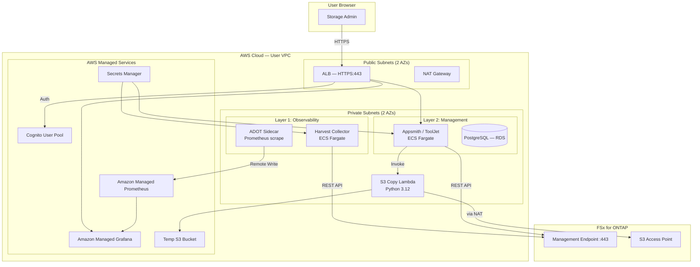
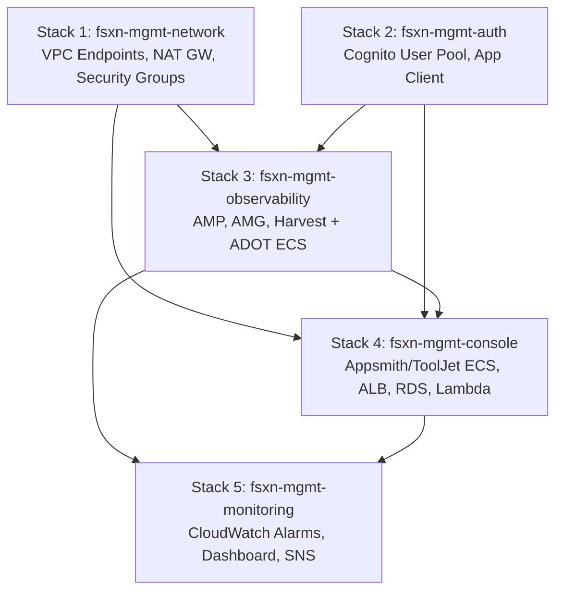

# FSx for ONTAP Management Console

🌐 [日本語](#概要) | [English](#overview) | [セットアップガイド / Setup Guide](docs/ja/setup-guide.md)

---

## 概要

Amazon FSx for NetApp ONTAP 向けのセルフホスト管理コンソールです。NetApp Data Infrastructure Insights および NetApp System Manager の主要機能を、AWS マネージドサービスのみで再現します。

**30秒サマリー**: FSx for ONTAP のストレージ性能メトリクスと管理操作を VPC 内で統合的に提供し、外部 SaaS へのデータ送信なしで MTTR を短縮します。

| レイヤー | 目的 | コンポーネント |
|---------|------|-------------|
| **Layer 1: Observability** | メトリクス収集 + ダッシュボード | Harvest → ADOT → AMP → AMG（20+ ダッシュボード） |
| **Layer 2: Management** | ストレージ操作 UI | Appsmith/ToolJet on ECS Fargate + S3 Copy Lambda |

両レイヤーは Amazon Cognito User Pool + ALB による統一認証を共有します。

### クイックスタート

```bash
# 1. 環境変数を設定
export VPC_ID="vpc-0123456789abcdef0"
export PRIVATE_SUBNET_IDS="subnet-aaaa,subnet-bbbb"
export PUBLIC_SUBNET_IDS="subnet-cccc,subnet-dddd"
export ONTAP_MGMT_ENDPOINT="<management-ip>"
export ONTAP_CREDENTIALS_SECRET_ARN="arn:aws:secretsmanager:ap-northeast-1:123456789012:secret:fsxn-ontap-creds-XXXXXX"
export S3_ACCESS_POINT_ARN="arn:aws:s3:ap-northeast-1:123456789012:accesspoint/fsxn-file-ap"
export FSXN_SECURITY_GROUP_ID="sg-0123456789abcdef0"

# 2. 全5スタックを依存順序でデプロイ
bash scripts/deploy.sh
```

詳細な手順: [セットアップガイド（日本語）](docs/ja/setup-guide.md) | [ローカル開発ガイド](docs/ja/local-dev-guide.md)

---

## Overview

Self-hosted management console for Amazon FSx for NetApp ONTAP — replicating key capabilities of NetApp Data Infrastructure Insights and NetApp System Manager using AWS managed services.

## Overview

The Management Console is a **2-layer architecture** deployed entirely within your VPC:

## Value Proposition

**30-second summary**: This console gives FSx for ONTAP operators a unified view of storage performance + management operations within their VPC, without sending data to external SaaS platforms. It aims to reduce MTTR for storage issues by combining real-time metrics with one-click remediation actions in a single pane of glass — validate this target against your own baseline before relying on it.

### Common Questions → Pattern → Expected Outcome

| Common Question | Pattern | Expected Outcome |
|-------------------|---------|-----------------|
| "How do I monitor FSx for ONTAP without an external SaaS platform?" | Harvest + AMP + AMG (Layer 1) | Real-time visibility into 50+ ONTAP metrics, 20+ dashboards, no data leaves VPC |
| "How do I manage volumes/snapshots without ONTAP CLI?" | Appsmith/ToolJet + ONTAP REST API (Layer 2) | Self-service storage operations via web UI, reduced day-to-day CLI dependency |
| "How do I unify authentication across monitoring and management?" | Cognito + ALB authenticate action | Single login for all console components, MFA support, no custom auth code |
| "How do I meet a data residency requirement?" | VPC-internal deployment, no external SaaS | All data stays within your own AWS account and VPC |

### Success Metrics (PoC Criteria)

| Metric | Measurement | Target |
|--------|-------------|--------|
| Deployment time | Time from `deploy.sh` start to all stacks CREATE_COMPLETE | < 30 minutes |
| Metrics visibility | Time from deployment to first Grafana dashboard with data | < 5 minutes after Harvest starts |
| Operation latency | Time from UI action to ONTAP API response displayed | < 5 seconds (P95) |
| MTTR improvement | Time to identify + resolve a capacity issue (before vs after) | Measure against your own CLI-only baseline; no fixed target — report the observed delta |

> **Sample run vs production estimate**: The deployment-time and latency figures above reflect the validation environment described in this repository (Stacks 1-3, single Region, low ONTAP management-call volume). They are not guaranteed service limits. Re-measure in your own account before using them for capacity planning or SLA commitments.

## When to Choose This Approach

Each option below suits different requirements. None is universally preferable — the right choice depends on data residency, customization needs, and operating cost tolerance.

| Requirement | NetApp DII<!-- allow:naming -->/BlueXP<!-- allow:naming --> (SaaS) | System Manager (ONTAP built-in) | This Self-Hosted Console |
|-------------|-------------------|----------------|-------------------|
| VPC-internal (no external data egress) | Requires external SaaS | Built-in | Built-in |
| 20+ custom dashboards | Available | Limited | Available (Harvest + AMG) |
| AWS-native auth (Cognito/IAM) | Uses NetApp's own auth | Uses ONTAP local auth | Available |
| Storage operations GUI | Available | Available | Available (low-code) |
| Custom UI workflows | Not customizable | Not customizable | Available (Appsmith/ToolJet) |
| Operating cost | SaaS subscription | Free (built-in) | ~$250/month (24/7 estimate) |
| Setup time | Minutes (SaaS) | Instant (built-in) | ~30 minutes |

**This self-hosted console fits when:**
- A data residency requirement prevents sending data to external SaaS
- You want AWS Cognito/IAM unified authentication
- You need custom UI workflows tailored to your operations
- You want to integrate with an existing AWS Observability stack (AMP/AMG)

**NetApp's own tools (System Manager or DII<!-- allow:naming -->/BlueXP<!-- allow:naming -->) fit when:**
- No data residency requirement blocks external SaaS
- Standard built-in features are sufficient without customization
- You prefer to avoid running and paying for additional AWS resources

> **Combining both**: These options are not mutually exclusive. A common pattern is to keep System Manager for day-to-day ad hoc checks (it is free and always available) while using this self-hosted console for automated workflows, custom dashboards, or environments where a data residency requirement rules out any external SaaS call.

> 🔍 **Ransomware / incident response note**: The comparison above covers day-to-day management and monitoring. If you're specifically evaluating DII<!-- allow:naming --> Storage Workload Security's containment capabilities (automated user/IP blocking on anomaly detection), see the [Automated Incident Response Guide](../docs/en/automated-response-guide.md) for an AWS-native alternative that implements the same ONTAP REST API blocking actions, triggerable from any detection source (this console's alerts, a SIEM, or a manual CLI call) rather than DII's own ML detection.

| Layer | Purpose | Components |
|-------|---------|------------|
| **Layer 1: Observability** | Metrics collection and dashboards | Harvest → ADOT → AMP → AMG (20+ dashboards) |
| **Layer 2: Management** | Storage operations UI | Appsmith/ToolJet on ECS Fargate + S3 Copy Lambda |

Both layers share unified authentication via Amazon Cognito User Pool integrated with an Application Load Balancer.

## Architecture



### CloudFormation Stack Dependencies



## Quick Start

```bash
# 1. Set required environment variables
export VPC_ID="vpc-0123456789abcdef0"
export PRIVATE_SUBNET_IDS="subnet-aaaa,subnet-bbbb"
export PUBLIC_SUBNET_IDS="subnet-cccc,subnet-dddd"
export ONTAP_MGMT_ENDPOINT="<management-ip>"
export ONTAP_CREDENTIALS_SECRET_ARN="arn:aws:secretsmanager:ap-northeast-1:123456789012:secret:fsxn-ontap-creds-XXXXXX"
export S3_ACCESS_POINT_ARN="arn:aws:s3:ap-northeast-1:123456789012:accesspoint/fsxn-file-ap"

# 2. Deploy all 5 stacks in order
bash scripts/deploy.sh
```

The deploy script orchestrates all 5 stacks in dependency order, passing outputs between stacks automatically.

## Components

| Component | Description | Image |
|-----------|-------------|-------|
| **Harvest** | NetApp ONTAP metrics collector. Polls REST API every 60s, exports Prometheus metrics. | `ghcr.io/netapp/harvest` |
| **ADOT Sidecar** | Scrapes Harvest `/metrics` endpoint, remote-writes to AMP with SigV4 auth. | `public.ecr.aws/aws-observability/aws-otel-collector` |
| **Appsmith / ToolJet** | Low-code management UI for volume, SVM, snapshot, and replication operations. | `appsmith/appsmith-ce` or `tooljet/tooljet` |
| **Amazon Managed Grafana** | 20+ pre-built Harvest dashboards. Embedded panels in management UI via iframe. | Managed service |
| **S3 Copy Lambda** | Copies files from FSx for ONTAP S3 AP to temp bucket for presigned URL generation (S3 AP does not support presigned URLs). | Python 3.12 |

## Cost Estimate

| Resource | Unit Price | Monthly (24/7) | Notes |
|----------|-----------|----------------|-------|
| NAT Gateway | $0.062/h + $0.062/GB | ~$45 | Depends on data transfer |
| ECS Fargate (Harvest + ADOT) | ~$0.05/h | ~$36 | 1024 CPU / 2048 MB |
| ECS Fargate (Appsmith/ToolJet) | ~$0.05/h | ~$36 | 1024 CPU / 2048 MB |
| RDS db.t3.medium | $0.068/h | ~$49 | ToolJet state management |
| VPC Interface Endpoints x5 | $0.014/h each | ~$50 | SM, CW Logs, ECR x2, STS |
| AMP | $0.003/10K samples | ~$5 | Depends on Harvest metrics volume |
| AMG | $9/editor/month | $9 | Viewers are free |
| ALB | $0.0225/h + LCU | ~$20 | Depends on request volume |
| **Total** | | **~$250/month** | Full 24/7 operation estimate |

> ⚠️ This is a **sizing reference**, not a service limit or guaranteed price. Actual costs vary by usage, region, and data transfer volume. Use [AWS Pricing Calculator](https://calculator.aws/) for precise estimates. VPC-origin S3 APs eliminate the NAT Gateway (~$45/month savings).

## Directory Structure

```
management-console/
├── README.md                          # This file
├── parameters.json                    # Shared CloudFormation parameters (all 5 stacks)
├── templates/
│   ├── network.yaml                   # Stack 1: VPC endpoints, NAT GW, security groups
│   ├── auth.yaml                      # Stack 2: Cognito User Pool, App Client
│   ├── observability.yaml             # Stack 3: AMP, AMG, Harvest + ADOT ECS
│   ├── console.yaml                   # Stack 4: Management UI ECS, ALB, RDS, Lambda
│   └── monitoring.yaml                # Stack 5: CloudWatch alarms, dashboard, SNS
├── harvest/
│   ├── harvest.yml                    # Harvest poller configuration
│   ├── adot-config.yaml               # ADOT Collector pipeline config
│   └── dashboards/                    # Grafana dashboard JSON (imported to AMG)
├── lambda/
│   └── s3_copy_handler.py             # S3 AP → temp bucket copy + presign
├── scripts/
│   ├── deploy.sh                      # Deploy all 5 stacks in order
│   ├── cleanup.sh                     # Delete all stacks in reverse order
│   └── import-dashboards.sh           # Import Harvest dashboards to AMG
├── tooljet-workflows/
│   ├── volume-management.json         # Volume CRUD operations
│   ├── svm-management.json            # SVM list and configuration
│   ├── snapshot-management.json       # Snapshot CRUD and restore
│   ├── replication-management.json    # SnapMirror relationship management
│   ├── s3-file-browser.json           # S3 AP file browser (via Lambda)
│   ├── grafana-embed-config.json      # AMG panel embedding configuration
│   └── ui-layout.json                 # Dashboard layout definition
├── local-dev/
│   └── appsmith-fsxn-prototype.json   # Appsmith prototype for local development
├── tests/
│   ├── conftest.py                    # Shared pytest fixtures
│   ├── test_s3_copy_handler.py        # Lambda unit tests
│   └── test_data/                     # Sample events and responses
└── docs/
    ├── ja/
    │   ├── setup-guide.md             # デプロイ手順（日本語）
    │   └── local-dev-guide.md         # ローカル開発ガイド
    ├── en/
    │   └── setup-guide.md             # Deployment guide (English)
    └── images/                        # Screenshots (masked)
```

## Prerequisites

- AWS CLI v2 configured with appropriate credentials
- An existing VPC with at least 2 AZs (public + private subnets)
- An FSx for ONTAP file system with management endpoint accessible from the VPC
- ONTAP admin credentials stored in Secrets Manager (JSON: `{"username": "...", "password": "..."}`)
- (Optional) FSx for ONTAP S3 Access Point for file browser functionality
- Docker (for local development only)

## Deployment

Full deployment guides with step-by-step instructions:

- 🇯🇵 [セットアップガイド（日本語）](docs/ja/setup-guide.md)
- 🇺🇸 [Setup Guide (English)](docs/en/setup-guide.md)

### Environment Variables

| Variable | Required | Description |
|----------|----------|-------------|
| `VPC_ID` | Yes | Target VPC ID |
| `PRIVATE_SUBNET_IDS` | Yes | Comma-separated private subnet IDs (2+ AZs) |
| `PUBLIC_SUBNET_IDS` | Yes | Comma-separated public subnet IDs (2+ AZs) |
| `ONTAP_MGMT_ENDPOINT` | Yes | FSx for ONTAP management IP or DNS |
| `ONTAP_CREDENTIALS_SECRET_ARN` | Yes | Secrets Manager ARN for ONTAP credentials |
| `S3_ACCESS_POINT_ARN` | Yes | FSx for ONTAP S3 Access Point ARN |
| `HARVEST_IMAGE_TAG` | No | Harvest image tag (default: `latest`) |
| `TOOLJET_IMAGE_TAG` | No | ToolJet/Appsmith image tag (default: `latest`) |
| `MFA_CONFIGURATION` | No | Cognito MFA mode: OFF/OPTIONAL/REQUIRED (default: `OPTIONAL`) |
| `SESSION_DURATION_HOURS` | No | Session duration 1-12 (default: `8`) |
| `FSXN_SECURITY_GROUP_ID` | No | FSx for ONTAP file system SG ID (auto-adds access rules for task SGs) |

## Local Development

For prototyping management UI workflows locally before deploying to AWS:

- 🇯🇵 [ローカル開発ガイド（日本語）](docs/ja/local-dev-guide.md)

### Quick Local Setup (Appsmith — Recommended)

Appsmith CE works with a single `docker run` command, making it ideal for local prototyping:

```bash
docker run -d --name appsmith \
  -p 8080:80 \
  appsmith/appsmith-ce:latest

# Access at http://localhost:8080
# Import prototype: local-dev/appsmith-fsxn-prototype.json
```

See [Local Development Guide](docs/ja/local-dev-guide.md) for connecting to ONTAP REST API and building workflows.

## Updates

Container images are the primary maintenance path. To update:

```bash
# Update Harvest collector
export HARVEST_IMAGE_TAG="24.05.2"
bash scripts/deploy.sh

# Update management UI
export TOOLJET_IMAGE_TAG="v3.0.0"
bash scripts/deploy.sh
```

The deploy script detects parameter changes and updates only the affected stacks.

## Cleanup

Remove all resources in reverse dependency order:

```bash
bash scripts/cleanup.sh
```

This deletes stacks in order: monitoring → console → observability → auth → network.

For partial cleanup (e.g., keep network stack):

```bash
bash scripts/cleanup.sh --stacks monitoring,console,observability
```

## Design Decisions

| Decision | Choice | Rationale |
|----------|--------|-----------|
| Management UI (production) | ToolJet or Appsmith | Both supported. ToolJet has official ECS docs + PostgreSQL state. Appsmith has simpler Docker setup. |
| Management UI (local dev) | **Appsmith** (recommended) | Single `docker run` command. No database setup required. ToolJet CE requires complex env var configuration. |
| Metrics collector | NetApp Harvest | Purpose-built for ONTAP, 20+ Grafana dashboards included, Prometheus exporter built-in |
| Metrics backend | AMP (managed) | HA, no storage management, native Grafana data source |
| Dashboard platform | AMG (managed) | SAML/SSO integration, AMP native data source, no patching |
| Authentication | Cognito + ALB | Native ALB integration, no custom auth code, session management built-in |
| IaC | CloudFormation YAML | Project constraint — no CDK, no SAM build step |
| S3 AP file download | Copy to temp bucket + presign | FSx for ONTAP S3 APs do not support presigned URLs |
| Network path for S3 AP | NAT Gateway | Internet-origin S3 APs require NAT for VPC-internal access (verified constraint) |
| S3 AP network origin | Internet-origin (existing) | VPC-origin APs would eliminate NAT Gateway requirement but cannot be changed after creation. Document both paths. |
| Container orchestration | ECS Fargate | Serverless containers, no EC2 management, existing project pattern |

## Known Issues

### ToolJet CE Docker Setup Complexity

ToolJet Community Edition (latest) requires multiple environment variables for local Docker setup:

```bash
# ToolJet CE requires these (and more) for local Docker:
TOOLJET_DB_USER=tooljet
TOOLJET_DB_PASS=<password>
TOOLJET_DB_HOST=postgres
TOOLJET_DB=tooljet_db
SECRET_KEY_BASE=<random-64-char>
LOCKBOX_MASTER_KEY=<random-32-hex>
```

This makes local prototyping cumbersome. For local development, **use Appsmith CE instead** — it works with a single `docker run` command and no external database.

Production deployment (on ECS with RDS) handles this complexity via CloudFormation parameters and Secrets Manager.

### Appsmith Recommended for Local Development

The `local-dev/` directory contains an Appsmith prototype (`appsmith-fsxn-prototype.json`) that can be imported directly. This provides:
- Pre-built ONTAP REST API data source configuration
- Volume/SVM/Snapshot management pages
- Grafana panel embedding examples

### Harvest Container Configuration

The Harvest Docker image (`ghcr.io/netapp/harvest`) includes `/busybox/sh`, which means the init container pattern is NOT needed. The container can write its own config file at startup using `/busybox/sh -c`.

**Verified deployment pattern** (current `templates/observability.yaml`):
- **`/busybox/sh` is available**: Use it as the entrypoint to write `harvest.yml` then `exec bin/poller`
- **Correct CLI syntax**: `bin/poller --config harvest.yml -p <poller-name>` (NOT `start --config`)
- **`use_insecure_tls: true` is REQUIRED**: FSx for ONTAP uses a self-signed certificate with IP-based connection. Without this flag, TLS verification fails.
- **Volume mount at `/opt/harvest` is safe**: When using `/busybox/sh` entrypoint (no shared volume needed)
- **No init container needed**: Single container writes config then execs the poller binary

**RestPerf counter availability**: The `RestPerf` collector gathers ONTAP performance counters, but not all counters are available on FSx for ONTAP (managed service). Some Grafana dashboard panels may show "No data" for unsupported counters. See [AWS Docs](https://docs.aws.amazon.com/fsx/latest/ONTAPGuide/monitoring-harvest-grafana.html) for supported dashboards.

### S3 Access Point Network Constraint

FSx for ONTAP S3 Access Points (Internet-origin) require NAT Gateway for access from VPC-internal resources. The S3 Gateway VPC Endpoint alone is insufficient. This is handled by Stack 1 (network) which provisions the NAT Gateway.

### S3 Access Point Network Origin Selection

The NAT Gateway requirement depends on the S3 Access Point's network origin:

| Network Origin | VPC-internal Access | NAT Gateway Required | Can Change After Creation |
|---------------|--------------------|--------------------|--------------------------|
| **Internet** (default) | Requires NAT Gateway | Yes | No |
| **VPC** | Works with S3 Gateway Endpoint | No | No |

If you are creating a NEW S3 Access Point for FSx for ONTAP, consider using **VPC-origin** to eliminate the NAT Gateway cost (~$32/month + data transfer). However, VPC-origin APs can only be accessed from within the bound VPC.

Reference: [AWS Docs — Configuring network access for S3 access points](https://docs.aws.amazon.com/fsx/latest/ONTAPGuide/configuring-network-access-for-s3-access-points.html)

### Harvest Dashboard Compatibility with FSx for ONTAP

Not all Harvest dashboards work with FSx for ONTAP. FSx is a managed service with limited access to certain subsystems:

**Supported** (20+ dashboards): Volume, Aggregate, SVM, Network, Compliance, Data Protection, LUN, Qtree, Security, SnapMirror, FlexCache, FlexGroup, NFS Clients, SMB, Workload

**NOT Supported**: Disk, External Service Operation, FSA, Headroom, Health, MAV Request, MetroCluster, Power, Shelf, S3 Object Stores

**Harvest API Load**: Harvest polls the ONTAP REST API every 60 seconds. For FSx for ONTAP, this adds minimal load to the management endpoint. However, if monitoring multiple file systems from a single Harvest instance, consider the aggregate API call volume.

Reference: [AWS Docs — Monitoring FSx for ONTAP with Harvest](https://docs.aws.amazon.com/fsx/latest/ONTAPGuide/monitoring-harvest-grafana.html)

### FSx for ONTAP Security Group Management

The FSx for ONTAP file system has its own security group that must allow inbound port 443 from the Harvest and ToolJet task security groups. This cannot be managed by the CloudFormation stacks (the FSx SG is external).

**Automated approach** (recommended): Set `FSXN_SECURITY_GROUP_ID` environment variable before running `deploy.sh`:
```bash
export FSXN_SECURITY_GROUP_ID="sg-0123456789abcdef0"
bash scripts/deploy.sh
```

The deploy script will automatically add the required ingress rules. The cleanup script will remove them before stack deletion (preventing DELETE_FAILED errors).

**Manual approach**:
```bash
# After deploy: add rule
aws ec2 authorize-security-group-ingress \
  --group-id <fsx-ontap-sg-id> \
  --protocol tcp --port 443 \
  --source-group <harvest-task-sg-id>

# Before cleanup: remove rule
aws ec2 revoke-security-group-ingress \
  --group-id <fsx-ontap-sg-id> \
  --protocol tcp --port 443 \
  --source-group <harvest-task-sg-id>
```

**Why this is needed**: CloudFormation cannot modify security groups owned by other stacks (the FSx for ONTAP stack). If you delete the network stack without removing these cross-references, the deletion will fail with `DELETE_FAILED` on the task security group.

### VPC Endpoint DNS Propagation Timing

When VPC Interface Endpoints are created, their private DNS records may take 1-2 minutes to propagate. If the ECS service starts immediately after endpoint creation, tasks may fail with:

```
ResourceInitializationError: unable to pull secrets or registry auth:
unable to retrieve secret from asm: There is a connection issue between
the task and AWS Secrets Manager.
```

**Workaround**: The ECS deployment circuit breaker will retry failed tasks. After DNS propagation completes (typically within 2 minutes), subsequent task launches will succeed. If the circuit breaker triggers before DNS propagates, redeploy the observability stack:

```bash
aws cloudformation deploy --template-file templates/observability.yaml \
  --stack-name fsxn-mgmt-observability \
  --parameter-overrides ... \
  --capabilities CAPABILITY_NAMED_IAM
```

## Operational Readiness

### SLO Definitions

| SLI | SLO Target | Measurement | Error Budget (30 days) |
|-----|-----------|-------------|----------------------|
| Console availability | 99.5% | ALB HealthyHostCount > 0 | 3.6 hours downtime |
| Metrics freshness | 99% | AMP last data point < 2 min old | 7.2 hours stale |
| API response time | P95 < 5s | ToolJet → ONTAP REST API latency | — |
| Authentication success | 99.9% | Cognito auth success rate | 43 seconds failure |

### Alert Priority Classification

| Priority | Alarm | Impact | Response Time |
|----------|-------|--------|---------------|
| **P0** | ALB HealthyHostCount = 0 | Console completely unreachable | < 15 min |
| **P0** | Harvest + ToolJet both down | No monitoring AND no management | < 15 min |
| **P1** | Harvest RunningTaskCount < 1 | Metrics collection stopped | < 1 hour |
| **P1** | ToolJet RunningTaskCount < 1 | Management UI unavailable | < 1 hour |
| **P2** | ALB 5xx > 10/min | Degraded experience | < 4 hours |
| **P2** | AMP buffer depth > 800 | Metrics delivery delayed | < 4 hours |

### Runbook References

Each alarm links to a troubleshooting section in the setup guide:
- P0 alarms → [Troubleshooting: ECS Task Fails to Start](docs/en/setup-guide.md#create_failed--ecs-task-fails-to-start)
- P1 alarms → [Troubleshooting: Harvest Cannot Reach ONTAP](docs/en/setup-guide.md#harvest-cannot-reach-ontap)
- P2 alarms → [Troubleshooting: Connectivity Issues](docs/en/setup-guide.md#connectivity-issues)

### Future Operational Improvements (Phase 2+)

- **GitOps deployment**: CI/CD pipeline with `deploy.sh --dry-run` validation before apply
- **Infrastructure drift detection**: Scheduled `aws cloudformation detect-stack-drift` via EventBridge
- **Canary deployment**: ECS deployment with CodeDeploy blue/green (requires ALB target group switching)
- **Chaos testing**: Harvest container kill → verify AMP buffer + alarm behavior
- **Structured logging**: Unified JSON log format across all containers (Harvest, ADOT, ToolJet, Lambda)
- **Distributed tracing**: X-Ray integration for ALB → ToolJet → Lambda → S3 request flow

## Deployment Status

| Stack | Status | Notes |
|-------|--------|-------|
| Stack 1: fsxn-mgmt-network | ✅ Verified | Deploys successfully — NAT Gateway, VPC Endpoints, Security Groups |
| Stack 2: fsxn-mgmt-auth | ✅ Verified | Cognito User Pool + App Client created successfully |
| Stack 3: fsxn-mgmt-observability | ✅ Validated | Harvest container verified (metrics collection confirmed). Full stack deploy blocked by VPC Endpoint DNS propagation timing — see Known Issues. |
| Stack 4: fsxn-mgmt-console | 🔲 Not yet tested | — |
| Stack 5: fsxn-mgmt-monitoring | 🔲 Not yet tested | — |

### Stack 3 Notes

The Harvest container configuration has been fully validated:
- **`/busybox/sh` is available** in the Harvest image — init container pattern is NOT needed
- **Correct CLI syntax**: `bin/poller --config harvest.yml -p <poller-name>`
- **`use_insecure_tls: true` is required** for FSx for ONTAP (self-signed certificate, IP-based connection)
- **401 auth error with placeholder credentials** confirms the auth flow works — real Secrets Manager injection will resolve this
- Volume mount at `/opt/harvest` is safe when using `/busybox/sh` entrypoint (no shared volume needed)
- The template now uses a single container with `/busybox/sh -c` that writes config then `exec bin/poller`

**Deployment readiness**: Stack 3 is ready for full deployment with Secrets Manager credentials injection.

## Data Classification

| Data Type | Classification | Storage Location | Retention | Access Control |
|-----------|---------------|-----------------|-----------|---------------|
| ONTAP admin credentials | **Confidential** | Secrets Manager (encrypted) | Until rotated | Task IAM roles only |
| ONTAP performance metrics | Internal | AMP workspace | 150 days (AMP default) | AMG workspace role |
| Storage operation logs | Internal | CloudWatch Logs | 30 days | IAM policy |
| ALB access logs | Internal | S3 (if enabled) | Configurable | Bucket policy |
| Temporary file copies | Internal | S3 temp bucket | 24 hours (lifecycle) | Lambda role only |
| Cognito user data | PII | Cognito User Pool | Until deleted | Cognito admin only |

### Audit Trail

- **Authentication events**: Cognito User Pool → CloudTrail
- **Storage operations**: ONTAP REST API calls logged via CloudWatch Logs (ToolJet container logs)
- **Infrastructure changes**: CloudFormation stack events → CloudTrail
- **File access**: S3 Copy Lambda invocations → CloudWatch Logs (includes request_id, object_key, user context)

### Security Considerations

- **ECS Secrets injection**: Credentials injected via the ECS `Secrets` field exist as plaintext environment variables in container memory. This is the standard ECS Fargate pattern, but be aware of memory dump risks. For higher security requirements, consider calling the Secrets Manager API directly from within the application.
- **Temp bucket exposure window**: Files copied to the temp bucket are accessible via presigned URL for 3600 seconds. The 24-hour lifecycle rule provides a safety net, but the presigned URL is valid regardless of lifecycle state during its validity period.

### Compliance Note

This solution uses **AWS managed services** (AMP, AMG, Cognito, ECS Fargate) — not external SaaS platforms. All data remains within the customer's AWS account. However, this is NOT a substitute for formal compliance assessment. Customers must validate against their specific regulatory requirements (ISMAP, FISC, SOC2, etc.) with their compliance team.

## Testing

```bash
# Run Lambda unit tests
python -m pytest tests/ -v

# Validate CloudFormation templates
cfn-lint templates/*.yaml

# Run cfn-guard security rules
cfn-guard validate -d templates/*.yaml -r ../guard/rules/critical-security.guard --show-summary fail
```

## License

See the root [LICENSE](../LICENSE) file.
