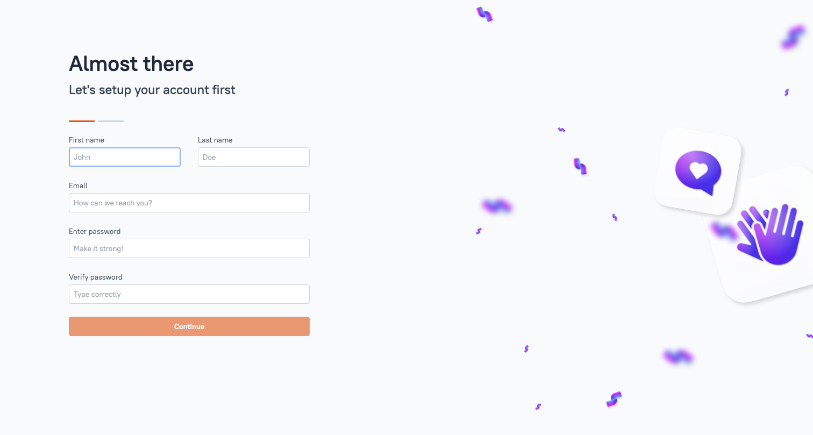
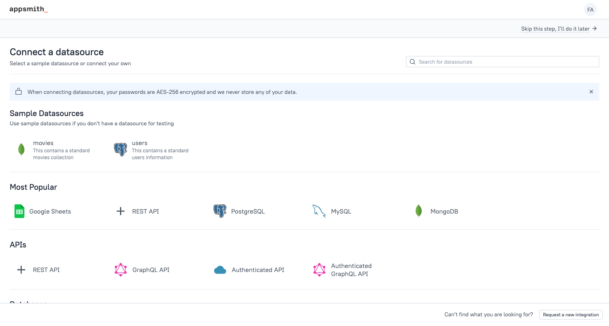
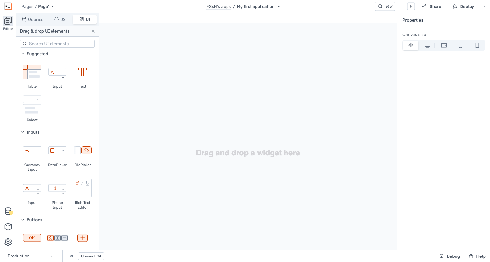
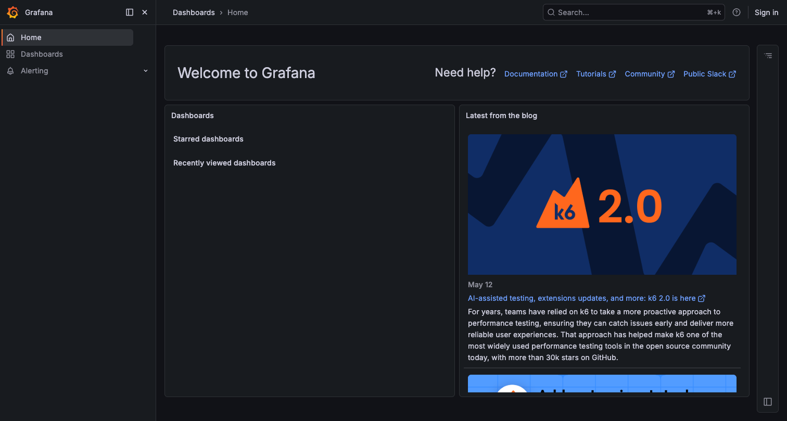
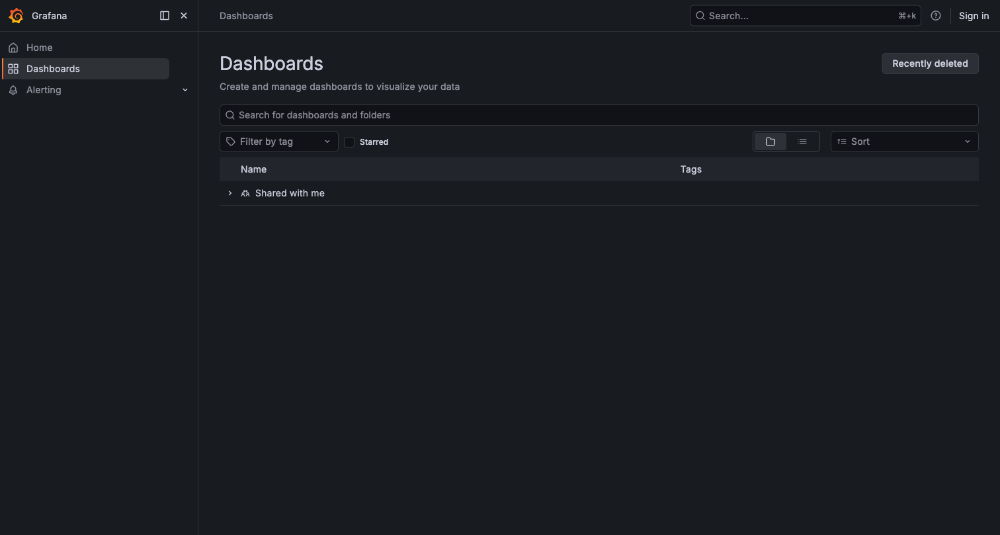

# Local Development & UI/UX Verification Guide

Step-by-step instructions for verifying the FSxN Management Console UI/UX in a local environment.

## Table of Contents

1. [Prerequisites](#prerequisites)
2. [Environment Setup](#environment-setup)
3. [Appsmith (Management UI) Verification](#appsmith-management-ui-verification)
4. [Grafana (Observability Layer) Verification](#grafana-observability-layer-verification)
5. [Grafana Panel Embedding Verification](#grafana-panel-embedding-verification)
6. [ONTAP REST API Mock Setup](#ontap-rest-api-mock-setup)
7. [Verification Checklist](#verification-checklist)
8. [Cleanup](#cleanup)

---

## Prerequisites

| Tool | Version | Purpose |
|------|---------|---------|
| Docker | 20.10+ | Container runtime |
| Colima (macOS) | 0.5+ | Docker runtime (Docker Desktop alternative) |
| Browser | Chrome/Firefox latest | UI verification |
| curl | Any | Health checks |
| jq | Any | JSON parsing |

### Starting Colima

```bash
# macOS users (if not using Docker Desktop)
colima start --cpu 4 --memory 4 --disk 20
```

---

## Environment Setup

### Step 1: Create Docker Network

```bash
docker network create fsxn-mgmt-dev
```

### Step 2: Start Appsmith (Management UI)

```bash
docker run -d \
  --name appsmith \
  --network fsxn-mgmt-dev \
  -p 80:80 \
  -p 443:443 \
  appsmith/appsmith-ce:latest
```

> Initial startup takes approximately 60 seconds (internal MongoDB + Redis initialization).

### Step 3: Start Grafana (Observability Layer)

```bash
docker run -d \
  --name grafana-local \
  --network fsxn-mgmt-dev \
  -p 3001:3000 \
  -e GF_AUTH_ANONYMOUS_ENABLED=true \
  -e GF_AUTH_ANONYMOUS_ORG_ROLE=Viewer \
  -e GF_SECURITY_ALLOW_EMBEDDING=true \
  -e GF_SERVER_ROOT_URL=http://localhost:3001 \
  grafana/grafana:latest
```

> `GF_SECURITY_ALLOW_EMBEDDING=true` is required for iframe embedding.

### Step 4: Verify Startup

```bash
# Appsmith
curl -s -o /dev/null -w "%{http_code}" http://localhost:80
# Expected: 200

# Grafana
curl -s -o /dev/null -w "%{http_code}" http://localhost:3001
# Expected: 200
```

---

## Appsmith (Management UI) Verification

### Initial Setup

1. Open `http://localhost` in your browser
2. Create an admin account (email, password)
3. Complete the profile setup



### Creating an Application

1. Click "New Application" from the dashboard
2. Rename the app to "FSxN Management Console"



### Building UI Components

Place the following widgets in the editor:



#### Tab Navigation

1. Left sidebar → UI → "New UI element"
2. Drag the "Tabs" widget onto the canvas
3. Add tabs: Dashboard, Volumes, SVMs, Snapshots, Replication, S3 Files, Settings

#### Volume Table

1. Place a "Table" widget inside the Volumes tab
2. Set the table data to the following mock data:

```json
[
  {"name": "vol_data_01", "svm": "svm-prod", "used": "450 GB", "total": "1 TB", "percent_used": 45, "state": "online"},
  {"name": "vol_data_02", "svm": "svm-prod", "used": "1.6 TB", "total": "2 TB", "percent_used": 78, "state": "online"},
  {"name": "vol_backup_01", "svm": "svm-dr", "used": "200 GB", "total": "500 GB", "percent_used": 40, "state": "online"},
  {"name": "vol_archive", "svm": "svm-prod", "used": "4.5 TB", "total": "5 TB", "percent_used": 90, "state": "online"}
]
```

#### Confirmation Dialog

1. Add a "Modal" widget
2. Title: "Delete Volume"
3. Message: "Are you sure you want to delete volume '{{selectedRow.name}}'?"
4. Buttons: "Cancel" + "Delete" (red)

#### Grafana Panel Embedding

1. Place an "iframe" widget in the Volume Detail section
2. URL: `http://localhost:3001/d-solo/...?panelId=1&from=now-1h&to=now`

---

## Grafana (Observability Layer) Verification

### Access

Open `http://localhost:3001` in your browser. Anonymous access is enabled, so no login is required.



### Creating a Dashboard

1. Left menu → Dashboards → New Dashboard
2. Click "Add visualization"
3. Select "-- Grafana --" as the data source (for testing)
4. Set the panel title to "Volume IOPS"

### Importing Harvest Dashboards

In production, use `scripts/import-dashboards.sh`, but you can also import manually in local dev:

1. Grafana left menu → Dashboards → Import
2. Upload a JSON file from the `harvest/dashboards/` directory
3. Select a data source and click Import



---

## Grafana Panel Embedding Verification

### Embedding URL Format

URL format for embedding Grafana panels in Appsmith iframes:

```
http://localhost:3001/d-solo/<dashboard-uid>/<dashboard-slug>?orgId=1&panelId=<panel-id>&from=now-1h&to=now&refresh=1m
```

### Verification Steps

1. Create a dashboard in Grafana and add a panel
2. Get the embed URL from the panel's "Share" → "Embed" option
3. Set the URL in the Appsmith iframe widget
4. Confirm the following:
   - Panel renders within 10 seconds
   - Auto-refresh occurs every 60 seconds
   - A fallback message appears if the panel fails to load

### Notes

- In the local environment, Cognito authentication is not available, so Grafana anonymous access is enabled instead
- In production, the ALB Cognito session cookie is shared, so no additional authentication is needed
- Panels will not render inside iframes unless `GF_SECURITY_ALLOW_EMBEDDING=true` is set

---

## ONTAP REST API Mock Setup

You can verify UI interactions without a real FSx ONTAP instance by using a mock API server.

### Using json-server

```bash
npm install -g json-server

# Create mock data
cat > /tmp/ontap-mock-db.json << 'EOF'
{
  "storage-volumes": {
    "records": [
      {
        "uuid": "vol-uuid-001",
        "name": "vol_data_01",
        "svm": {"name": "svm-prod", "uuid": "svm-uuid-001"},
        "space": {"size": 1099511627776, "used": 494780232499, "available": 604731395277},
        "state": "online",
        "aggregates": [{"name": "aggr1"}],
        "nas": {"path": "/vol_data_01"}
      },
      {
        "uuid": "vol-uuid-002",
        "name": "vol_data_02",
        "svm": {"name": "svm-prod", "uuid": "svm-uuid-001"},
        "space": {"size": 2199023255552, "used": 1715177736396, "available": 483845519156},
        "state": "online",
        "aggregates": [{"name": "aggr1"}],
        "nas": {"path": "/vol_data_02"}
      }
    ],
    "num_records": 2
  },
  "svm-svms": {
    "records": [
      {
        "uuid": "svm-uuid-001",
        "name": "svm-prod",
        "state": "running",
        "ip_interfaces": [{"ip": {"address": "10.0.x.x"}, "name": "lif-nfs-01"}],
        "nfs": {"enabled": true},
        "cifs": {"enabled": true},
        "s3": {"enabled": true}
      }
    ],
    "num_records": 1
  }
}
EOF

json-server --watch /tmp/ontap-mock-db.json --port 8443
```

### Connecting Appsmith to the Mock API

1. Appsmith → Data Sources → REST API
2. URL: `http://host.docker.internal:8443` (access macOS host from inside Docker)
3. Test the connection and confirm the volume list is returned

---

## Verification Checklist

### UI Navigation (Requirement 9)

- [ ] Tab switching completes within 200ms
- [ ] Active tab is visually distinguishable
- [ ] Accordion panels expand one at a time
- [ ] Browser back/forward restores tab state
- [ ] No horizontal scrolling between 1280px and 2560px

### Volume Management (Requirement 4)

- [ ] Volume list table displays name, SVM, usage, and state
- [ ] Create form validates input (name: 1–203 characters, alphanumeric + underscore)
- [ ] Confirmation dialog appears on delete
- [ ] Error messages display on failure

### Grafana Embedding (Requirement 8)

- [ ] Grafana panel renders inside the iframe
- [ ] Panel loads within 10 seconds
- [ ] Fallback message appears on load failure
- [ ] Auto-refresh occurs every 60 seconds

### Responsive Layout

- [ ] All elements visible at 1280px width
- [ ] Layout renders properly at 1920px width
- [ ] Content is centered or expands appropriately at 2560px width

---

## Cleanup

```bash
# Stop and remove containers
docker rm -f appsmith grafana-local

# Remove network
docker network rm fsxn-mgmt-dev

# Stop Colima (if needed)
colima stop
```

---

## Appendix: Features That Cannot Be Verified Locally

The following features require an AWS environment for verification:

| Feature | Reason | Alternative for Local Verification |
|---------|--------|-----------------------------------|
| Cognito auth flow | ALB + Cognito is AWS-only | Use Appsmith built-in auth as a substitute |
| S3 AP file browser | Lambda + S3 AP is AWS-only | Verify UI only with mock API |
| AMP metrics | AMP is an AWS managed service | Can substitute with local Prometheus |
| AMG dashboards | AMG is an AWS managed service | Substitute with local Grafana |
| VPC network isolation | VPC is AWS-only | Conceptual verification with Docker networks |
